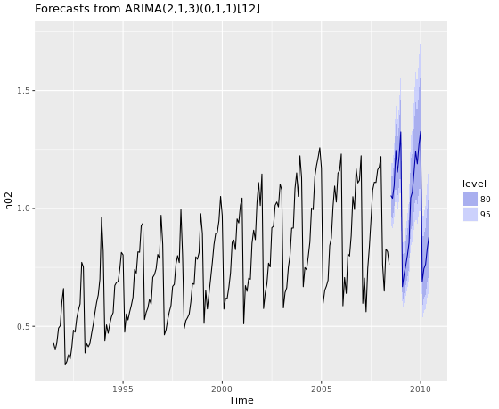

```{r setup, include=FALSE}
knitr::opts_chunk$set(echo = TRUE)
```

# INTRODUCCIÓN
Este manual describe cómo trabajar con series temporales y cómo hacer pronósticos con ellas en R. Explicaremos los principales paquetes de $$R$$ que facilitan el uso de series temporales y muchos ejemplos prácticos que muestran casos concretos de análisis, aplicaciones y programación sobre datos temporales en este lenguaje.

Una serie temporal es una secuencia de datos, observaciones o valores, medidos en determinados momentos y ordenados cronológicamente. Los datos pueden estar espaciados a intervalos iguales o irregulares, normalmente las series sobre las que trabajaremos son series de intervalo regular, pues son las más fáciles de representar y analizar con funciones y librerías..

Las series temporales son pares de valores fecha-dato y uno de los usos principales es su análisis para predicción y pronóstico (así se hace por ejemplo con los datos climáticos, las acciones de bolsa, o las series de datos demográficos). 

## Clasificación de las series temporales
Existen muchas formas de clasificar las series temporales, cada vez que clasificamos algo pretendemos identificar patrones, grupos comunes que nos aporte información del comportamiento de los datos. UNa vez identificado el grupo esto nos permite realizar uno u otro tipo de analisis, o aplicar diferentes funciones al modelo que va a funcionar mejor.

Es importante realizar visualización de los datos e intentar hacer análisis directo previo observando la forma, identificando el tipo de serie, su comportamiento de la varianza y su evolución.

Básicamente las series temporales pueden clasificarse por su forma en 3 tipos:

    1. **Series de tendencia.** Son aquellas que tienen una evolución creciente o decreciente en el tiempo
    2. **Series estacionales.** Son las que reflejan comportamientos de patrones periodicos asociados al calendario, formas que se repiten en horasm días, semanas
    3. **Series Cíclicas.** Las que tienen patrones de repetición de comprotamiento, que no se corresponden con calendarios fijos, repiten ciclos irregulares.
    
En las series estacionales, podemos pronosticar las temporadas de picos y valles, pero en las series cíclicas es algo más complicado. Tambien interesa apreciar en los datos si existe una tendencia de fondo, de forma que pueda extraerse de los datos y aplicar diferentes modelos de predicción a acad uno de los componentes que forman la serie de observaciones.

Lo habitual es que una serie temporal sea mezcla y convinación de estos comprotamientos (tendencia + ciclo + ruido), identificarlos facilitará el trabajo de análisis.

Existen funciones en R que descomponen una serie temporal en los componentes principales (tendencia + ciclo + ruido). Una de estas funciones es `sdl()` del paquete base tambien la función `decompose()`.

Ejemplo: descomponemos los componentes estacionalidad + tendencia + ruido de la serie de cotizaciones del oro entre 1980 y 1985 almacenanda en la variable `gold`
```{r}
    require(forecast) # la serie ejem: gold está en esta libreria
    # Aplicamos funcion de descomposición sdl()
    des.oro<-stl(gold,s.window = "periodic" )
    #Pintamos el resultado    
    plot(des.oro, main="Descomposición del precio del oro")
    #plot(decompose(gold))
```


## Estructura del libro

Se ha ordenado el manual en un formato progresivo, de manera que sirva de libro de consulta constante durante el trabajo y también de guia continua de aprendizaje, desde las nociones básicas, a las más complejas.

En primer lugar haremos un resumen completo de las formas de medida del tiempo en R, lo que nos permitirá entender mejor el funcionamiento de las series temporales, así como obtener conocimientos para realizar analisis alternativos, no solo con objetos de serie temporal sino con otras muy comunes como `data frame`.

El segundo capítul está dedicado a obtener datos, a crear series temporales para ejemplos, o a obtenerlas de los multiples origenes que puedan darse (web, ficheros...). Se aportan ejemplos concretos de librerías para descarga de datos financieros que son unos datos muy demandados por ususarios de $$R$$.

En el tercer capítulo entramos al grano describiendo cómo realizar gráficos de series temporales, haremos un completo repaso por las multiples funciones que existen, y que son más fáciles y atractivas.
También se detallan tipos de graficos exclusivos de series temporales y que realizan analisis graficos muy completos, como los graficos estacionales, los de autocorrelación y retardo ect.

El cuarto capitulo está dedicado a las funciones de pronostico más simples y una introducción al completo paquete `forecast`que tiene elementos interesantes para los pronósticos.

El siguiente caitulo se muestra una introducción al analisis de los residuos, que es una forma de evaluar la bondad de las predicciones que realizamos con los modelos de pronostico.

El sexto capitulo se entra en los metodos de pronostico por regresiñon lineal.

El séptimo detalla las transformaciones en los datos, y cómo se pueden conseguir con ellas mejores pronósticos con simples cambios de base de los datos.


# MEDIDA DEL TIEMPO EN R

Antes de iniciarnos en el uso de series temporales vamos realizar un resumen de la medida del tiempo en R, qué clases existen, cómo se trabaja con fechas y datos de tiempo. Conocer estos tipos de datos no es imprescindible en el manejo de series temporales, pero nos permite tener un conocimiento profundo y mucho más completo de la teoría.

Los datos de tiempo (fechas y horas) son tratados en R Base mediante varios tipos de datos, objetos y clases. Estas clases almacenan internamente la fecha como el número de días o segundos transcurridos desde el 1 de enero de 1970 en la zona UTC.

R Base define principalmente 3 clases de datos fechados:

  1. Clase ***Date*** para las fechas diarias de calendario 
  2. Para las fechas horarias se usan dos clases:
    -  **POSIXct** es un **valor** numérico que representa el número de segundos desde 1/1/1970.
    -  **POSIXlt** es un objeto **lista** con distintas variables (sec,min,hour,mday,mon, year, wday, yday, isdst, zone, gmtoff)  
    
### Fecha diarias (Dates)

La clase `Dates` almacena solo datos _diarios_ que incluyen el año, mes y día de una fecha, pero no los tiempos inferiores a un día (ni horas, ni segundos por ejemplo).

Un fecha del tipo *Date* se puede asignar mediante código de la siguiente manera:

```{r}
  # Asignar una fecha
  x<- as.Date("1970-01-03")
  x  # se imprime como cadena de texto
  
  # pero podemos comprobar que internamente se almacena como 2
  # dos días despues del 1 de enero de 1970.
  unclass(x)
```


### Fechas completas `POSIXct` y `POSIXlt`

R almacena las fechas completas usando los estándar *POSIX* que incluyen una serie de características para homogeneizar el tipo complejo de datos de tiempos en diferentes sistemas operativos. POSIX es el acrónimo de *Portable Operating System Interface* y la X procede del sistema operativo $$\UNIX$$.
 
Ambas clases *POSIX* almacenan la fecha y hora como el número de segundos transcurridos desde el _1 de enero de 1970_. La clase `POSIXct` almacena internamente esta cifra como un número entero, mientras que la clase `POSIXlt` la descompone en una lista con elementos para los segundos, minutos, horas, día, mes y año.

En resumen:

    -  **POSIXct** es simplemente un numero entero que guarda el número de segundos desde 1/1/1970. Es útil cuando almacenamos tiempos en un data frame, pues ocupa menos espacio y solo una variable.
    -  **POSIXlt** es un objeto lista que almacena un bloque completo de información diferenciada, como el día, año, dia de la semana, día del mes etc.

Para recordar la diferencia es util la nemotecnia de que el que finaliza en lt es una lista (`POSIXlt` $\rightarrow$ lt  = lista, `POSIXct` = entero) 

### librería `lubridate` funciones para fechas    

Para trabajar con fechas y horas es casi imprescindible cargar la librería `lubridate`. Este paquete nos facilita el uso analitico de los datos fechados:

  * `Sys.Date()` $\rightarrow$ fecha actual del sistema operativo
  * `now()` $\rightarrow$  fecha y hora del momento actual
  * `today()` $\rightarrow$ fecha `Date` de hoy
  * `weekdays()` $\rightarrow$ devuelve el día de la semana
  * `months()` $\rightarrow$ retorna el mes de la fecha
  * `quarters()` $\rightarrow$ retorna el cuatrimestre de la fecha (Q1,Q2,Q3 o Q4)
  
Otras funciones que permiten operaciones de tiempo son:

  * `difftime(fecha1, fecha2, units = "weeks")` $\rightarrow$ la diferencia en tiempo entre dos fechas.
  * `diff()` $\rightarrow$ aplicado a una serie temporal da la diferencia entre dos valores consecutivos de fecha.
  * `seq(dia.inicio, dia.fin,length=10, by=2)`$\rightarrow$ crea una secuencia de fechas.

Una forma alternativa y útil para acceder a un valor concreto dentro de una fecha (por ejemplo el año, el día de una fecha) es hacer la llamada a las propiedades de la variable usando el símbolo `$` en la forma `varfecha$mday`:

  * `sec`: segundos 
  * `min`: minutos de la fecha
  * `hour`: hora
  * `mday`: dia del mes
  * `mon`: mes
  * `year`: año desde 1900. Por lo que debemos sumar esto si queremos el año real
  * `wday`: día de la semana (0 domingo - 6 sábado)

Veamos un ejemplo práctico:
```{r}
  # guardamos la fecha actual del sistema en x
  x <- Sys.time()
  x
  # Convertimos es fecha en la clase POSIXlt (la más completa con la lista)
  fecha_x <- as.POSIXlt(x)
  # imprimimos los nombres de las variables de la clase POSIXlt
  names(unclass(fecha_x))
  # Para sacar el dato de cualquiera de ellos basta escribir:
  #  nombre del objeto + $ nombre_variable
  fecha_x$sec
  fecha_x$wday
  
  # cambiamos el objeto a POSIXct
  fecha_x<-as.POSIXct(fecha_x)
  unclass(fecha_x)
  #solo almacena este gran entero con los segundos desde 1/1/1970
  
  # Generamos una secuencia de días
  dia1=as.Date("25/05/2017",format="%d/%m/%Y")
  dia2=as.Date("10/06/2017",format="%d/%m/%Y")
  seq(dia1,dia2, by=1)
  seq(dia1,length=10,by=1)
  seq(dia1,dia2, by="week")
```

### Conversión de texto a fecha `strptime` 
Cuando el formato de partida que contiene la fecha es un texto, la función _strptime()_ es una manera sencilla de convertirlo en la clase de tiempo, es decir pasar una cadena en formato texto a la clase `POSIX`. La función toma como parámetros de entrada la lista de texto con las fechas y también hay que decirle qué formato tienen dichos textos de entrada.

```{r}
  # Convertir texto en fecha
  # Ejemplo 1
  x <- c("1 ene 1960 12:37", "2 abr 1990 23:00", "7 jul 1975 15:15")
  # para convertir estos textos con fechas a formato de tiempo de R
  z <- strptime(x, "%d %b %Y %H:%M")
  z
  class(z)
  
  #ahora podemos acceder a los datos de esta forma sencilla
  z$year # nos da el año
  z$mon  # nos devuelve el mes
  z$wday # nos devuelve el día de la semana
  z$mday # devuelve el día del mes
  
  
  # Ejemplo 2 . cambiamos el formato de entrada
  x <- c("1/1/60 12:37", "2/4/90 23:00", "7/7/75 15:15")
  z <- strptime(x, "%d/%m/%y %R") # notese el cambio de formato
  z
```


### Operaciones con fechas y tiempos

Podemos realizar operaciones con fechas y tiempos siempre que los objetos que intervengan pertenezcan a la misma clase. Es decir, un objeto _Date_ no puede sumarse a otro _POSIXlt_, debemos primero convertirlos a la misma clase.

```{r}
  x<- as.Date("2015-03-24")
  y <-as.POSIXlt("2016-03-24 12:10")
  
  # probamos a restar dos objetos de diferentes clases
  # y-x # esto da error 
  
  # Convertimos x a clase POSIXlt
  x<-as.POSIXlt(x)
  y-x
  # ahora la resta es posible
```

Los objetos POSIX tienen una propiedad que permite especificar la zona horaria en la forma `y<-as.POSIXct("2016-03-24 12:10", tz="GMT")`

### Funciones adicionales de `lubridate`

Este paquete añade funciones que facilitan la manipulación de fechas expresadas en la clase POSIXct. La conversión de caracteres a dicha clase puede hacerse utilizando las funciones definidas por combinaciones de las letras d, m, y (day, month, year) y h, m, s (horas, minutos y segundos). 

Este sistema facilita la entrada de datos a R, por ejemplo $dmy_hms$ espera *día-mes-año-horas-minutos-segundos* en ese orden; si usamos $ymd_h$ espera *año-mes-dia-hora* en el mismo orden

Veamos un ejemplo:

```{r}
  require(lubridate)
  library(lubridate)
  
  fecha1=ymd_hms("2016-02-23 18:15:09") 
  fecha1
  
  fecha2=dmy_hm("12/3/1975 23:24")
  fecha2
  
  fecha3=dmy("6 7 1975")
  fecha3
  
  # Extraemos valores de mes, semana, y día de la semana de fechas
  month(fecha2)
  week(fecha3)
  wday(fecha3)
```
### Extraer información de un fecha
Para obtener una información concreta de una fecha u hora se utilizan las funciones, second(), minute(), hour(), day(), wday(), yday(), week(), month(), year() y tz(), para la zona horaria.

```{r}
  fecha.actual<-now()
  
  # Extraemos información de dicha fecha
  year(fecha.actual) # año
  month(fecha.actual) # mes
  wday(fecha.actual,label = TRUE) # dia de la semana
  minute(fecha.actual) # minutos

```

### Aritmétrica con fechas y horas

La suma de fechas con `lubridate` se hace usando la función *difftime(fecha1,fecha2, units="days")*, en units podemos especificar la unidad de fecha para el resultado entre las siguientes:“auto”, “secs”, “mins”, “hours”, “days”, “weeks”

```{r}
  d1 <- as.Date("01 marzo 1950", "%d %B %Y")
  d2 <- as.Date(c("01 abril 1955", "01 julio 1980"), "%d %B %Y")
  
  difftime(d2,d1,units = "weeks")
```

También pueden ser tratadas en R como una nueva clase de objeto que se llama intervalo.

```{r}
  # hay que cargar el paquete lubridate
  require("lubridate")
  # Creamos un intervalo
  congreso_inicio <- ymd_hm("20170528 12:00")
  congreso_fin <- ymd_hm("20170604 10:00") 
  duracion_congreso <-  difftime(congreso_fin,congreso_inicio)
  # Para verlo en unidades enteras de fecha es mejor pasarlo a periodo
  as.period(duracion_congreso)
  
  # Si no solo queremos la diferencia de fechas sino usarlo como intervalo
  # tenemos que crear el objeto 
  duracion_congreso <- interval(congreso_inicio,congreso_fin)
  # Tambien podía definirlo así:
  congreso_inicio %--% congreso_fin

  # Ejem. tengo programada una visita a Madrid en la fecha
  visita_Madrid<-ymd("20170601")
  # quiero saber si coincide con el congreso
  visita_Madrid %within% duracion_congreso
  
  # Cual es la duración del congreso en días
  duracion_congreso / days(1)
  # y en semanas
  duracion_congreso / weeks(1)

```
Para convertir entre intervalos, duraciones o periodos se usan las funciones `as.interval()`, `as.period()`, y `as.duration()`.

Con la aritmética simple podemos generar series temporales de manera sencilla añadiendo o sustrayendo periodos de tiempo a una fecha:

```{r}
  # Inicio de la serie el 15 de mayo de 2017
  inicio<-dmy_hm("15052017 10:00")
  # Sumamos una semana 4 veces
  serie <- inicio + weeks(0:4)
  serie
```

# OBTENER DATOS
Para empezar y aprender necesitamos datos y ejemplos sencillos en los que podamos manipular y probar el código. En este capitulo mostraremos algunas de las formas de obtener datos de series temporales de manera que podamos iniciar nuestra práctica con elementos reales.

Solo vamos a describir de forma breve solo algunas de las fuentes de datos. En primer lugar los propios datos de R base, que tiene bastantes, y después muchas librarías y funciones útiles para descarga de datos de series web. Otra forma es crear los datos uno mismo, por ello explicaremos también de forma sencilla cómo crear series de prueba aleatorias para uso de enseñanza y aprendizaje.

## Datos ejemplo en R base
El programa básico de R contienen un montón de datos de ejemplo que podemos usar en la práctica. Estos datos están contenidos en el paquete `datasets` y contiene ejemplos de  multiples formatos: data frames, series ts, matrices, vectores.

Para ver todos los datos disponibles hay que ejecutar el comando `data()` en R, así conseguimos que nos muestre una lista completa de todos los objetos de datos almacenados de ejemplo. Entre estos hay varios de series temporales.


Por ejemplo usaremos los datos de *Nile* que contiene observaciones de caudal máximo del río Nilo para este primer script.

```{r}
    # Ejemplos de datos en datasets:
    # Serie de caudales del Nilo
    str(Nile) # vemos qué contiene Nile
    
    plot(Nile, main="caudal máximo anual del río Nilo", col="blue") # pintamos la serie temporal
    
    # Otro ejemplo de R Base es AirPassengers
    plot.ts(AirPassengers, main="Num pasajeros internacionales por mes entre 1949-1960", xlab="año" )
    # datos de manchas solares, diarios, mensuales y anuales
    #plot(sunspot.month)
    plot(sunspot.year)
```

Muchas de las librarias relacionadas con los datos contienen ejemplos incluídos en el código del paquete. La libraría `forecast`que usaremos profusamente en este manual tiene varias series temporales de diferentes características que pueden usarse de ejemplo (gold, WWWusage...)

### Resumen de datos temporales de ejemplo

    - sunspot, sunspot.month y sunspot.year :Número de manchas solares medias mensuales de 1749 a 1983. Recolectado en el Observatorio Federal Suizo, Zúrich hasta 1960, luego el Observatorio Astronómico de Tokio.
    - Nile : Mediciones del caudal anual del río Nilo en Aswan, 1871-1970, en $$10^8 m^3$$.
    - EuStockMarkets: precios de cierre diarios de los principales índices bursátiles europeos: Alemania DAX (Ibis), Suiza SMI, Francia CAC y Reino Unido FTSE. Los fines de semana y fiestas se omiten. 
    - WWWusage: del paquete `forecast`.Una serie temporal con el número de usuarios conectados a Internet a través de un servidor cada minuto.
    - gold: del paquete `forecast`. Precios diarios de oro por la mañana en dólares estadounidenses. 1 de enero de 1985 - 31 de marzo de 1989.
    - wineind: del paquete `forecast` Ventas totales de vinos australianos por fabricantes de vino en botellas <= 1 litro. Enero de 1980 - agosto de 1994.
    
## Lectura de ficheros locales
Otra opción simple es la lectura de ficheros locales, como hojas excel o ficheros `csv`.
Recordamos en un ejemplo cómo realizar la lectura de un fichero.

```{r eval=FALSE}
    # Lectura de ficheros separados por comas:
    datos<-read.csv("filename.txt", header = FALSE)
    
    # Lectura de ficheros separados por tab
    datos<-read.table("filename.txt", sep="\t", header = FALSE)
    
    # Por defeco se lee columnas de texto como factores, pero si no queremos eso hacemos
    datos<-read.table("filename.txt", sep="\t", header = FALSE, stringsAsFactors = FALSE)
```

Otra opcion interesante es copiar directamnte del portapapeles o de una url web:

```{r eval=FALSE}
# para leer lo copiado en el portapapeles de windwows
datos<-read.table(file="clipboard", sep="\t",header=TRUE)

# para ller de una url web
datos<-read.csv("http://mitablas/aa.csv")

```

Además siempre podemos recurrir al paquete `rio` que simplifica la importación y exportación de ficheros al máximo, con dos únicas funciones (export, import).

```{r eval=FALSE}
    #install.packages("rio")
    library(rio)
    # uso de export
    export(mtcars, "coches.csv")
    
    # uso de import
    x <- import("coches.csv")
```


## Lectura de datos de internet

Existen multitud de webs de *open data* en las que podemos conseguir información de calidad de administraciones y gobiernos. Normalmente hay que bucear en ellas para buscar datos, y una vez que seleccionamos o tenemos a la vista la tabla resultado nos dan la opción de *descarga de ficheros* en un formato estandar como *csv*, o *json*. Copiando estos enlaces a R podemos hacer descargas directas de los datos a nuestro sistema.

Vamos a poner un ejemplo de lectura de datos desde internet de la web de datos abiertos de la Región de Murcia (<http://datosabiertos.regiondemurcia.es>), es una de tantas paginas oficiales con adminstracion transparente y de volcado de datos públicos. Usaremos esta web para descargar el fichero de datos diarios de la estación meteorológica MU62 situada en la Alberca Murcia y pintar una gráfica de temperaturas máximas. Usarems el objeto temporal xts que veremos más adelante en este libro.

```{r}
    # leemos un fichero de datos meteorologicos obtenido de la web
    #  datosabiertos.regiondemurcia.es 
    # http://datosabiertos.regiondemurcia.es/carm/catalogo/medio-ambiente/informe-meteorologico-diario-carm-anos-2000-a-2017-estacion-meteorologica-mu62
    
    rutafichero<-"https://datosabiertos.carm.es/odata/Agricultura/IMIDA_Diario_MU62.csv"
    
    # Leemos los datos en formato csv directamente desde la url anterior
    datos_meteo<-read.csv(fileurl)
    # vemos la estructura de los datos leídos
    str(datos_meteo)
    
    require(xts) # para objeto xts
    require(ggplot2) # para autoplot
    
    # creamos un objeto xts con los datos de tmax leídos 
    # para crear un xts(valores, order.by=...fechas)
    stmax <- xts(datos_meteo$tmax, order.by = as.Date(datos_meteo$fecha, format = "%d/%m/%Y")) 
    
    #Graficamos los datos del 2005 al 2008
    autoplot(stmax["2005/2007"], geom = c("line"), color="red") + xlab("año")

```


## Crear objetos temporales `ts`
Existen varias opciones para trabajar con series temporales. La más simple es usar el objeto `ts` de R, pensado para series de tipo anual, mensual e intervalos regulares. Esta función sirve para crear y definir una serie temporal a partir de los datos, fechas y frecuencia: `y <- ts(datos, star=fecha_inicio, end= fecha_fin, frecuency=frecuencia)`. Como está pensada para datos anuales, una frecuencia de 12 indicará datos mensuales, de 4 trimestrales.


```{r Series temporales}
    # Creamos una serie de 24 datos aleatorios para trabajar
    # como suma acumulada de una normal x10
    datos <- cumsum(rnorm(24)*10)
    # pintamos los datos
    plot(datos, type="l")

    # Creamos la serie temporal asumiendo que son datos trimestrales (cuartos de año)
    # y que se inician en julio de 1990
    # 12= mensuales
    # 4= cada 4 meses
    mits <- ts(datos, start = c(1990,3), frequency = 4)
    mits
    # Pintamos nuevamente los datos 
    plot(mits)
    # otra forma de ver resumen completo de la serie temporal
    tsdisplay(mits)
    # Calculamos el maximo de la serie
     which.max(mits)
     frequency(mits)
```

En el siguiente ejemplo representaremos varias series temporales en la misma escala y gráfica con la función plot.

```{r}
    # ejemplo para pintar varias series juntas en la misma grafica
    # Generamos 3 series aleatorias mensuales
    z <- ts(matrix(rnorm(300), 100, 3), start = c(1961, 1), frequency = 12)
    z[,2]<-z[,2]+5 # sumo 5 a la serie=col 3
    z[,3]<-z[,3]-5 # resto 5 a la serie=col 3
    
    class(z)
    head(z) # as "matrix"
    # pintamos las series con plot y con plot single
    plot(z)
    
    plot(z, plot.type = "single", lty = 1:3, col=c(1:3))
```


Vamos a crear también una serie temporal cíclica con números aleatorios:

```{r}
    st_estac <- sin(seq(0.1*pi, 10*pi, 0.1*pi))
    
    # generamos una lista de 100 numero aleatorios de media 0 y standard deviation de 0.2
    err <- rnorm(length(st_estac),0, 0.2) #note: length(aSeq)=100
    st_estac <- st_estac + err
    
    	
    #creating a monthly time series, beginning at January 2001
    st_estac<- ts(st_estac, freq = 12, start=c(2005,1))
    plot.ts(st_estac, col="red")

```

### Dividir series temporales ts
En muchas ocasiones nos interesa extraer una parte de la serie temporal, dividir una serie para obtener dos o mas subconjuntos. Esto lo podemos hacer con la función `window()`. Veamos un ejemplo.

```{r}
    # ejemplo de uso de window para extraer el año 1993 de los datos
    # recordemos que son datos trimestrales (4 datos al año)
    # Usamos la serie generada en el ejmplo anterior
    ano93 <- window(mits, start = 1993, end = c(1993,4))
    ano93

    plot(ano93)
```
### Objeto `xts`
Aunque existen muchos objetos creados en R para el manejo de Series temporales, es `xts` el estandar que ha permitido la gestion eficiente de las series temporales y ha conseguido aglutinar en un mismo objeto las carcerísticas comunes a todos los que necesitan implementar valores de series en el tiempo.

Uno de los defectos que encontramos en el uso de `ts` como objeto temporal es que muchas veces obtenemos datos fechados sin que tengamos necesidad de indicar el inicio y fin del periodo. Un objeto `xts` almacena los datos como `coredata` y las fechas o tiempo como `index`admitiendo una variedad amplia de formatos de tiempo. En el nucleo de un objeto `xts` está `zoo`.

En el ejemplo siguiente vermos muchas formas de usar `xts`, por ejemplo para extraer los datos de la fecha de una objeto `xts`se usa la función `index(objet_xts)`esto no ahorrará muchos dolores de cabeza buscando la forma trabajar con las fechas de la serie.
 
```{r}
    library(xts)
    # creamos de nuevo una serie aleatoria temporal
    datostem <- cumsum(rnorm(60)*10)
    datostem <- ts(datostem, start = c(2010,3), frequency = 12)
    
    # convertimos el objeto del ejemplo anterior mits en xts
    xts1<-as.xts(datostem)
    class(xts1)
    head(xts1)    
    
    # La forma habitual de crear una serie xts será así:
      xts1 <- xts(dat.bit$price, order.by=as.Date(dat.bit$Time, "%Y-%m-%d %R"))
    
    # extraemos solo lo datos de xts 
    head(coredata(xts1))
    # vemos el indice de tiempo almacenado en xts
    index(xts1)
    indexClass(xts1) # tipo de fechas usadas
    indexFormat(xts1) # formato de las fechas
    tzone(xts1) # Zona Horaria
    
    # otra forma de verlo todo a la vez es con el comando
        .index(xts1)
    # nos dice el día de la semana del indice
    .indexwday(xts1)

    # periodicidad de la serie temporal
    periodicity(xts1)
    nmonths(xts1) # cuenta el numero de meses de la serie
    nyears(xts1) # cuenta el numero de años
    
    # seleccion de un año con xts
    xts1["2013"]
    # seleccion en un intervalo de fechas
    xts1["20111101/20130705"]
    
    # Tambien se permiten calculos de retraso o diferencia
    head(lag(xts1,2)) # crea una serie con retraso de un intervalo
    head(diff(xts1,3)) # crea una serie con la diferencia del 3 intervalo
    
    # conversion de frecuencia de los datos
    datos_ano<-to.period(xts1, period = "years",OHLC = FALSE)
    head(datos_ano )
    
    # uso de splits
    split(xts1 , f = "years")
    # uso de lapply
    lapply(xts1, FUN = cumsum)
    
```


## Librería `Quandl`
El paquete `Quandl` da acceso desde R a la ámplia base de datos del mismo nombre. `Quandl` ofrece datos financieros de múltiples fuentes, algunos de forma gratuita y otros en formato premium que requiere inscripción e incluso pago.

El primer paso para usar `Quandl` es registrar un nuevo usuario en el sitio web. Poco después, hay que ir a la configuración de la cuenta y hacer clic en **API KEY**. Esta página debe mostrar un código, como este: *LDgg4c7zsTgLLxyHj*. Este código lo usaremos para la conexión.

La gente `Quandl` ha desarrollado una API especifica para R bastante sencilla de usar. Hay muchos datos libres,como por ejemplo todos los datos economicos mundiales de la [FRED](https://fred.stlouisfed.org/categories). Para obtener el listado completo de datos que ofrece la librería podemo ir a su web y buscar el nombre de la serie especifica que buscamos <https://www.quandl.com/data/>. Veamos un ejemplo.


```{r}
    # install.packages("Quandl")
    require(Quandl)
    # creamos el API KEY para la conexión
    Quandl.api_key("LDgg4c7zsTgLLxyHj.")

    # obtenemos datos: serie temporal población en España
    poblacionESP<-Quandl("FRED/POPTTLESA148NRUG",type="ts")
    
    # podemos especificar las fechas de inicio y fin:
    # Quandl("FRED/GDPPOT", start_date="2005-01-03",end_date="2013-04-10",type="xts")

    plot(poblacionESP, main="Evolución de la población en España",type= "l",col="red",lwd=2)
```
La web de `Quandl` incluso facilita el propio script de R para el dato que buscas, por ejemplo mira aquí: <https://www.quandl.com/data/FRED/GDPPOT-Real-Potential-Gross-Domestic-Product>


## Librería `quandmod`

Para obtener datos de bolsa y valores `quandmod` es una librería interesante que contienen la función `getSymbols()`. Esta función permite extraer de las webs de yahoo, FRED y alguna más los datos diarios de acciones, fondos e índices. Por desgracia *Google* bloqueó recientemente el acceso a *getSymbols*.

Para descargar un valor entre fechas es necesario conocer el TICKER del valor y usar la función como sigue, por cierto los datos se almacenan en un objeto `xts`.

```{r}
    require(quantmod)

    acc1 <- getSymbols("TEF.MC", 
                       src ="yahoo",
                       periodicity = "monthly",
                       warning= "FALSE",
                       adjust = TRUE,
                       auto.assign=FALSE)
    require(ggplot2)    
    autoplot(Cl(acc1),main="Telefónica MC")
    
```

## Librería `BatchGetSymbols`
Esta librería es similar a `quantmod`, pero para análisis de varios valores puede tener alguna ventaja al estructurar mejor los datos en una única *data frame*.

```{r eval=FALSE}
    # esta librería no funcion con R nuevo
    library("BatchGetSymbols")
    # Cargamos varios tickers de empresas
    mis.valores <- c('MSFT','GOOGL','JPM','GE')
    
    # establecemos las fechas
    fecha.ini <- Sys.Date()-30
    fecha.fin <- Sys.Date()
    
    datosvalores<- BatchGetSymbols(tickers = mis.valores,
                             first.date = fecha.ini,
                             last.date = fecha.fin )
```

## ustyc
El paquete `ustyc` permite la descarga de los datos de la curva de interes del  Departamento del Tesoro de EE.UU. La curva de intereses es el tipo que un inversor recibiría por los bonos a diferentes vencimientos. Los valores de los rendimientos se basan en los precios de los instrumentos de deuda del gobierno de EE.UU. negociados en el mercado secundario. 

Dado que estos bonos tienen un riesgo de incumplimiento mínimo, estos valores se utilizan comúnmente como puntos de referencia para rendimientos sin riesgo en los mercados financieros.

Usar el paquete ustyc es muy simple. Todo lo que necesita hacer es llamar a la función `getYieldCurve`. En el siguiente ejemplo, descargaremos la curva de rendimiento para el año 2017.

```{r}
    library(ustyc)
    # obtener lacurva de rendimiento
    my.yield.curve <- getYieldCurve(year = 2017)
    print(head(my.yield.curve$df))
```

## Datos de Bitcoin y otras criptomonedas
Otra fuente de datos de interés son las nuevas criptomonedas y el Bitcoin (BTC). 

### `coinmarketcapr`
Uno de los paquetes más interesantes es `coinmarketcapr` con el que podemos descargar las series temporales de valoración de criptos que usa la web <https://coinmarketcap.com/> y muchas funciones variadas de control del estado de mercado:

```{r}
    library(coinmarketcapr)
    # funcion plot_top_5_currencies
    # pinta el valor de las 5 primeras criptos en capitalización
    plot_top_5_currencies()

    # funcion get_marketcap_ticker_all
    # nos da el precio actual de cada cripto frente al $ y BTC
    market_today <- get_marketcap_ticker_all()
    head(market_today[,1:8])
```

### `RBitcoin`

Otro paquete que vale la pena mencionar es [RBitcoin](https://github.com/jangorecki/Rbitcoin). Permite el acceso a los datos comerciales de varias casa de cambio de Bitcoin. Vamos a mostrar un ejemplo simple de importación de datos desde el exchange de intercambio [kraken](https://www.kraken.com/).
```{r}
    #install.packages("Rbitcoin", repos=c("https://jangorecki.gitlab.io/Rbitcoin","https://cran.rstudio.com"))
    
    library(Rbitcoin)
    # ver precios en exchanges
    market <- "kraken"
    #currency_pair <- c("BTC","EUR")
    currency_pair <- c("LTC","EUR")
    ticker <- market.api.process(market, currency_pair, "ticker")
    ticker
    
    # CONVERSION DE VALORES
    fromBTC(1) # el precio actual de BTC en USD
    fromBTC(1, "EUR") # el precio actual de BTC en euros
    
    toBTC(150, "EUR") # convertir 150 EUROS a BTC
    
    # acceso a la blockchain
    # a wallet
    monedero <- blockchain.api.process('1A1zP1eP5QGefi2DMPTfTL5SLmv7DivfNa')
    str(monedero)
    
    # Acceso a las transacciones
    tx <- blockchain.api.process('e5c4de1c70cb6d60db53410e871e9cab6a0ba75404360bf4cda1b993e58d45f8')
    str(tx, max.level=1)
```

### `coindeskr`
Otro paquete interesante es `coindeskr`, que extrae de la web de noticias mas famosa del sector <https://www.coindesk.com/> el precio del bitcoin y otras cosas interesantes. La informeación de la libraría está en: <https://cran.r-project.org/web/packages/coindeskr/coindeskr.pdf>

```{r}
    # Intalamos el paquete
    #install.packages('coindeskr')
    library(coindeskr) #R-Package connecting to Coindesk API
    
    # obtenemos el precio de los ultimos 31 días (ultimo mes)
    last31 <- get_last31days_price() 
    # pintamos le resultado
    plot.ts(last31)
    
    # obtenemos los precios historicos del cambio BTC EUR
    precios100_dias<-get_historic_price(currency = "EUR", start = Sys.Date() - 100,end = Sys.Date() )
    plot.ts(precios100_dias)
    
```

### Enlaces de datos
Algunas paginas web dan un servicio directo de descarga de datos en formato csv, por ejemplo los datos de cambi de BTC están disponibles en este sistema en: <http://data.bitcoinity.org/markets/price_volume/all/USD?t=lb&vu=curr>

De esta página hemos descargado el fichero *bitcoinity_data.csv* con los precios históricos y volumen de BTC.

```{r}
    #Leemos el fichero
    # usando library(rio)
    dat.bit<-import("bitcoinity_data.csv")
    plot.ts(dat.bit$price)
    
    # Como vemos no coge bien las fechas por lo que debemos hacer una conversión forzada
    # usando la libraría xts.
    library(xts)
    dat.xts.bit <- xts(dat.bit$price, order.by=as.Date(dat.bit$Time, "%Y-%m-%d %R"))
    # pintamos el logaritmo de la serie para comprender mejor los cambios de escala
    autoplot(log(dat.xts.bit))
    
    #otra opcion es usar zoo
    require(zoo)
    dd<- read.zoo(dat.bit[,1:2],header = TRUE, format = "%Y-%m-%d %R")
    plot(dd)
    
    # agregamos a valores mensuales por año yearamon
    dd.mes<-as.zooreg(aggregate(dd, as.yearmon,max),freq=12)
    tail(dd.mes)
```

# GRÁFICAS DE SERIES TEMPORALES
Hemos visto como manejar objetos de tiempo en R, con las clases: `Date`, `POSIXlt` y `POSIXct`, estas clases nos facilitan el trabajo de fechas, pero las series temporales son algo más complejas pues además del fechado está el otro par del conjunto que lo forma el valor.

En las series de intervalo regular nos podemos olvidar del fechado para trabajo analítico y quedarnos solo con el valor y el orden cronológico de dichos datos. Esto facilita el trabajo y amplia las posibilidades de cálculo.

Vamos a ver en este capitulo cómo pintar objetos de serie temporal en R para producir desde gráficos sencillos a otros complejos con tratamiento implicito de los datos como los estacionales o los de ACF.

## Funciones básicas de trazado de series temporales
Cuando usamos el comando `plot()` para representar series temporales R reconoce automáticamente el origen de los datos y ejecuta la funcion `plot.ts()`. Esta función adapta los ejes de abcisas al formato de fecha que tenga la serie temporal así como algunas otras caracteristicas gráficas.

Otra de las funciones que permiten dibujar series temporales es `ggplot`, y en concreto el comando `autoplot()`.

```{r}
    # Vamos a leer unos datos temporales de la FRED 
    # para su representación grafica posterior:
    # desempleo datos ESP trimestrales
    desESP <- getSymbols("LRUN64TTESQ156N", 
                       src ="FRED",
                       warning= "FALSE",
                       adjust = TRUE,
                       auto.assign=FALSE)  
    # precio vivienda ESP datos trimestrales
    pcasasESP <- getSymbols("QESN628BIS", 
                       src ="FRED",
                       warning= "FALSE",
                       adjust = TRUE,
                       auto.assign=FALSE) 
    
    # Unimos las dos variables
    datosESP<- cbind(desESP,pcasasESP)
    # Eliminamos las filas sin ambos datos
    datosESP<-datosESP[complete.cases(datosESP),]
```


## Gráficas estandar 
Describimos las funciónes sencillas para pintar grafics temporales. Es un asunto delicado, pues nos encontraremos que en muchas ocasiones, las funciones habitaules de trazado no pintan las graficas correctamente, o no interpretan las fechas que están almacenadas en lso objetos `ts`, `xts`, u otros.
En ocasiones manejaremos dataframes, que son los objetos más comunies, y no sabremos cómo pintar las fechas correctamente, bien porque están en los nombres de fila o porque proceden de un objeto xts.
Estas cuestiones las intentaremos acalarar en este apartado que será consulta obligada para el que se inicia en series temporales.

###`plot.xts`
El formato más completo para trabajar con series temporales es `xts`, pues los datos de objetos `ts` están más limitados, por ejemplo requieren datos de frecuencia uniforme y sin huecos mientras que `xts`no.

Por esto la forma habitual de pintar una grafica temporal es como `plot.xts()`, esta función produce gráfias por defecto que detectan las fechas y pinta correctamente los datos.

```{r eval=FALSE}
    # pintamos una grafica como plot.xts
    plot.xts(datosESP)

```


### `autoplot` 
Otro tipo de grafico muy utilizado es `autoplot`, que es una versión simplificada de `ggplot`, que completa muchos parámetros en función de la serie que lee y es particularmente sencilla de usar.
Cuando la funcion detecta una serie temporal la función real que ejecuta es `autoplot.zoo()`.

 
```{r eval=FALSE}
    # pintamos una grafica como plot.xts
    autoplot(datosESP)

```
 
### `plot.zoo`
Las funciones de trazado de `zoo`para serires temporales son de las mejores y están expresamente pensadas para crear graficas claras y atractivas. 

```{r eval=FALSE}
    # Muestra de plot.zoo
    plot.zoo(datosESP,col=c("blue","red"), xlab="Año")
```
### Otras funciones gráficas
Existen multitud de librerías gráficas en R. Para usar con serie temporales suelen ser apropiadas las librerías financieras que contienen funciones grñaficas adaptadas y en algún caso muy buenas, tambien otras librerías especializadas en graficos interacticos como dygraphs, vemos algunas de ellas.

Las funciones `chartSeries` y `barChart` de la librería `quandmod`, o la función `chart.TimeSeries` de la librería  `PerformanceAnalytics` suelen dar buenos resultados vamos a ver ejemplos para nuestro curriculo.

```{r}
    # Ejemplo de graficas
    # Librería quantmod
    require(quantmod)
        chartSeries(datosESP$preciocasas, TA=NULL,theme=chartTheme('white'))
       # barChart(datosESP$preciocasas,TA=NULL,theme=chartTheme('white'))

    # Librería PerformanceAnalytics
    require(PerformanceAnalytics)
    chart.TimeSeries(datosESP)
    
    # Libraría dygraph, interactiva
    # install.packages("dygraphs")
    require(dygraphs)
    dygraph(datosESP)
```

## Gráficas estacionales

La librería `forecast` contiene una funcion para representar *graficas estacionales* usando `ggseasonplot()`o también `seasonplot()`. Lo que hacen estas funciones es trazar una línea para cada ciclo completo y superponer todos juntos en la grafica. Es decir, para el caso de graficas con ciclos anuales, nos pintaría cada año superpuesto.

Una gráfica estacional es similar a una gráfica de tiempo excepto que los datos se dibujan en las "temporadas" individuales en las que se observaron los datos.

Estas funciones tienen una variante interesante que convierte los datos a coordenadas polares, donde el eje de tiempo es circular en lugar de horizontal. Para cambiar este sistema es suficiente con cambiar el argumento polar a VERDADERO.

Otra opción es el formato de grafica de subseries, que hace una mini gráfica de cada temporada y marca el valor medio de cada temporada se muestra como una línea azul.


```{r}
    require(ggplot2)  # para las graficas
    require(forecast) # para el ggseasonplot

    require(Quandl)   # para los datos
    # Quandl.api_key("lalala")
    # obtenemos los datos de población de España
    # vamos a usar datos de consumo de gas en USA
    gas<-Quandl("EIA/STEO_NGTCPUS_M", api_key="ybWqPvdv3r6bfrsNFkbq", type="ts")
    # podemos especificar las fechas de inicio y fin:
    autoplot(gas,main="US Natural Gas Consumption, Monthly")
    
    # Grafica estacional
    ggseasonplot(gas,year.labels=TRUE, main="Grafico estacional del gas")
    # Grafcia estacional en ByN 
    seasonplot(gas)
    # Grafica estacional  sin superposición
    ggsubseriesplot(gas)

```

## Graficas de dispersión o Scatterplots
Si queremos hallar relaciones entre variables de una tabla temporal, tenderemos que hacer muchas gráficas de dispersión comparando cada observación de la variable x con la observación de la misma fecha de la variable y. 

```{r}
    library(ustyc)
    # obtener lacurva de rendimiento
    my.yield.curve <- getYieldCurve(year = 2017)
    # me guardo la tabla de curva de intereses
    curva.de.interes<-na.omit(my.yield.curve$df)
    # Quito las filas con ceros
    curva.de.interes<-curva.de.interes[apply(curva.de.interes!=0, 1, all),]
    
    qplot(BC_10YEAR, BC_5YEAR, data=curva.de.interes) +
        ylab("Tasa a 5 años") + xlab("Tasa a 10 años") +
        ggtitle("Comparar tasas de interés diferentes periodos 2017")

    # para ver las relaciones de todos con todos en un data frame   
    # vamos a representar las relaciones de todos 
    require(GGally) # paquete para pintar el grafico 
    curva.de.interes[,c(1,4,7,9,11)] %>% GGally::ggpairs()
```


## Autocorrelación de series temporales
Otra forma de ver los datos de series de tiempo es trazar cada observación contra otra observación que ocurrió algún tiempo antes. Esto es lo que llamamos graficas de retardo y puede hacerse con la función `gglagplot()`.

Por ejemplo, trazar y~t contra y~t-1. Esto se llama **diagrama de retardo** porque está trazando la serie temporal contra los retardos (*lag*) de sí misma.

Si calculamos el coeficiente de correlación de los datos de cada gráfica de retardo, obtenemos una gráfica muy interesante que llamamos **grafica de autocorrelación (ACF)** de la serie. Esta gráfica nos aporta mucha infomación valiosa para interepretar los datos, la existencia o no de ciclos, la magnitud de estos y la relación entre intervalos temporales. En R la función que usamos para pintarla es `ggAcf()`.


### Autocorrelación en series no estacionales

```{r}
    library(ggplot2)
    # Pintar la serie temporal completa
    autoplot(Nile)
    
    # Pintar la grafica de autocorrelaciones 
    gglagplot(Nile,do.lines=FALSE)
    # Tambien puede hacerse con la función lag.plot
    lag.plot(Nile, lags=10, do.lines =FALSE)
    
    # Pintar la grafica de autocorrelación 
    ggAcf(Nile)
    

```
### Autocorrelación en series en series cíclicas
Cuando los datos son estacionales o cíclicos, el ACF alcanzará su punto máximo alrededor de los retrasos estacionales o en *la duración promedio del ciclo*.

Vamos a investigar el fenómeno de manchas solares con los datos disponibles en la base de datos `sunspot.year` y  comprobar que exste un ciclo de 10-11 años en los que se repite la insensidad de las mismas.

```{r}
    require(ggplot2)
    require("forecast")
    # Creamos el grafico de numero de manchas solares con el año.
    #autoplot(sunspot.year)
    autoplot.zoo(sunspot.year)
    
    # Creamos un grafico de restrasos con los datos
    gglagplot(sunspot.year)
    
    # Creamos un grafico ACF 
    ggAcf(sunspot.year)
```

Como vemos en el gráfico, las bandas azules indican los limites de ruido blanco. Si la autocorrelación es menor que esas marcas cuyo valor es $$\pm 2 / \sqrt{T}$$ donde $$T$$ es el numero de observaciones, es idicativo de que se trata de ruido blanco.

## Ruido blanco
El ruido blanco es un término que describe datos puramente aleatorios. Para comprobar si una serie es o no ruido blanco se puede realizar la prueba de *Ljung-Box* utilizando la función `Box.test (serie, lag = 24, fitdf = 0, tipo = "Ljung")`. 

Si el resultado de `p` es un valor mayor que **0.05** se sugiere que los datos no son significativamente diferentes del ruido blanco, y si es inferio es posible que los datos sean predecibles pues se diferencian del ruido blanco.

Vamos a comprobar la "Hipótesis del mercado eficiente" que establece que los precios de los activos reflejan toda la información disponible, por lo que no son predecibles  son independientes de los valores anteriores. Una consecuencia de esto es que los cambios diarios en los precios de las acciones deben comportarse como _ruido blanco_ (ignorando los dividendos, las tasas de interés y los costos de transacción). La consecuencia para los pronosticadores sería que el mejor pronóstico del precio futuro es el precio actual.

Probaremos esto con los precios de google, (la serie `goog`), que contiene el precio de cierre de acciones para Google durante más de 1.000 días hábiles que finaliza el 13 de febrero de 2017. 

```{r}
    # leemos los datos de la web con quandmod
library("quantmod")
    valor1<-getSymbols("goog", from ="2016-09-15", to ="2017-02-13", src ="yahoo", warning= "FALSE",adjust = TRUE,auto.assign=FALSE)
    # numero de días de los datos
    ndays(valor1)
    # pintamos la serie origen
    autoplot(Cl(valor1))

    # Pintamos la serie de diferencias
    autoplot(diff(Cl(valor1)))

    #Pintamos la grafica de retrasos de autocorrelación
    ggAcf(diff(Cl(valor1)))

    # Por último realizamos el test de Ljung-Box
    # sobre la serie de diferencias
    Box.test(diff(Cl(valor1)), lag = 1, type = "Ljung")
```
Como vemos el valor del test (p-value = 0.20) es bastante superior a 0.05, por lo que podemos afirmar que la serie de diferencias de las accioes de Google se comporta como ruido blanco y por tanto.

# PREDICIONES SIMPLES
Un pronóstico es la estimación del valor fururo de una serie temporal. No es difícil hacer predicciones a futuro en base a unos datos iniciales, la prueba es que existen métodos simples que han sido usados profusamente incluso con buenos resultados. En otras ocasiones es necesario conocer estas fórmulas sencillas de pronóstico para comparar sus resultados con otros modelos complejos y estimar su calidad, recordemos que el *principio de parsimonia* nos indica que las soluciones más simples suelen ser las correctas.

Veremos en este capítulo 4 modelos de pronóstico de formulación muy sencilla, contenidas dentro del paquete `forecast` de R:

    - método de la media
    - pronóstico simple
    - pronóstico simple estacional
    - modelo lineal
    
## Método de la media
Se trata simplemente de estimar el valor futuro de la serie como el valor medio de las observaciones dadas hasta la fecha de pronóstico. La función de desarrolla el modelo es `meanf()`

```{r}
    require(forecast)
    # Usamos la serie ts de ejemplo del cap1
    # creamos un pronostico simple de media
    p.med<-meanf(mits,20)
    #Pintamos el pronostico
    plot(p.med)
```


## Pronóstico simple o ingenuo
El método de pronóstico simple consiste en usar la última observación, la más reciente, como valor de predicción para el futuro próximo, esto es lo que se conoce como *pronóstico ingenuo*. Puede parecer tonto, pero existe una función específica para su calculo `naive()`y es, en muchas ocasiones el mejor pronóstico que podemos ofrecer.

Esta estimación sencilla es lo mejor que se puede tener para muchas series temporales, incluida la mayoría de los datos sobre el precio de las acciones, e incluso si no es un buen método de pronóstico, proporciona un punto de referencia útil para comparar con otros.

Para los datos estacionales o cíclicos, una idea similar es establecer como pronóstico el último valor de la misma temporada que la actual. Por ejemplo, si deseamos pronosticar el volumen de ventas para el próximo marzo, usaríamos el volumen de ventas del marzo del año anterior. Esto se implementa en la función `snaive()`(*sesonal naive*, es decir, ingenuo de temporada).

```{r eval=FALSE}
    # pronostico ingenuo en serie tendencial
    naive(y, h = 10) ;

    # pronostico ingenuo en serie cíclica estacional
    snaive(y, h = 2 * frequency(y))`

```
`
Para ambas funciones de pronóstico, puede establecerse un segundo parámetro que indica el número de valores hacia el futuro a pronosticar (argumento `h`).

El paquete de R `forecast`nos facilita el uso de pronósticos sobre series temporales y contiene unas ayudas gráficas que representan la información de manera intuitiva y límpia.
Además la clase principal de objetos en el paquete `forecast` contiene muchas funciones para manejarlos, incluyendo `summary()` y `autoplot()`.


```{r}
    require(forecast)
    # Usamos naive() para hacer un pronostico ingenuo de la serie por 10 días
    p.simple <- naive(mits, 10)

    # Pintamos el pronóstico y el resumen
    plot(p.simple)
    summary(prono.goog)

```

Otro ejemplo con lectura de fichero Excel:

```{r}
    require(forecast)
    require(xlsx)
    
    paro.Murcia<-read.xlsx("sec1.xls", sheetIndex = 2, header = T)
    #, colIndex = "1:2")#, rowIndex ="7:120")
    
    paro<-xts(paro.Murcia[,2], order.by = as.Date(paro.Murcia[,1],"%Y-%m-%d %R"))
    colnames(paro)<-"Total_paro"
    head(paro)
    # Usamos naive() para hacer un pronostico ingenuo de la serie por 10 días
    p.simple <- naive(paro, 12)

    # Pintamos el pronóstico y el resumen
    autoplot(p.simple)
```

##Pronóstico simple estacional

Para series estacionales la función de pronóstico simple añade una `s` inicial `snaive()`.
Veamos un ejemplo de uso.

```{r}
    # Usaremos una serie estacinal como wineind
    # seleccionamos un tramo de la serie que acaba en 1985
    vinos<-window(wineind,end=1985)
    # realizamos el pronostico simple estacional para 2 años
    p.simple <- snaive(vinos, 24)

    # Pintamos el pronóstico 
    autoplot(p.simple)
```

## Método lineal
El método lineal extrapola los valores futuros en base a las dos ultimas observaciones, con una simple interpolación lineal de los datos.

Este método está tambien incluido en el paquete `forecast` mediante la función `rwf(y, h, drift=TRUE)`.
```{r}
    # Pronostico lineal
    # usaremos la serie del oro
    # realizamos un pronostico simple para 50 pasos futuros
    p.simple <- rwf(gold[1:400], 50,drift=TRUE)

    # Pintamos el pronóstico 
    plot(p.simple)
```

# EVALUACIÓN DE PRONÓSTICOS
Vamos a ver fórmulas que nos permitan evaluar la bondad de las predicciones que realizamos.
Estas funciones se basan principalmente en medir la diferencia entre el valor pronosticado y el observado en la realidad.

## Residuos del pronóstico, función tubería
Llamamos *residuos* ($$e_t$$) a las diferencias entre cada valor pronosticado $$\hat{y_t}$$ al aplicar el modelo sobre los datos y su correspondiente valor observado $$y_t$$. Estas diferencias, para cada punto del pronóstico forman una nueva variable aleatoria, que podemos estudiar y que debe cumplir unas características adecuadas para asegurar que el modelo es correcto.

$$ e_t = y_t - \hat{y_t}$$

Por ejemplo, es bueno que los residuos sean pequeños, que tengan un comportamiento de ruido blanco y distribución normal de sus valores, esto indicaría que la parte de residuo **que no pronostica el modelo** es mínima e impredecible. En jerga estadística (regresion lineal) lo que se busca es que se cumplan en los residuos las premisas de linealidad, homocedasticidad y normalidad (<http://tabarefernandez.tripod.com/coco2.pdf>).

Por tanto, para analizar el buen comportamiento del modelo de pronóstico es importante verificar siempre que los **residuos** se comporten bien, esto es: sin valores atípicos, ni patrones y que se asemejen al ruido blanco y que se distribuya normalmente. 

La función `checkresiduals()` se usa para verificar estas características y entre ellas aporta el resultado de la prueba de `Ljung-Box` sobre el ruido blanco.

Para probar esta función es habitual el uso de la función de tubería (*%>%*) en el código R. Esta función es útil cuando hay funciones anidadas, en las que el resultado de una es tomado de entrada en la siguiente. Las funciones de tubería hacen que el código sea mucho más fácil de leer. 

Vamos a calcular los residuos de las funciones de pronóstico anteriores usando tambien la función tubería.

```{r}
    require(quantmod)
    require(ggplot2)    
    require(forecast)

    acc1 <- getSymbols("MSFT", 
                       src ="yahoo",
                       periodicity = "monthly",
                       warning= "FALSE",
                       adjust = TRUE,
                       auto.assign=FALSE)

    autoplot(Cl(acc1),main="Microsoft") +
        xlab("Mes") + ylab("Precio Microsoft en $")
    
    # Calculamos los residuos de los pronosticos ingenuos
    res<-residuals(naive(Cl(valor1)))
    # Grafica de residuos
    autoplot(res) + xlab("Mes") + ylab("residuos") +
        ggtitle("Residuos del metodo simple")
    # Grafica de histograma de residuos
    gghistogram(res) + ggtitle("Histograma de residuos")
    

```

Podemos pintar un resumen de las anteriores gráficas con la función `checkresiduals()`.

```{r}

    # función checkresiduals
    Cl(valor1) %>% naive() %>% checkresiduals()
    
    # Calculamos el test de Ljung
    Cl(valor1) %>% diff() %>% Box.test(lag=1,type= "Ljung")
```


## Datos de entrenamiento vs prueba
Antes de comenzar a trabajar en un modelo de pronóstico sobre datos, es preciso dividir la muestra de observaciones o la serie temporal de partida en dos grupos:

 1. un conjunto o varios para el **entrenamiento** del modelo
 2. otro conjunto con datos diferentes de **prueba** del modelo
 
El conjunto de entrenamiento será el que nos de los párámetros finales de clibración del modelo y debe ser diferente al conjunto de prueba, pues de otro modo, estaríamos sobreajustando los parámetros y caeremos en lo que se denomina (en inglés) *overfitting*, sobreajuste.

No se puede evaluar la bondad de un modelo de predicción sobre datos que se han utilizado para calibrar el modelo, pues los resultados serían falsos, no adecuadso. Un modelo sobreajustado  da muy buenos pronósticos en los datos de entrenamiento, pero suele dar malos en los datos de prueba. Esto indica que el modelo no ha detectado la señal principal en los datos y se ha centrado en el ruido, aunque tambien hay que comprobar que no exista un *bias* o desviación en los conjuntos de muestra.

Se logra por tanto un buen resultado, pero a costa de usar demasiados datos observables, lo que suele conllevar fallos en la predicción cuando se incluyen datos nuevos. El sobre-calibrado o sobreajuste es una muestra más del *principio de parsimonia*, o principio de la navaja de Ockham, que dice que en **igualdad de condiciones, la explicación más sencilla suele ser la más probable**. 

Por esto es necesario **siempre** reservar una cantida de datos para descubrir sus posibles relaciones y calibrar el modelo y otro conjunto significativo de observaciones distintas para las pruebas del mismo.

### Funciones para dividir una muestra
Una función que se puede usar para crear los grupos de entrenamiento y de prueba es `subset()` del paquete `forecast` en caso de series `ts`, que devuelve un subconjunto de una serie temporal donde los argumentos opcionales de inicio y fin se especifican usando valores de índice.

```{r}
    require("forecast")
    # convertimos los datos a ts
    observaciones<-ts(Cl(valor1))
    
    length(observaciones) # comprobamos la longitud de registros
    str(observaciones) # comprobamos el tipo de objeto
    
    # Creamos subconjunto de entrenamiento de las 50 primeras obsevaciones
    train<-subset(observaciones, end = 50)
    
    # Creamos subconjunto de prueba
    test<-subset(observaciones,start = 51, end = 103)
    
    # comprobamos la longitud de cada subconjunto
    length(train)
    length(test)
```
Otra función que nos vale para dividir la muestra es `window()`, o las funciones típicas de data.frames como `head()` o `tail()` que nos permiten dividir series.

```{r}
    require("forecast")

    # Creamos subconjunto de entrenamiento y test
    # sobre las primeras 40 observaciones
    train<-window(observaciones, end = 40)
    test<-subset(observaciones, start = 41)
    
    # comprobamos la longitud de cada subconjunto
    print(paste("Num datos conjunto entrenamiento=", length(train)))
    print(paste("Num datos conjunto prueba=", length(test)))
```
## Medidas del error de predicción 
Dado que el residuo o error de las prediciones dependen de las escala de los datos observados, debemos buscar una fórmula que nos permita comparar diferentes modelos de ajuste sin la dependencia esta escala incial de los datos.

Hay varios indicadores en este sentido, por ejemplo los dos siguientes ns permiten comparar diferentes modelos en una misma serie, siendo el MAE más facil de interpretar.

  * **MAE**(Mean absolute error) o valor absoluto medio del error $$MAE=media(|e_t|)$$
  * **RMSE** o raiz cuadrada del error medio cuadrático = $$ RMSE=\sqrt{media(e_t^2)}$$

Otras de las medidas como el MAPE permiten desescalar los resultados a porcentaje lo que pemite comparar diferentes series y modelos. Todas estas medidas tienen sus ventajas y desventajas, por ejemplo MAPE sobrevalora los errres positivos, o las escalas con un cero, por lo que hay otras mediciones como **sMAPE** o incluso el **MASE** que tratan de paliar estas consecuencias con mejores , pero más complejos estimadores.
 
 * **MAPE** (mean absolute mean error) $$MAPE= mean(|100e_t/y_t|)$$ este valor es el mejor par series con estacionalidad.

## Precisión del modelo en series de tendencia

La función `accuracy(f,x,...)` del paquete `forecast`calcula varias estadísticas referentes al ajuste del pronóstico, dados las predicciones y también las observaciones reales correspondientes. Es una función muy completa a la que se le debe aportar como parámetros:

 * **f** es un objeto de clase `forecast`
 * **x** es un vector numérico o una serie temporal

Entre los estadísticos que da están los vistos en el aprtado anterior como RMSE, MSE etc...
Cuanto menor sea el valor de esta medidas, por ejemplo de RMSE, mejor es el pronóstico, más se ajusta a lso datos observados.

Vamos a comparar dos modelos de pronostico con esta función para ver cual es el mejor.

```{r}
    # Trabajaremos sobre la serie del ventas de vinos en Australia que ya usamos anteriormente
    # pintamos la serie 
    vinos<-window(wineind,end=1985)
    autoplot(vinos)
    
    # Longitud de la serie
    length(vinos)
    
    # Creamos el conjunto de entrenamiento
    train <- subset(vinos, end = 50)

    # 1. Metodo simple
    # Calculamos el pronostico ingenuo, para los proximos 11 intervalos
    pronos_s1 <- naive(train, h = 11)
    autoplot(pronos_s1)

    # 2. Metodo simple estacional     
    # Calculamos el pronostico de media anterior
    pronos_s2 <- snaive(train, h = 11)
    autoplot(pronos_s2)
    
    # 3. Comparamos resultados
    # Usamos accuracy()  para calcular el RMSE 
    accuracy(pronos_s1, vinos)
    accuracy(pronos_s2, vinos)
    
    # Podemos acceder a valroes concetor
    accuracy(pronos_s1, wineind)["Test set", "MAPE"]
    accuracy(pronos_s2, wineind)["Test set", "MAPE"]

    checkresiduals(pronos_s2)

```


## Validación cruzada con `tsCV()`
Otra de las funciones que nos permiten evaluar la bondad de un modelo de pronóstico es aplicar la validación cruzada a los datos de prueba. La función `tsCV()` (*En inglés time serie Cross Validation*) calcula los errores (es decir la diferencia entre el valor esperado y el observado) en un pronóstico realizado con una función determinada, para cada valor de la serie temporal.

```{r}
    # argumentos de la función tsCV()
    args(tsCV)
```

La validación cruzada consiste en aplicar calcular los pronósticos con datos de la serie de prueba tomando cada vez un elemento más de la misma serie, y tratandolos como series independientes.
Es decir, considera como conjunto de entrenamiento todos los puntos de la serie hasta uno determinado, y con eso pronostica una serie de pasos adelante, y repite esta misma acción considerando un nuevo intervalo.


La llamada a la función `tsCV()` requiere que se de la *serie temporal*, el *método de pronóstico* y el *horizonte de pronóstico*. El resultado es una nueva serie con el error del valor pronosticado para cada intervalo de la serie temporal.

Haciendo estadísticas de estos errores podemos saber la precisión del modelo de pronóstico.

Veamos un ejemplo en el que calcularemos el MSE (Mean Square Error= erro medio al cuadrático). Lo de elevarlo al cuadrado es para obtener valor absoluto del error.

```{r}
    require(quantmod)
    #Leemos los datos de Santander en bolsa de Madrid
    acc1 <- getSymbols("SAN.MC", 
                       src ="yahoo",
                       periodicity = "monthly",
                       warning= "FALSE",
                       adjust = TRUE,
                       auto.assign=FALSE)    
    
    autoplot(acc1$SAN.MC.Close)

   e <- matrix(NA_real_, nrow = length(acc1$SAN.MC.Close), ncol = 8)
   
    # Creamos una matriz que va a contener los errores de diferentes pronósticos.
    # en este caso haremos la validación cruzada para 8 pasos adelante
    # y necesitamos almacenarlo en una matriz de la misma longitud que la serie y 8 columnas
    # una por cada paso o pronostico
    # Creamos matriz de NA_reales   
    for (h in 1:8){
      e[, h] <- tsCV(acc1$SAN.MC.Close, forecastfunction = naive, h = h)
    }
   
    # Calcularemos pel MSE ara cada pronostico 
    mse <- colMeans(e^2, na.rm = TRUE)
    
    # Pintamos la evolución del MSE contra el horizonte de pronostico.
    data.frame(h = 1:8, MSE = mse) %>%
      ggplot(aes(x = h, y = MSE)) + geom_point()  
   
```
Como vemos en el ejemplo anterior a mayor horizonte de pronsóstico, el error MSE es mayor.

## Banda de predicción
Los graficos que estamos usando por defecto para representar pronósticos en la libraría `forecast` incluyen, no solo el valor predicho para cada horizonte de pronostico, sino también unas bandas de colores que indican los intervalos de predición del 80 y 95%.

Se trata de un rango de probabilidad en los que se espera que esté el pronostico, suponiendo que las prediciones tengan una distribución normal.

```{r}
    # Bandas de predición de pronóstico
    p.acc<-forecast(acc1$SAN.MC.Close,h=20)
    plot(p.acc)
    
```


# MODELOS DE REGRESIÓN LINEAL

En capítulos anteriores hemos visto algunos modelos muy simples, como el modelo ingenuo que pronostica el último valor observado como predicción futura. Vamoa a estudiar en este capítulo otros modelos para series temporales basados en regresión lineal.

## Regresión lineal simple
Cuando tenemos dos variables relacionadas se puede utilizar la regresión lineal para estimar una de ellas a partir del valor de la otra. Para esto usaremos las funciones gráficas que devuelven directamente el modelo de  regresión de mejor ajuste, o las funciones como `lm()` que aportan los parámetros de la regresión.

```{r}
    # tomamos dos variables : desempleo en españa y precio de la vivienda
    # aunque pongamos fechas, los datos del FRED se leen enteros y  no hace caso a las fechas de inicio y fin
    require(quantmod)
    require(ggplot2)
    require(dplyr) # para pipe operator %>%
    # desempleo datos ESP trimestrales
    desESP <- getSymbols("LRUN64TTESQ156N", 
                       src ="FRED",
                       warning= "FALSE",
                       from ="2006-01-01", to ="2017-01-01",
                       adjust = TRUE,
                       auto.assign=FALSE)  
    # precio vivienda ESP datos trimestrales
    pcasasESP <- getSymbols("QESN628BIS", 
                       src ="FRED",
                       warning= "FALSE",
                       from ="2006-01-01", to ="2017-01-01",
                       adjust = TRUE,
                       auto.assign=FALSE) 
    
    #    plot(pcasasESP)   
    # Unimos las dos variables
    datosESP<- cbind(desESP,pcasasESP)
    # Eliminamos las filas sin ambos datos
    datosESP<-datosESP[complete.cases(datosESP),]
    head(datosESP)
    # Cambiamos los nombres de las columnas
    colnames(datosESP)<-c("desempleo","preciocasas")

  # pintamos la grafica
    plot.zoo(datosESP,col=c("blue","red"))

    require(lubridate) # para la fucnion year que convierte a años una fecha
    #Pintamos la relación grafica
    datosESP %>% as.data.frame()  %>% ggplot(aes(x=desempleo, y=preciocasas)) +
        ylab("Precio vivienda en España") +
        xlab("Desempleo en España") +
        geom_point(size=2, color=year(index(datosESP))) +
        geom_smooth(method="lm", se=TRUE)
        
 
    # Los coeficientes de regresion de la grafica son los obtenidos por a funcion:
    lm(desempleo ~ preciocasas, data=as.data.frame(datosESP))
    # y= intercep + coeficient x    
    # el primero es el valor de interseccion del eje y
    #el segundo es la pendiente de la linea de regresión
    
    # Para añadir la linea a una grafico podriamos usar:
    # abline(intercep, coeficient) en plot
    # geom_abline(intercep, coeficient) en ggplot

```

## Correlación entre variables
Si tenemos varias variables relacionadas, una forma de ver graficamente los coeficientes de correpación entre cada par de variables es usar la función `ggpairs()` del paquete **GGally**. El resultado nos dá la matriz gráfica de autocorrepaciones entre las series.


```{r}
    #Añadimos a la serie anterior de datosEsp las exportaciones
    expESP <- getSymbols("ESPEXPORTQDSMEI", 
                       src ="FRED",
                       warning= "FALSE",
                       from ="2006-01-01", to ="2017-01-01",
                       adjust = TRUE,
                       auto.assign=FALSE)

    # añadimos la serie de exportaciones
    datosESP<- cbind(datosESP,expESP)
    
    # Eliminamos las filas sin ambos datos
    datosESP<-datosESP[complete.cases(datosESP),]
     colnames(datosESP)[3]<-"export"
    plot.zoo(datosESP)    
    
    # También podemos ver la relacioó entre las variables con GGally
    datosESP %>%
        as.data.frame() %>%
        GGally::ggpairs() 
```

## Regresión multiple
La función `tlsm()` del paquete forecast, realiza pronósticos de regresion lineal a partir de la descomposición de una serie temporal. El modelo permite especificar una formula de pronostico. 

```{r}
    require(forecast)
    # Creamos una serie de ejemplo periodica y con tendencia
    y <- ts(rnorm(100,0,5) + 1:100 + 20*sin(2*pi*(1:100)/12), frequency=12, start = 2010)
    plot.zoo(y)
    # predicción usando tendencia y estacionalidad
    fit <- tslm(y ~ trend + season)
    plot(forecast(fit, h=24))
    
    # predicción solo usando la tendencia 
    fit <- tslm(y ~ trend)
    plot(forecast(fit, h=24))
    
```


## Suavizamiento exponencial simple
La función `ses()` produce pronósticos de regresión obtenidos usando la suavización exponencial simple o (SES). Los parámetros óptimos los obtiene la función internamente minimizando el error por mínimos cuadrados. El uso práctico de la serie es simple, solo se necesita especificar la serie de tiempo y el horizonte de pronóstico

La función `fitted()`
La función `autolayer()` agrega una capa nueva a un grafico de autoplot.

```{r}
# Uso de ses() en el pronostico de una serie a h=20
# usa
str(AirPassengers)
plot(AirPassengers)
# cCreamos el pronostico al horizonte 20
fc <- ses(AirPassengers, h = 20)

# Usamos summary() para ver los resultados
head(summary(fc))

# Pintamos la serie con el pronostico y la serie ajustada
autoplot(fc) + autolayer(fitted(fc))
```

Como vemos el modelo SES es bastante simple, por ello podemos compara los resultados con el modelo ingenuo y ver cual funciona mejor, el resultado puede ser muy similar con ambos.

```{r}
# Create a training set using subset.ts()
train <- subset(AirPassengers, end = length(AirPassengers) - 100)

# Compute SES and naive forecasts, save to fcses and fcnaive
fcses <- ses(train, h = 100)
fcnaive <- naive(train, h = 100)

# Calculate forecast accuracy measures
accuracy(fcses, AirPassengers)
accuracy(fcnaive, AirPassengers)
autoplot(fcses)
autoplot(fcnaive)

autoplot(fcses) + autolayer(fcnaive)
# El mejor es el que tiene menor RMSE en el test
```

## Métodos de tendencia de Holt
El método de tendencia local de Holt se implementa en la función `holt()`, es aplicable a series tendenciales, no vale para series de ciclo ni estacinales

```{r}
    # Produce 10 year forecasts of austa using holt()
    fcholt <- holt(gold	,h=10) # esto para tendencias de pendiente constante
    # esta version es contando con suavizado
    fcholt <- holt(gold	,h=10, damped = TRUE)
    # Look at fitted model using summary()
    summary(fcholt)
    
    # Plot the forecasts
    plot(fcholt)
    #autoplot(fcholt)
    # Check that the residuals look like white noise
    checkresiduals(fcholt)
```

## Holt-Winters para datos estacionales
La función `hw()` produce pronósticos usando el método de Holt-Winters específico para cualquier serie estacional

fc1 <- hw (gas, estacional = "aditivo")
fc2 <- hw (gas, estacional = "multiplicativo")
Aquí, aplicará hw () a a10, las ventas mensuales de medicamentos antidiabéticos en Australia de 1991 a 2008. Los datos están disponibles en su espacio de trabajo.


```{r}
# Trabajaremos con la serie del oro de ejemplo
# queremos un pronostico a 3 años
fc <- hw(gold, seasonal = "additive", h =12*3)
autoplot(fc)

fc <- hw(gold, seasonal = "multiplicative", h =12*3)
autoplot(fc)
# Check if residuals look like white noise
checkresiduals(fc)
# Veremos si el valor del test de Ljung-Box es mayor que 0.05 en cuyo caso indica que el residuo es ruido blanco y por tanto la predicción puede sr buena.
```

## Predicción automática con `ETS`
La función ETS (alisamiento exponencial), proporciona una forma completamente automática de realizar pronósticos para una amplia gama de series de temporales. La llamada de la funcion es algo diferente, pues `ets()` ajusa los parámetros del modelo, pero para realizar el pronóstico debemos llamar después a `forecast()`, indicando el modelo y el horizonte de predicción.

```{r}
    # Calculamos un pronóstico automático con ETS
    fc <- forecast(ets(gold),h=3*12)
    # Pintamos los datos  del pronóstico 
    autoplot(fc)
    # Análisis de residuos
    # checkresiduals(fc)
```
Esta función realiza el ajuste con métodos internos, por lo que automatiza mucho el proceso y los resultados son ajustados, aunque a veces el método ingenuo tenga menor error como podemos ver en el siguiente ejemplo.

```{r}
# CReamos una función para almacenar los resultados de 
# pronosticos ETS 
p_ets <- function(y, h) {
  forecast(ets(y), h = h)
}

# aplicamos la validación cruzada tsCV() a los métodos para horizonte de 6 meses
e1 <- tsCV(gold, forecastfunction = p_ets, h = 6)
e2 <- tsCV(gold, forecastfunction = snaive, h = 6)

# calculamos el MSE de cada resultado)
mean(e1^2, na.rm = TRUE)
mean(e2^2, na.rm = TRUE)

```
Como vemos elpronostico de `ets()` no siempre es bueno, incluso en series cíclicas no estacionales funciona bastante mal por ejemplo con la serie *lynx* que contiene el numero de trampas de lince entre 1821-1934.

```{r}
    # Pintamos la serie lynx{datasets}
    autoplot(lynx)
    
    # Ajustamos un modelo ets a la serie
    fit <- ets(lynx)
    
    # veos los parametros del calculo 
    summary(fit)
    
    # Pintamos un pronostico a 20 años
    fit %>% forecast(h=20) %>% autoplot()
    
    # sin embargo con series estacionales si va bien
    autoplot(AirPassengers)
    fit <- ets(AirPassengers)
    fit %>% forecast(h=20) %>% autoplot()

```

# TRANSFORMACIONES DE SERIES TEMPORALES

Algunas veces la transformación de la serie temporal nos permite igualar la varianza de la serie en el tiempo y mejorar por tanto los modelos de predicción. Existen muchas formas de trnasformación vamos a ver algunas de ellas:

## Transformaciones de Box-Cox para series de tiempo
Aquí, utilizará una transformación de Box-Cox para estabilizar la varianza de la serie a10 precargada, que contiene las ventas mensuales de medicamentos antidiabéticos en Australia desde 1991-2008.

En este ejercicio, deberá experimentar para ver el efecto del argumento lambda (λ) en la transformación. Tenga en cuenta que los pequeños cambios en λ hacen poca diferencia en la serie resultante. Desea encontrar un valor de λ que haga que las fluctuaciones estacionales sean aproximadamente del mismo tamaño en toda la serie.

Recuerde en el video que el rango recomendado para valores lambda es $$-1≤λ≤1$$.

INSTRUCCIONES
100 XP
Trace la serie a10 y observe la varianza creciente a medida que aumenta el nivel de la serie.
Intente transformar la serie usando BoxCox () en el formato del código de muestra. Experimente con cuatro valores de lambda: 0.0, 0.1, 0.2 y 0.3. ¿Puedes determinar qué valor lambda estabiliza aproximadamente la varianza?
Ahora compare su valor elegido de lambda con el que devuelve BoxCox.lambda ().
Take Hint (-30 XP)

```{r}
# Plot the series
autoplot(a10)

# Try four values of lambda in Box-Cox transformations
a10 %>% BoxCox(lambda = 0.0) %>% autoplot()
a10 %>% BoxCox(lambda = 0.1) %>% autoplot()
a10 %>% BoxCox(lambda = 0.2) %>% autoplot()
a10 %>% BoxCox(lambda = 0.3) %>% autoplot()

# Compare with BoxCox.lambda()
BoxCox.lambda(a10) 
# sale 0.13
```
## Diferenciación no estacional para estacionariedad
La diferenciación es una forma de hacer una serie temporal estacionaria; esto significa que elimina cualquier patrón sistemático como tendencia y estacionalidad de los datos. Una serie de ruido blanco se considera un caso especial de una serie temporal estacionaria.

Con los datos no estacionales, utiliza las diferencias de lag-1 para modelar los cambios entre las observaciones en lugar de las observaciones directamente. Has hecho esto antes usando la función diff ().

En este ejercicio, usará los datos de wmurders precargados, que contienen la tasa anual de asesinatos de mujeres en los EE. UU. De 1950-2004.

INSTRUCCIONES
100 XP
Trace los datos de wmurders y observe cómo ha cambiado con el tiempo.
Ahora, trace los cambios anuales en la tasa de homicidios usando la función mencionada anteriormente y observe que estos son mucho más estables.
Finalmente, trace el ACF de los cambios en la tasa de homicidios usando una función que aprendió en el primer capítulo.
Take Hint (-30 XP)

```{r}
# Plot the US female murder rate
autoplot(wmurders)

# Plot the differenced murder rate
wmurders %>% diff()%>%autoplot()

# Plot the ACF of the differenced murder rate
ggAcf(diff(wmurders))
```

## Diferenciación estacional para estacionariedad
Con los datos estacionales, a menudo se toman diferencias entre las observaciones en la misma temporada de años consecutivos, en lugar de en períodos consecutivos. Por ejemplo, con datos trimestrales, uno tomaría la diferencia entre Q1 en un año y Q1 en el año anterior. Esto se llama diferenciación estacional (seasonal differencing)

A veces es necesario aplicar las diferencias estacionales y las diferencias lag-1 a la misma serie, por lo tanto, calculando las diferencias en las diferencias.

En este ejercicio, usará diferenciación y transformaciones simultáneamente para hacer que una serie temporal parezca estacionaria. El conjunto de datos aquí es h02, que contiene 17 años de ventas mensuales de corticosteroides en Australia. Se ha cargado en su espacio de trabajo.

INSTRUCCIONES
100 XP
Trace los datos para observar la tendencia y la estacionalidad.
Tome el registro () de los datos de h02 y luego aplique la diferenciación estacional usando un valor de retardo apropiado en diff (). Asignar esto a difflogh02.
Trace los datos resultantes registrados y diferenciados.
Debido a que difflogh02 todavía no se ve estacionario, tome otra diferencia lag-1 aplicando diff () a sí mismo y guárdelo en ddifflogh02. Trace la serie resultante.
Grafique el ACF de la serie final ddifflogh02 usando la función apropiada.
Take Hint (-30 XP)

```{r}
# Plot the data
autoplot(h02)

# Take logs and seasonal differences of h02
difflogh02 <- diff(log(h02), lag = 12)

# Plot difflogh02
autoplot(difflogh02)

# Take another difference and plot
ddifflogh02 <- diff(difflogh02, lag = 1)
autoplot(ddifflogh02)

# Plot ACF of ddifflogh02
ggAcf(ddifflogh02)
```
##  ARIMA Modelos ARIMA automáticos para series temporales no estacionales
En el video, aprendió que la función auto.arima () seleccionará un modelo apropiado de media móvil integrada autorregresiva (ARIMA) dada una serie temporal, tal como lo hace la función ets() para los modelos ETS. La función de summary() puede proporcionar algunas ideas adicionales:

> # p = 2, d = 1, p = 2
> resumen (ajuste)

Serie: usnetelec
ARIMA (2,1,2) con deriva
...
En este ejercicio, elegirá automáticamente un modelo ARIMA para la serie austa precargada, que contiene el número anual de visitantes internacionales a Australia de 1980-2015. A continuación, comprobará los residuos (recuerde que un valor p mayor que 0,05 indica que los datos se asemejan al ruido blanco) y genere algunos pronósticos. Aparte de la función de modelado, esto es idéntico a lo que hizo con la previsión de ETS.

INSTRUCCIONES
100 XP
INSTRUCCIONES
100 XP
Ajuste un modelo ARIMA automático a la serie austa usando la función recién introducida. Guarde esto para encajar.
Use la función apropiada para verificar que los residuos del modelo resultante se vean como ruido blanco. Asignar TRUE (si los residuos se ven como ruido blanco) o FALSE (si no lo hacen) a residualsok.
Aplique un resumen () al modelo para ver los coeficientes ajustados.
En función de los resultados que utilizan el resumen(), ¿cuál es el valor AICc con dos decimales? ¿Cuántas diferencias se usaron? Asignar estos a AICc y d, respectivamente.
Finalmente, usando el operador de tubería, trace los pronósticos de los próximos 10 períodos del modelo elegido.
Take Hint (-30 XP)

```{r}
# Fit an automatic ARIMA model to the austa series
fit <- auto.arima(austa)

# Check that the residuals look like white noise
checkresiduals(fit) #p-value = 0.9173
residualsok <- TRUE

# Summarize the model
summary(fit)

# Find the AICc value and the number of differences used 
AICc <- -14.46
d <- 1# ARIMA(0,1,1) with drift 

# Plot forecasts of fit
fit %>% forecast(h = 10) %>% autoplot()
```

## Pronóstico con modelos ARIMA
El método automático en el ejercicio anterior eligió un ARIMA (0,1,1) con un modelo de deriva para los datos de *austa*, es decir, $$yt = c + yt-1 + θet-1 + et$$. Ahora experimentará con varios otros modelos ARIMA para que los datos vean qué diferencia hace a los pronósticos.

La función Arima() se puede usar para seleccionar un modelo ARIMA específico. Su primer argumento, orden, se establece en un vector que especifica los valores de p, d y q. El segundo argumento, include.constant, es un booolean que determina si la constante c, o drift, debe incluirse. A continuación se muestra un ejemplo de una función de tubería que graficaría los pronósticos de usnetelec a partir de un modelo ARIMA (2,1,2) con deriva:

> usnetelec%>%
    Arima (orden = c (2,1,2), include.constant = TRUE)%>%
    pronóstico ()%>%
    autoplot ()
En los ejemplos aquí, observe cómo los diferentes modelos afectan los pronósticos y los intervalos de predicción. Los datos de austa están listos para que los use en su espacio de trabajo.

INSTRUCCIONES
100 XP
Trace los pronósticos de un modelo ARIMA (0,1,1) sin deriva.
Trace los pronósticos de un modelo ARIMA (2,1,3) con deriva.
Trace los pronósticos de un modelo ARIMA (0,0,1) con una constante.
Trace los pronósticos de un modelo ARIMA (0,2,1) sin constante.

```{r}
# Plot forecasts from an ARIMA(0,1,1) model with no drift
austa %>% Arima(order = c(0,1,1), include.constant = FALSE) %>% forecast() %>% autoplot()

# Plot forecasts from an ARIMA(2,1,3) model with drift
austa %>% Arima(order = c(2,1,3), include.constant = TRUE) %>% forecast() %>% autoplot()

# Plot forecasts from an ARIMA(0,0,1) model with a constant
austa %>% Arima(order = c(0,0,1), include.constant = TRUE) %>% forecast() %>% autoplot()

# Plot forecasts from an ARIMA(0,2,1) model with no constant
austa %>% Arima(order = c(0,2,1), include.constant = FALSE) %>% forecast() %>% autoplot()
```

## Comparando auto.arima () y ets () en datos no estacionales
La estadística AICc es útil para seleccionar entre modelos en la misma clase. Por ejemplo, puede usarlo para seleccionar un modelo ETS o para seleccionar un modelo ARIMA. Sin embargo, no puede usarlo para comparar modelos ETS y ARIMA porque están en diferentes clases de modelos.

En su lugar, puede usar la validación cruzada de series temporales para comparar un modelo ARIMA y un modelo ETS en los datos austa. Debido a que tsCV () requiere funciones que devuelven objetos de pronóstico, configurará algunas funciones simples que se ajusten a los modelos y devuelva los pronósticos. Los argumentos de tsCV () son una serie de tiempo, una función de pronóstico y un horizonte de pronóstico h. Examine este fragmento de código del segundo capítulo:

```{r eval=FALSE}
e <- matriz (NA_real_, nrow = 1000, ncol = 8)
for (h en 1:8){
  e [, h] <- tsCV (goog, ingenuo, h = h)
#...
   }
```

Además, recuerde que los operadores de tuberías en R toman el valor de lo que esté a la izquierda y lo pasan como argumento a lo que está a la derecha, paso a paso, de izquierda a derecha. Aquí hay un ejemplo basado en el código que viste en un capítulo anterior:

```{r eval=FALSE}
# Trazar pronósticos de 20 años de la serie de linces modelada por ets ()
lynx%>% ets()%>% forecast(h = 20)%>% autoplot()
```

En este ejercicio, comparará el MSE de dos funciones de pronóstico aplicadas a *austa*, y trazará previsiones de la función que calcula los mejores pronósticos. Una vez más, austa ha sido cargado en su espacio de trabajo.

INSTRUCCIONES
100 XP
INSTRUCCIONES
100 XP
Complete la función farima () para pronosticar los resultados de auto.arima (). Siga la estructura del código preescrito en fets () que hace lo mismo para ets ().
Calcule errores con validación cruzada para modelos ETS en austa usando tsCV () con errores de un solo paso, y guárdelo en e1.
Calcule errores con validación cruzada para modelos ARIMA en austa usando tsCV () con errores de un solo paso, y guárdelo en e2.
Calcule el MSE con validación cruzada para cada clase de modelo y elimine los valores faltantes. Consulte el capítulo anterior si no puede recordar cómo calcular MSE.
Produzca y trace pronósticos a 10 años de los valores futuros de austa usando la mejor clase de modelo.
Take Hint (-30 XP)

```{r}
# Set up forecast functions for ETS and ARIMA models
fets <- function(x, h) {
  forecast(ets(x), h = h)
}
farima <- function(x, h) {
  forecast(auto.arima(x), h = h)
}

# Compute CV errors for ETS as e1
e1 <- tsCV(austa, fets, 1)

# Compute CV errors for ARIMA as e2
e2 <- tsCV(austa, farima, 1)

# Find MSE of each model class
mean(e1^2, na.rm = TRUE)
mean(e2^2, na.rm = TRUE)

# Plot 10-year forecasts using the best model class
austa %>% farima(h=10) %>% autoplot()
```

## Modelos ARIMA automáticos para series temporales estacionales
Como aprendió en el video, la función auto.arima () también funciona con datos de temporada. Tenga en cuenta que establecer lambda = 0 en la función auto.arima () - aplicar una transformación de registro - significa que el modelo se ajustará a los datos transformados, y que los pronósticos se transformarán de nuevo a la escala original.

Después de aplicar el resumen () a este tipo de modelo ajustado, puede ver algo como el resultado a continuación que corresponde con (p, d, q) (P, D, Q) [m]:

 ARIMA (0,1,4) (0,1,1) [12]

En este ejercicio, usará estas funciones para modelar y pronosticar los datos de h02 precargados, que contienen las ventas mensuales de drogas de corticosteroides en Australia.

### INSTRUCCIONES
100 XP
Usando la función de trazado estándar, grafique los datos h02 registrados para verificar que tengan una varianza estable.
Ajuste un modelo ARIMA estacional a la serie h02 con lambda = 0. Guarde esto para encajar.
Resuma el modelo ajustado utilizando el método apropiado.
¿Qué niveles de diferenciación se usaron en el modelo? Asigne la cantidad de diferencia de lag-1 a d y la diferenciación estacional a D.
Trace los pronósticos para los próximos 2 años utilizando el modelo ajustado. Establecer h en consecuencia.
Take Hint (-30 XP)

```{r}
# Check that the logged h02 data have stable variance
h02 %>% log() %>% autoplot()

# Fit a seasonal ARIMA model to h02 with lambda = 0
fit <- auto.arima(h02, lambda=0)

# Summarize the fitted model
summary(fit) #ARIMA(2,1,3)(0,1,1)[12]

# Record the amount of lag-1 differencing and seasonal differencing used
d <- 1
D <- 1

# Plot 2-year forecasts
fit %>% forecast(h=24) %>% autoplot()
```



## Explorando las opciones de auto.arima ()
La función auto.arima () necesita estimar muchos modelos diferentes, y se usan varios atajos para tratar de hacer la función lo más rápido posible. Esto puede hacer que se devuelva un modelo que en realidad no tiene el valor de AICc más pequeño. Para hacer que auto.arima () trabaje más duro para encontrar un buen modelo, agregue el argumento opcional paso a paso = FALSO para ver una colección de modelos mucho más grande.

Aquí, intentará encontrar un modelo ARIMA para los datos de euretail precargados, que contiene el comercio minorista trimestral en la zona del euro de 1996-2011. Inspeccione en la consola antes de comenzar este ejercicio.

### INSTRUCCIONES
100 XP
Use las opciones predeterminadas en auto.arima () para encontrar un modelo ARIMA para euretail y guárdelo en fit1.
Utilice auto.arima () sin una búsqueda por pasos para encontrar un modelo ARIMA para euretail y guárdelo en fit2.
Ejecute el resumen () para fit1 y fit2 en su consola, y use esto para determinar el mejor modelo. Para 2 decimales, ¿cuál es su valor AICc? Asignar el número a AICc.
Finalmente, utilizando el mejor modelo basado en AICc, trace sus pronósticos a 2 años. Establecer h en consecuencia.


```{r}
# Find an ARIMA model for euretail
fit1 <- auto.arima(euretail)

# Don't use a stepwise search
fit2 <- auto.arima(euretail,stepwise = FALSE)
summary(fit1) # ARIMA(1,1,2)(0,1,1)[4]  
summary(fit2) # ARIMA(0,1,3)(0,1,1)[4] 
# AICc of better model
AICc <- 68.39
# autoplot(euretail)
head(euretail) # vemosque la serie es de trimestres, quarters
# Compute 2-year forecasts from better model
fit2 %>% forecast(h=8) %>% autoplot()
```
## Comparando auto.arima () y ets () en datos estacionales
¿Qué sucede cuando desea crear conjuntos de entrenamiento y prueba para datos que son más frecuentes que anualmente? Si es necesario, puede usar un vector en forma c (año, período) para las palabras clave de inicio y / o finalización en la función de ventana (). También debe asegurarse de estar utilizando los valores apropiados de h en las funciones de pronóstico. Recuerde que h debe ser igual a la longitud de los datos que componen su conjunto de prueba.

Por ejemplo, si sus datos abarcan 15 años, su conjunto de capacitación consta de los primeros 10 años y tiene la intención de pronosticar los últimos 5 años de datos, usaría h = 12 * 5 no h = 5 porque su conjunto de pruebas incluiría 60 observaciones mensuales. Si, en cambio, su conjunto de capacitación consta de los primeros 9.5 años y desea pronosticar los últimos 5.5 años, usaría h = 66 para dar cuenta de los 6 meses adicionales.

En el ejercicio final de este capítulo, comparará los modelos ARIMA y ETS estacionales aplicados al volumen de datos trimestrales de producción de cemento. Debido a que la serie es muy larga, puede permitirse usar un conjunto de entrenamiento y prueba en lugar de una validación cruzada de series de tiempo. Esto es mucho más rápido.

Los datos de qcement están disponibles para usar en su espacio de trabajo.

INSTRUCCIONES
100 XP
Crear un conjunto de entrenamiento llamado tren que consta de 20 años de datos de recopilación comenzando en el año 1988 y terminando en el último trimestre de 2007; debes usar un vector para el final. Los datos restantes son su conjunto de prueba.
Ajuste los modelos ARIMA y ETS a los datos de entrenamiento y guárdelos en fit1 y fit2, respectivamente.
Tal como lo hizo con ejercicios anteriores, verifique que ambos modelos tengan residuos de ruido blanco.
Produzca pronósticos para los datos restantes de ambos modelos como fc1 y fc2, respectivamente. Establezca h en el número total de trimestres en su conjunto de prueba. Tenga cuidado: la última observación en qcement no es el último trimestre del año.
Usando la función de precisión (), encuentre el mejor modelo basado en el valor RMSE y guárdelo como mejor modelo.
Take Hint (-30 XP)
```{r}
# Use 20 years of the qcement data beginning in 1988
train <- window(qcement, start =1988, end = c(2007,4))
#autoplot(qcement)
# Fit an ARIMA and an ETS model to the training data
fit1 <- auto.arima(train)
fit2 <- ets(train)

# Check that both models have white noise residuals
checkresiduals(fit1)
checkresiduals(fit2)
# h= length(qcement)-length(train)
# no h= 2014, 1 - (2007, 4)
# Produce forecasts for each model
fc1 <- forecast(fit1, h = 25)
fc2 <- forecast(fit2, h = 25)
# Use accuracy() to find better model based on RMSE
accuracy(fc1, qcement)
accuracy(fc2, qcement)
bettermodel <- fit2 # rmse mas bajo
```

# Regresión dinamica
Vemos como añadir otra infomración adicional a la propia serie temporal

## Pronóstico de ventas que permite gastos de publicidad
¡Bienvenido al último capítulo del curso!

La función auto.arima () se ajustará a un modelo de regresión dinámico con errores ARIMA. El único cambio en la forma en que lo utilizó anteriormente es que ahora usará el argumento xreg que contiene una matriz de variables de regresión. Aquí hay algunos fragmentos de código del video:

> fit <- auto.arima (uschange [, "Consumo"],
xreg = uschange [, "Ingresos"])

> # rep (x, veces)
> fcast <- forecast (ajuste, xreg = rep (0.8, 8))

Puede ver que los datos están configurados en la columna Consumo de uschange, y la variable de regresión es la columna Ingresos. Además, la función rep() en este caso replicaría el valor 0.8 exactamente ocho veces para el argumento matriz xreg.

En este ejercicio, modelará los datos de ventas retrocedidos frente a los gastos de publicidad, con un error ARMA para contabilizar cualquier correlación serial en los errores de regresión. Los datos están disponibles en su espacio de trabajo como anuncio y comprenden 24 meses de gastos de publicidad y ventas para una empresa de partes automotrices. La trama muestra las ventas frente a los gastos de publicidad.

Piense en todo lo que ha aprendido hasta ahora en este curso, inspeccione los datos del anuncio en su consola y lea cuidadosamente cada instrucción para abordar este ejercicio desafiante.

### INSTRUCCIONES
100 XP
Trace los datos en el anuncio. Las variables están en diferentes escalas, por lo tanto, use facets = TRUE.
Ajuste una regresión con errores ARIMA para publicitar estableciendo el primer argumento de auto.arima () en la columna "ventas", el segundo argumento xreg en la columna "anuncio" y el tercer argumento estático en VERDADERO.
Verifique que el modelo ajustado sea una regresión con errores AR (1). ¿Cuál es el aumento en las ventas por cada aumento de unidad en publicidad? Este coeficiente es el tercer elemento en la salida de los coeficientes ().
Pronóstico del modelo ajustado que especifica los próximos 6 meses de gastos de publicidad como 10 unidades por mes como fc. Para repetir 10 seis veces, use la función rep () dentro de xreg como en el código de ejemplo anterior.
Trace las predicciones fc y complete el código provisto para agregar una etiqueta x "Mes" y una etiqueta y "Ventas".
Take Hint (-30 XP)

```{r}
# Time plot of both variables
autoplot(advert, facets = TRUE)

# Fit ARIMA model
fit <- auto.arima(advert[, "sales"], xreg = advert[, "advert"], stationary = TRUE)

# Check model. Increase in sales for each unit increase in advertising
salesincrease <- coefficients(fit)[3]

# Forecast fit as fc
fc <- forecast(fit, xreg = rep(10,6))

# Plot fc with x and y labels
autoplot(fc) + xlab("Month") + ylab("Sales")
```

## Pronóstico de la demanda de electricidad
También puede modelar la demanda de electricidad diaria en función de la temperatura. Como puede haber visto en su factura de electricidad, se usa más electricidad en los días calurosos debido al aire acondicionado y en los días fríos debido a la calefacción.

En este ejercicio, se ajustará a un modelo de regresión cuadrática con un error ARMA. Un año de datos diarios se almacenan como elec, incluida la demanda diaria total, una variable indicadora para los días de trabajo (un día de trabajo se representa con 1, y un día no laborable se representa con 0) y las temperaturas máximas diarias. Como hay estacionalidad semanal, la frecuencia se ha establecido en 7.

Echemos un vistazo a las primeras tres filas:

> elec [1: 3,]
       Temperatura de demanda Workday
[1,] 168.2798 20.2 0
[2,] 183.0822 21.9 1
[3,] 184.5135 25.1 1
elec ha sido precargado en su espacio de trabajo.

INSTRUCCIONES
100 XP
Produzca diagramas de tiempo de solo la demanda diaria y las temperaturas máximas con facetas.
Indique elecientemente para configurar la matriz de regresores para incluir MaxTemp para las temperaturas máximas, MaxTempSq, que representa el valor al cuadrado de la temperatura máxima, y Workday, en ese orden. Claramente, el segundo argumento de cbind () requerirá un operador matemático simple.
Ajuste un modelo de regresión dinámica de la columna de demanda con errores ARIMA y establezca este ajuste.
Si el día siguiente es un día laborable (el indicador es 1) con un pronóstico de temperatura máxima de 20 ° C, ¿cuál es la demanda prevista? Complete los valores apropiados en cbind () para el argumento xreg en forecast ().
Take Hint (-30 XP)

Time Series:
Start = c(1, 1) 
End = c(53, 1) 
Frequency = 7 
            Demand Temperature Workday
 1.000000 168.2798        20.2       0
 1.142857 183.0822        21.9       1
 1.285714 184.5135        25.1       1
 1.428571 174.8963        26.0       0
 1.571429 188.5909        23.0       1
 1.714286 188.9169        22.2       1
 1.857143 173.8142        20.3       0
 2.000000 169.5152        26.1       0
 2.142857 195.7288        19.6       1
 2.285714 199.9029        20.0       1
 2.428571 205.3375        27.4       1
 2.571429 228.0782        32.4       1
 2.714286 258.5984        34.0       1
 2.857143 201.7970        22.4       0
 3.000000 187.6298        22.5       0
 3.142857 254.6636        30.0       1
 3.285714 322.2323        42.4       1
 3.428571 343.9934        41.5       1
 3.571429 347.6376        43.2       1
 3.714286 332.9455        43.1       1
 3.857143 219.7517        23.7       0
 4.000000 186.9816        22.3       0
 4.142857 228.4876        24.0       1
 4.285714 222.3650        23.1       1
 4.428571 220.4669        23.3       1
 4.571429 240.5806        29.6       1
 4.714286 224.6652        22.1       1
 4.857143 181.1498        20.3       0
 5.000000 182.2231        27.0       0
 5.142857 230.2226        34.5       0
 5.285714 309.3744        41.4       1
 5.428571 243.2239        24.5       1
 5.571429 258.3896        29.2       1
 5.714286 259.3053        26.8       1
 5.857143 241.3185        29.2       0
 6.000000 264.5050        38.6       0
 6.142857 264.9556        33.9       1
 6.285714 221.6807        25.7       1
 6.428571 237.1498        30.5       1
 6.571429 276.4134        35.1       1
 6.714286 283.3155        35.6       1
 6.857143 272.5084        40.0       0
 7.000000 243.6298        39.5       0
 7.142857 223.0845        24.7       1
 7.285714 238.7871        26.2       1
 7.428571 252.2366        26.9       1
 7.571429 250.9030        26.6       1
 7.714286 242.4558        26.6       1
 7.857143 214.2726        28.7       0
 8.000000 175.2935        23.0       0
 8.142857 216.4104        25.3       1
 8.285714 232.6376        30.2       1
 8.428571 222.3622        25.4       1
 8.571429 210.2031        20.3       1
 8.714286 211.6370        20.4       1
 8.857143 186.7995        19.6       0
 9.000000 178.2322        22.9       0
 9.142857 221.6854        24.3       1
 9.285714 237.5595        32.7       1
 9.428571 220.5093        21.8       1
 9.571429 216.7880        21.5       1
 9.714286 214.8875        23.5       1
 9.857143 193.5388        23.1       0
10.000000 183.3550        22.3       0
10.142857 228.3825        25.0       1
10.285714 255.3741        33.3       1
10.428571 233.9622        25.6       1
10.571429 216.4703        20.8       1
10.714286 215.9607        22.5       1
10.857143 194.5699        27.8       0
11.000000 200.7804        32.7       0
11.142857 213.9160        32.1       0
11.285714 240.5818        31.1       1
11.428571 220.3766        21.8       1
11.571429 219.1226        22.7       1
11.714286 223.9310        26.2       1
11.857143 191.9780        29.1       0
12.000000 172.9602        20.3       0
12.142857 212.6693        24.7       1
12.285714 216.7992        24.1       1
12.428571 215.9562        22.2       1
12.571429 226.8287        30.7       1
12.714286 221.9756        22.9       1
12.857143 186.2491        19.4       0
13.000000 179.2746        18.7       0
13.142857 213.5667        18.8       1
13.285714 214.6133        24.4       1
13.428571 217.4129        26.9       1
13.571429 221.7905        25.3       1
13.714286 214.8814        21.5       1
13.857143 185.2121        23.6       0
14.000000 181.7951        25.9       0
14.142857 230.6637        30.1       1
14.285714 253.2901        32.9       1
14.428571 235.5289        26.0       1
14.571429 222.7004        18.2       1
14.714286 218.9320        19.7       1
14.857143 192.1518        24.1       0
15.000000 182.5951        24.3       0
15.142857 218.4745        24.5       1
15.285714 226.2018        22.0       1
15.428571 225.5993        17.8       1
15.571429 223.8808        18.9       1
15.714286 220.3987        18.9       1
15.857143 189.7302        22.4       0
16.000000 180.7974        21.5       0
16.142857 212.9014        20.7       1
16.285714 216.1034        21.1       1
16.428571 218.3603        21.6       1
16.571429 215.1137        24.3       1
16.714286 177.7474        18.8       0
16.857143 183.7940        17.3       0
17.000000 178.9498        18.3       0
17.142857 181.3320        18.1       0
17.285714 219.8456        17.6       1
17.428571 218.9037        19.2       1
17.571429 217.9708        18.3       1
17.714286 189.6816        20.5       0
17.857143 189.3522        19.2       0
18.000000 186.1761        17.2       0
18.142857 222.7253        21.3       1
18.285714 226.8940        22.3       1
18.428571 227.8383        17.6       1
18.571429 234.1514        15.6       1
18.714286 234.8755        13.9       1
18.857143 205.5938        17.0       0
19.000000 203.6670        13.7       0
19.142857 237.8857        16.4       1
19.285714 240.6153        16.0       1
19.428571 240.3634        16.2       1
19.571429 241.3502        18.4       1
19.714286 236.7497        18.3       1
19.857143 206.3455        16.3       0
20.000000 192.7160        19.7       0
20.142857 229.3544        19.9       1
20.285714 230.0164        20.1       1
20.428571 224.4637        20.2       1
20.571429 216.9592        22.4       1
20.714286 212.6305        22.8       1
20.857143 188.9991        20.0       0
21.000000 181.5075        21.4       0
21.142857 217.0623        22.8       1
21.285714 224.3771        21.6       1
21.428571 221.9410        23.1       1
21.571429 222.4899        20.9       1
21.714286 221.5659        20.3       1
21.857143 195.6669        17.1       0
22.000000 190.3111        20.2       0
22.142857 226.0510        20.8       1
22.285714 226.9175        21.7       1
22.428571 230.2927        18.0       1
22.571429 234.6604        15.8       1
22.714286 231.8486        17.7       1
22.857143 201.0383        18.4       0
23.000000 199.7129        14.9       0
23.142857 232.5876        16.4       1
23.285714 235.0114        16.4       1
23.428571 230.9970        18.1       1
23.571429 232.0875        16.7       1
23.714286 234.6715        15.4       1
23.857143 202.4323        16.8       0
24.000000 196.7197        14.9       0
24.142857 206.5046        15.4       0
24.285714 235.7782        18.3       1
24.428571 241.0994        16.2       1
24.571429 243.6167        16.2       1
24.714286 237.2126        16.5       1
24.857143 212.1366        15.2       0
25.000000 203.3582        16.0       0
25.142857 241.3206        17.0       1
25.285714 244.7568        15.8       1
25.428571 244.5883        14.2       1
25.571429 252.8974        12.2       1
25.714286 239.6948        15.1       1
25.857143 211.0494        15.0       0
26.000000 205.6888        15.4       0
26.142857 245.3576        14.4       1
26.285714 261.7745        14.3       1
26.428571 248.2476        15.7       1
26.571429 243.3896        15.6       1
26.714286 241.5915        14.5       1
26.857143 218.8741        12.7       0
27.000000 220.2953        11.0       0
27.142857 255.0056        13.1       1
27.285714 254.8101        13.1       1
27.428571 245.0865        16.6       1
27.571429 247.8669        12.4       1
27.714286 249.0520        12.4       1
27.857143 218.4067        15.2       0
28.000000 212.9148        13.9       0
28.142857 241.2600        15.7       1
28.285714 242.9725        14.3       1
28.428571 257.5991        13.3       1
28.571429 257.9806        14.7       1
28.714286 247.6547        14.4       1
28.857143 227.0290        11.1       0
29.000000 220.9397        14.9       0
29.142857 258.8287        13.1       1
29.285714 264.1827        12.9       1
29.428571 253.5232        14.6       1
29.571429 259.8050        12.1       1
29.714286 256.2355        13.8       1
29.857143 223.4825        13.2       0
30.000000 215.7748        13.2       0
30.142857 258.8278        12.9       1
30.285714 268.9846        12.2       1
30.428571 267.2355        13.4       1
30.571429 269.3544        14.9       1
30.714286 253.2748        15.9       1
30.857143 223.1568        14.9       0
31.000000 211.2160        16.8       0
31.142857 242.0725        16.7       1
31.285714 246.4046        16.5       1
31.428571 237.8841        18.9       1
31.571429 239.6187        19.3       1
31.714286 263.3148         9.8       1
31.857143 227.5769        13.4       0
32.000000 221.6350        14.2       0
32.142857 256.6197        15.2       1
32.285714 250.4816        16.5       1
32.428571 246.8155        15.9       1
32.571429 252.0098        13.6       1
32.714286 243.5690        15.9       1
32.857143 217.1874        14.6       0
33.000000 212.9136        13.6       0
33.142857 261.0586        12.7       1
33.285714 262.4751        12.7       1
33.428571 253.5156        14.5       1
33.571429 249.8530        14.8       1
33.714286 244.9549        16.9       1
33.857143 221.1463        13.3       0
34.000000 210.5977        15.7       0
34.142857 250.2505        13.6       1
34.285714 248.2650        13.3       1
34.428571 247.3034        13.3       1
34.571429 242.7937        17.4       1
34.714286 231.1652        20.6       1
34.857143 202.5800        19.9       0
35.000000 200.8607        16.3       0
35.142857 239.1268        16.1       1
35.285714 236.9323        18.7       1
35.428571 233.0740        19.5       1
35.571429 233.1221        20.0       1
35.714286 233.8208        15.0       1
35.857143 193.0105        21.0       0
36.000000 189.3291        21.0       0
36.142857 236.2696        17.8       1
36.285714 238.2240        16.1       1
36.428571 241.4517        14.8       1
36.571429 241.7054        15.9       1
36.714286 233.5166        16.7       1
36.857143 198.1050        18.9       0
37.000000 186.0104        20.7       0
37.142857 218.2276        20.8       1
37.285714 222.7274        20.7       1
37.428571 222.0213        19.1       1
37.571429 226.7373        17.1       1
37.714286 231.3683        15.9       1
37.857143 196.5834        18.5       0
38.000000 185.0438        20.1       0
38.142857 225.4641        18.0       1
38.285714 235.6982        14.8       1
38.428571 236.1329        16.2       1
38.571429 241.1509        13.7       1
38.714286 230.3640        15.5       1
38.857143 199.8989        16.8       0
39.000000 187.0570        17.2       0
39.142857 217.4684        23.0       1
39.285714 215.1564        25.3       1
39.428571 215.4661        23.5       1
39.571429 217.7978        17.0       1
39.714286 214.7996        19.3       1
39.857143 184.7269        23.3       0
40.000000 177.3159        27.9       0
40.142857 207.7305        22.9       1
40.285714 218.1746        23.8       1
40.428571 224.6942        15.9       1
40.571429 224.9024        17.4       1
40.714286 212.3656        18.1       1
40.857143 183.7487        26.2       0
41.000000 173.5839        19.2       0
41.142857 221.1614        25.0       1
41.285714 216.7209        17.7       1
41.428571 221.2251        18.7       1
41.571429 217.7267        23.1       1
41.714286 213.9397        24.9       1
41.857143 186.2191        21.2       0
42.000000 181.4456        27.5       0
42.142857 222.1222        15.5       1
42.285714 228.7036        16.9       1
42.428571 225.6833        17.1       1
42.571429 224.5799        16.7       1
42.714286 214.5551        18.1       1
42.857143 191.7391        24.2       0
43.000000 183.9389        28.8       0
43.142857 213.2147        20.6       1
43.285714 222.9096        28.2       1
43.428571 233.0016        31.1       1
43.571429 224.6348        22.7       1
43.714286 227.9454        30.4       1
43.857143 193.2198        19.8       0
44.000000 182.9607        24.5       0
44.142857 212.9383        22.5       1
44.285714 220.9596        19.7       1
44.428571 218.7275        22.5       1
44.571429 218.7459        21.8       1
44.714286 226.7615        32.7       1
44.857143 187.8364        20.3       0
45.000000 186.3019        16.6       0
45.142857 200.5634        23.3       1
45.285714 186.9384        28.9       0
45.428571 206.6377        17.8       1
45.571429 211.9857        23.5       1
45.714286 227.2132        32.8       1
45.857143 205.4283        34.6       0
46.000000 176.0597        19.4       0
46.142857 211.9239        20.2       1
46.285714 215.3201        18.8       1
46.428571 222.2635        24.3       1
46.571429 239.6066        30.6       1
46.714286 223.6820        27.7       1
46.857143 189.5637        18.0       0
47.000000 182.0131        18.1       0
47.142857 208.3546        20.1       1
47.285714 211.8105        20.9       1
47.428571 217.4702        29.6       1
47.571429 228.7774        28.1       1
47.714286 215.2890        23.0       1
47.857143 196.0592        30.8       0
48.000000 187.2593        25.0       0
48.142857 222.5512        19.6       1
48.285714 213.9397        21.8       1
48.428571 218.0656        18.7       1
48.571429 214.9400        19.4       1
48.714286 212.5017        20.5       1
48.857143 193.7848        24.3       0
49.000000 213.2383        34.1       0
49.142857 242.4983        29.0       1
49.285714 232.7346        26.0       1
49.428571 228.0617        23.5       1
49.571429 235.9962        26.4       1
49.714286 224.0923        21.2       1
49.857143 192.1555        22.5       0
50.000000 185.8437        17.7       0
50.142857 216.0966        21.2       1
50.285714 217.0111        20.8       1
50.428571 219.8595        21.1       1
50.571429 215.7580        21.4       1
50.714286 219.1628        27.4       1
50.857143 209.4520        31.2       0
51.000000 196.8496        25.9       0
51.142857 228.2496        23.4       1
51.285714 231.0967        32.1       1
51.428571 214.1462        22.3       1
51.571429 216.3581        24.0       1
51.714286 206.0286        19.9       1
51.857143 189.0453        23.0       0
52.000000 204.0398        33.3       0
52.142857 230.4448        24.7       1
52.285714 219.4981        26.7       1
52.428571 192.9426        22.2       1
52.571429 166.6984        23.4       0
52.714286 166.8567        20.1       0
52.857143 173.7280        22.2       0
53.000000 188.5128        31.2       0


```{r}
# Time plots of demand and temperatures
autoplot(elec[, c("Demand", "Temperature")], facets = TRUE)

# Matrix of regressors
xreg <- cbind(MaxTemp = elec[, "Temperature"], 
              MaxTempSq = (elec[, "Temperature"])^2, 
              Workday = elec[, "Workday"])

# Fit model
fit <- auto.arima(elec[,"Demand"], xreg = xreg)

# Forecast fit one day ahead
forecast(fit, xreg = cbind(20, 400, 1))
```

# fourier 
Sirven para series cuos ciclos no son constantes ..

##Previsión de datos semanales
Con datos semanales, es difícil manejar la estacionalidad usando modelos ETS o ARIMA ya que la longitud estacional es demasiado grande (aproximadamente 52). En cambio, puede usar la regresión armónica que usa senos y cosenos para modelar la estacionalidad.

La función fourier () facilita la generación de los armónicos necesarios. Cuanto mayor sea el orden (K), más "ondulado" se permite el patrón estacional. Con K = 1, es una curva sinusoidal simple. Puede seleccionar el valor de K minimizando el valor de AICc. Como viste en el video, fourier () toma una serie de tiempo requerida, el número requerido de términos de Fourier para generar y el número opcional de filas que necesita pronosticar:

> # fourier (x, K, h = NULL)

> fit <- auto.arima (café, xreg = fourier (café, K = 6),
                    estacional = FALSE, lambda = 0)
> ajuste%>%
    pronóstico (xreg = fourier (café, K = 6, h = 24))%>%
    autoplot () + ylim (1.6, 5.1)
Los datos de gasolina precargados comprenden datos semanales sobre productos de gasolina para motores con acabado en los Estados Unidos. En este ejercicio, ajustará una regresión armónica a este conjunto de datos y pronosticará los próximos 3 años.

INSTRUCCIONES
100 XP
Configure una matriz xreg llamada armónicos utilizando el método de fourier () en gasolina con orden K = 13 que se ha elegido para minimizar el AICc.
Ajustar un modelo de regresión dinámica para adaptarse. Establezca xreg igual a armónicos y estacional a FALSO porque los regresores controlan la estacionalidad.
Configure una nueva matriz xreg llamada newharmonics de forma similar, y luego calcule los pronósticos para los próximos tres años como fc.
Finalmente, trace las predicciones fc.
Take Hint (-30 XP)


```{r}
# Set up harmonic regressors of order 13
harmonics <- fourier(gasoline, K = 13)

# Fit regression model with ARIMA errors
fit <- auto.arima(gasoline, xreg = harmonics, seasonal = FALSE)

# Forecasts next 3 years
newharmonics <- fourier(gasoline, K = 13, h = 3*52)
fc <- forecast(fit, xreg = newharmonics)

# Plot forecasts fc
autoplot(fc)
```
## Regresión armónica para la estacionalidad múltiple
Las regresiones armónicas también son útiles cuando las series temporales tienen múltiples patrones estacionales. Por ejemplo, taylor contiene demanda de electricidad cada media hora en Inglaterra y Gales durante algunos meses en el año 2000. Los períodos estacionales son 48 (estacionalidad diaria) y 7 x 48 = 336 (estacionalidad semanal). No hay suficientes datos para considerar la estacionalidad anual.

auto.arima () tomaría mucho tiempo para ajustarse a series largas como esta, por lo que en su lugar se ajustará a un modelo de regresión estándar con términos de Fourier utilizando la función `tslm()`. Esto es muy similar a lm() pero está diseñado para manejar series temporales. Con la estacionalidad múltiple, debe especificar el orden K para cada uno de los períodos estacionales.

# El argumento de la fórmula es una descripción simbólica
# del modelo a ser instalado

> args (tslm)
función (fórmula, ...)
tslm () es una función recién introducida, por lo que debería poder seguir el código preescrito en su mayor parte. Los datos de taylor se cargan en su espacio de trabajo.

INSTRUCCIONES
100 XP
Ajuste una regresión armónica llamada fit to taylor usando el orden 10 para cada tipo de estacionalidad.
Pronóstico 20 días hábiles más adelante como fc. Recuerde que los datos son cada media hora para establecer el valor correcto para h.
Crea un gráfico de tiempo de las predicciones.
Verifique los residuos de su modelo ajustado. Como puede ver, auto.arima () habría hecho un mejor trabajo.
Take Hint (-30 XP)

```{r}
# Fit a harmonic regression using order 10 for each type of seasonality , 
# K es un vector pues hay doble ciclo estacinal diario y semanal
fit <- tslm(taylor ~ fourier(taylor, K = c(10, 10)))

# Forecast 20 working days ahead
fc <- forecast(fit, newdata = data.frame(fourier(taylor, K = c(10, 10), h = 960)))

# Plot the forecasts
autoplot(fc)

# Check the residuals of fit
checkresiduals(fit)
```

## Previsión de reservas de llamadas
Otra serie temporal con múltiples períodos estacionales son las `calls`, que contiene 20 días consecutivos de datos de volumen de llamadas de 5 minutos para un gran banco de América del Norte. Hay 169 periodos de 5 minutos en un día laboral, por lo que la frecuencia estacional semanal es de 5 x 169 = 845. La estacionalidad semanal es relativamente débil, por lo que aquí solo se modelará la estacionalidad diaria. las llamadas se precargan en su espacio de trabajo.

Los residuos en este caso aún no superan las pruebas de ruido blanco, pero sus autocorrelaciones son pequeñas, aunque son significativas. Esto es porque la serie es tan larga. A menudo no es realista tener residuos que pasen las pruebas para series tan largas. El efecto de las correlaciones restantes en las previsiones será insignificante.

### INSTRUCCIONES
100 XP
Trace los datos de las llamadas para ver la fuerte estacionalidad diaria y la estacionalidad semanal débil.
Configure la matriz xreg usando el orden 10 para la estacionalidad diaria y el 0 para la estacionalidad semanal.
Ajusta un modelo de regresión dinámico llamado fit usando auto.arima () con estacional = FALSO y estacionario = VERDADERO.
Verifique los residuos del modelo ajustado.
Cree las predicciones para 10 días hábiles antes como fc, y luego grábelas. La descripción del ejercicio debería ayudarlo a determinar el valor apropiado de h.
Take Hint (-30 XP)

```{r}
# Plot the calls data
autoplot(calls)

# Set up the xreg matrix
xreg <- fourier(calls, K = c(10,0))

# Fit a dynamic regression model
fit <- auto.arima(calls, xreg = xreg, seasonal = FALSE, stationary = TRUE)

# Check the residuals
checkresiduals(fit)

# Plot forecasts for 10 working days ahead
fc <- forecast(fit, xreg =  fourier(calls, c(10, 0), h = 1690))
autoplot(fc)
```

## Modelos TBATS para la demanda de electricidad
Como viste en el video, un modelo TBATS es un tipo especial de modelo de serie temporal. Puede ser muy lento de estimar, especialmente con varias series temporales estacionales, por lo que en este ejercicio lo probará en una serie más simple para ahorrar tiempo. Analicemos los elementos de un modelo TBATS en TBATS (1, {0,0}, -, {<51.18,14>}), uno de los títulos gráficos del video:

Componente Significado
1 parámetro de transformación Box-Cox
{0,0} Error de ARMA
- Parámetro de amortiguación
{\ <51.18,14>} Período estacional, términos de Fourier


Los datos del gas contienen la producción de gas mensual de Australia. Un gráfico de los datos muestra que la varianza ha cambiado mucho con el tiempo, por lo que necesita una transformación. La estacionalidad también ha cambiado de forma con el tiempo, y hay una fuerte tendencia. Esto lo convierte en una serie ideal para probar la función tbats () que está diseñada para manejar estas características.

el gas está disponible para usar en su espacio de trabajo.

INSTRUCCIONES
100 XP
INSTRUCCIONES
100 XP
Trace el gas usando la función de trazado estándar.
Ajustar un modelo de TBATS utilizando el método recién introducido a los datos de gas como ajuste.
Pronostique la serie para los próximos 5 años como fc.
Trazar las previsiones de fc. Inspeccione el título del gráfico revisando la tabla anterior.
Guarde el parámetro Box-Cox en 3 decimales y el orden de los términos de Fourier en lambda y K, respectivamente.
Take Hint (-30 XP)

> gas
       Jan   Feb   Mar   Apr   May   Jun   Jul   Aug   Sep   Oct   Nov   Dec
1956  1709  1646  1794  1878  2173  2321  2468  2416  2184  2121  1962  1825
1957  1751  1688  1920  1941  2311  2279  2638  2448  2279  2163  1941  1878
1958  1773  1688  1783  1984  2290  2511  2712  2522  2342  2195  1931  1910
1959  1730  1688  1899  1994  2342  2553  2712  2627  2363  2311  2026  1910
1960  1762  1815  2005  2089  2617  2828  2965  2891  2532  2363  2216  2026
1961  1804  1773  2015  2089  2627  2712  3007  2880  2490  2237  2205  1984
1962  1868  1815  2047  2142  2743  2775  3028  2965  2501  2501  2131  2015
1963  1910  1868  2121  2268  2690  2933  3218  3028  2659  2406  2258  2057
1964  1889  1984  2110  2311  2785  3039  3229  3070  2659  2543  2237  2142
1965  1962  1910  2216  2437  2817  3123  3345  3112  2659  2469  2332  2110
1966  1910  1941  2216  2342  2923  3229  3513  3355  2849  2680  2395  2205
1967  1994  1952  2290  2395  2965  3239  3608  3524  3018  2648  2363  2247
1968  1994  1941  2258  2332  3323  3608  3957  3672  3155  2933  2585  2384
1969  2057  2100  2458  2638  3292  3724  4652  4379  4231  3756  3429  3461
1970  3345  4220  4874  5064  5951  6774  7997  7523  7438  6879  6489  6288
1971  5919  6183  6594  6489  8040  9715  9714  9756  8595  7861  7753  8154
1972  7778  7402  8903  9742 11372 12741 13733 13691 12239 12502 11241 10829
1973 11569 10397 12493 11962 13974 14945 16805 16587 14225 14157 13016 12253
1974 11704 12275 13695 14082 16555 17339 17777 17592 16194 15336 14208 13116
1975 12354 12682 14141 14989 16159 18276 19157 18737 17109 17094 15418 14312
1976 13260 14990 15975 16770 19819 20983 22001 22337 20750 19969 17293 16498
1977 15117 16058 18137 18471 21398 23854 26025 25479 22804 19619 19627 18488
1978 17243 18284 20226 20903 23768 26323 28038 26776 22886 22813 22404 19795
1979 18839 18892 20823 22212 25076 26884 30611 30228 26762 25885 23328 21930
1980 21433 22369 24503 25905 30605 34984 37060 34502 31793 29275 28305 25248
1981 27730 27424 32684 31366 37459 41060 43558 42398 33827 34962 33480 32445
1982 30715 30400 31451 31306 40592 44133 47387 41310 37913 34355 34607 28729
1983 26138 30745 35018 34549 40980 42869 45022 40387 38180 38608 35308 30234
1984 28801 33034 35294 33181 40797 42355 46098 42430 41851 39331 37328 34514
1985 32494 33308 36805 34221 41020 44350 46173 44435 40943 39269 35901 32142
1986 31239 32261 34951 38109 43168 45547 49568 45387 41805 41281 36068 34879
1987 32791 34206 39128 40249 43519 46137 56709 52306 49397 45500 39857 37958
1988 35567 37696 42319 39137 47062 50610 54457 54435 48516 43225 42155 39995
1989 37541 37277 41778 41666 49616 57793 61884 62400 50820 51116 45731 42528
1990 40459 40295 44147 42697 52561 56572 56858 58363 45627 45622 41304 36016
1991 35592 35677 39864 41761 50380 49129 55066 55671 49058 44503 42145 38698
1992 38963 38690 39792 42545 50145 58164 59035 59408 55988 47321 42269 39606
1993 37059 37963 31043 41712 50366 56977 56807 54634 51367 48073 46251 43736
1994 39975 40478 46895 46147 55011 57799 62450 63896 57784 53231 50354 38410
1995 41600 41471 46287 49013 56624 61739 66600 60054

```{r}
# Plot the gas data
autoplot(gas)

# Fit a TBATS model to the gas data
fit <- tbats(gas)

# Forecast the series for the next 5 years
fc <- forecast(fit, h=5*12)

# Plot the forecasts
autoplot(fc)

# Record the Box-Cox parameter and the order of the Fourier terms
lambda <- 0.082
K <- 5
```

# Enlaces

 * <https://robjhyndman.com/hyndsight/tspackages/>
 * <https://www.stat.pitt.edu/stoffer/tsa4/R_toot.htm>
 * <https://otexts.org/fpp2/appendix-using-r.html>
 * <https://a-little-book-of-r-for-time-series.readthedocs.io/en/latest/src/timeseries.html>