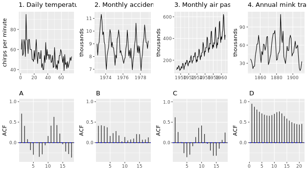

```{r setup, include=FALSE}
knitr::opts_chunk$set(echo = TRUE)
```

## Manual de uso de Series temporales en R
Este manual describe el uso de series temporales en R. Se detallan los paquetes utilizados y muchos ejemplos que muestran cómo desarrolar aplicaciones y programación sobre series temporales en el lenguaje R.

## CRear una serie temporal
las series temporales se almacenan como objetos `ts`en R. que constan de números junto con una información que indica el tiempo y que ordena los valores.

PAra crear una srie `ts` debemos especificar los datos, la fecha inicial y la frecuencia en la que se definen los datos:
ts(data, start, frequency, ...)

por ejemplo:
`usnim_ts = ts(usnim_2002[, 2], start = c(2002, 1), frequency = 4)`


```{r Series}
library(readxl)# paquete para lectura de Excel
# Read the data from Excel into R
mydata <- read_excel("exercise1.xlsx")

# Look at the first few lines of mydata
head(mydata)

# Create a ts object called myts
myts <- ts(mydata[,2:4], start = c(1981, 1), frequency = 4)
# Plot the data with facetting
autoplot(myts, facets = T)

# Plot the data without facetting
autoplot(myts, facets = F)

# Plot the three series
autoplot(gold)
autoplot(woolyrnq)
autoplot(gas)

# Find the outlier in the gold series
goldoutlier <- which.max(gold)

# Look at the seasonal frequencies of the three series
frequency(gold)
frequency(woolyrnq)
frequency(gas)
```
## Gráficas estacionales
UNa de las representaciones clásicas de la series temporales es su estacionalidad,

Una gráfica estacional es similar a una gráfica de tiempo excepto que los datos se dibujan en las "temporadas" individuales en las que se observaron los datos. Puede crear uno usando la función `ggseasonplot()` de la misma manera que lo hace con `autoplot()`.

Una variante interesante de una gráfica de temporada usa coordenadas polares, donde el eje de tiempo es circular en lugar de horizontal; para hacer uno, simplemente agregue un argumento polar y establézcalo en VERDADERO.

Una grafica de subseries comprende graficas mini para cada temporada. Aquí, la media de cada temporada se muestra como una línea horizontal azul.

Una forma de dividir una serie temporal es mediante el uso de la función `window()`, que extrae un subconjunto del objeto x observado entre los tiempos de inicio y fin.

`window (x, start = NULL, end = NULL)` 

En este ejercicio, cargará el paquete `fpp2` y usará dos de sus conjuntos de datos:

 * a10 contiene volúmenes de ventas mensuales de medicamentos antidiabéticos en Australia. En las parcelas, ¿puede ver qué mes tiene el mayor volumen de ventas cada año? ¿Qué es inusual sobre los resultados en marzo y abril de 2008?
 * ausbeer que contiene producción trimestral de cerveza para Australia. ¿Qué está pasando con la producción de cerveza en el cuarto trimestre?
 
Estos ejemplos te ayudarán a visualizar estos diagramas y comprender cómo pueden ser útiles.

###INSTRUCCIONES
100XP
Use library () para cargar el paquete fpp2.
Utilice autoplot () y ggseasonplot () para generar gráficos de los datos a10.
Utilice la función ggseasonplot () y su argumento polar para generar un gráfico de coordenadas polares para los datos a10.
Utilice la función window () para considerar solo los datos de ausbeer a partir de 1992.
Finalmente, use autoplot () y ggsubseriesplot () para producir gráficos de la serie de cerveza.
```{r}
# Load the fpp2 package
# install.packages("fpp2")
library(fpp2)

# Create plots of the a10 data
autoplot(a10)
ggseasonplot(a10)

# Produce a polar coordinate season plot for the a10 data
ggseasonplot(a10, polar = TRUE)

# Restrict the ausbeer data to start in 1992
beer <- window(ausbeer,start = 1992)

# Make plots of the beer data
autoplot(beer)
ggseasonplot(beer)
ggsubseriesplot(beer)
```
## Autocorrelación de series temporales no estacionales
Otra forma de ver los datos de series de tiempo es trazar cada observación contra otra observación que ocurrió algún tiempo anteriormente mediante `gglagplot()`.
Por ejemplo, puedes trazar y~t contra y~t-1. Esto se llama diagrama de retraso porque está trazando la serie temporal contra los rezagos de sí mismo.

Las correlaciones asociadas con los gráficos de retraso forman lo que se llama la función de autocorrelación (ACF). La función `ggAcf()` produce gráficos ACF.

En este ejercicio, trabajará con los datos de petróleo precargados (disponible en el paquete fpp2), que contiene la producción anual de petróleo en Arabia Saudita desde 1965 hasta 2013 (medida en millones de toneladas).

INSTRUCCIONES
100XP
Use la función autoplot () para trazar los datos de aceite.
Para los datos del petróleo, trace la relación entre yt y yt-k, k = 1, ..., 9 usando una de las dos funciones presentadas anteriormente. Mira cómo las relaciones cambian a medida que aumenta el retraso.
Del mismo modo, trazar las correlaciones asociadas con cada uno de los gráficos de retraso utilizando la nueva función apropiada.
Tome la sugerencia (-30xp)
```{r}
# Create an autoplot of the oil data
autoplot(oil)

# Create a lag plot of the oil data
gglagplot(oil)

# Create an ACF plot of the oil data
ggAcf(oil)
```
## Autocorrelación de series temporales estacionales y cíclicas
Cuando los datos son estacionales o cíclicos, el ACF alcanzará su punto máximo alrededor de los rezagos estacionales o en la duración promedio del ciclo.

Investigarás este fenómeno trazando la serie de manchas solares anuales (que sigue el ciclo solar de aproximadamente 10-11 años) en manchas solares `sunspot.year` y el tráfico diario al blog de Hyndsight (que sigue un patrón semanal de 7 días) en `hingsight`.

Ambos objetos se han cargado en su espacio de trabajo.

INSTRUCCIONES
100XP
Produzca un gráfico de tiempo y un gráfico de manchas solares de ACF.
Al observar el gráfico de ACF, ¿en qué valor de retraso (x) puede encontrar la autocorrelación máxima (y)? Establezca esto igual a maxlag_sunspot.
Produzca un gráfico de tiempo y un gráfico de ACF de hyndsight.
Al observar el gráfico de ACF, ¿en qué valor de retraso (x) puede encontrar la autocorrelación máxima (y)? Establezca esto igual a maxlag_hyndsight.

```{r}
# Plot the annual sunspot numbers
autoplot(sunspot.year)
ggAcf(sunspot.year)

# Save the lag corresponding to maximum autocorrelation
maxlag_sunspot <- 1

# Plot the traffic on the Hyndsight blog
autoplot(hyndsight)
ggAcf(hyndsight)

# Save the lag corresponding to maximum autocorrelation
maxlag_hyndsight <- 7
```
## Haga coincidir el ACF con la serie temporal
Ahora que ha visto trazados de ACF para varias series de tiempo, debería ser capaz de identificar características de la serie de tiempo solo desde la trama de ACF.

Haga corresponder los gráficos de ACF que se muestran (A-D) con sus gráficos de tiempo correspondientes (1-4).

1-B, 2-A, 3-D, 4-C



