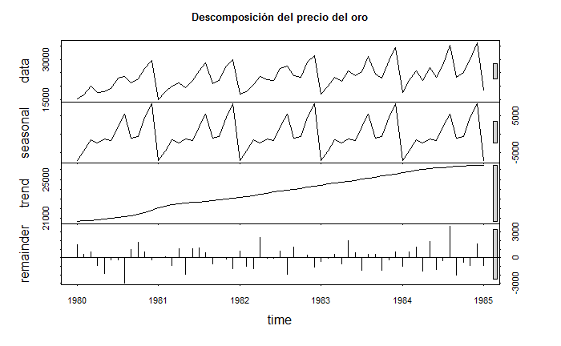
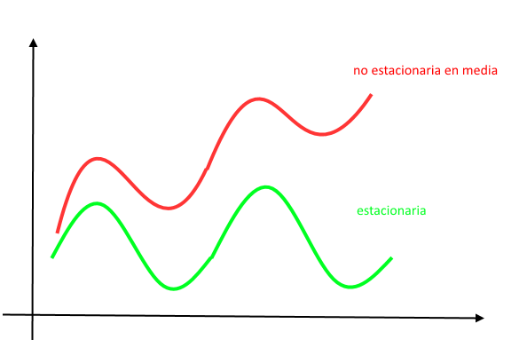
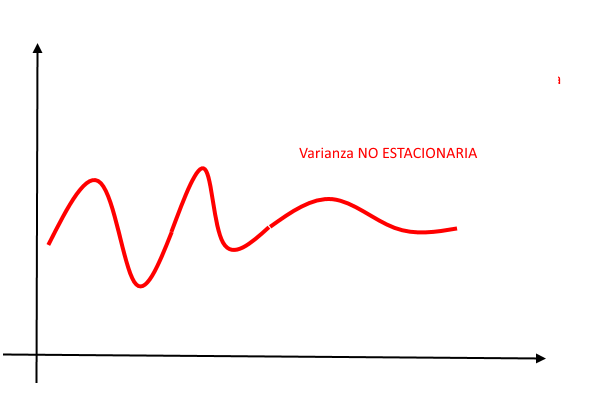
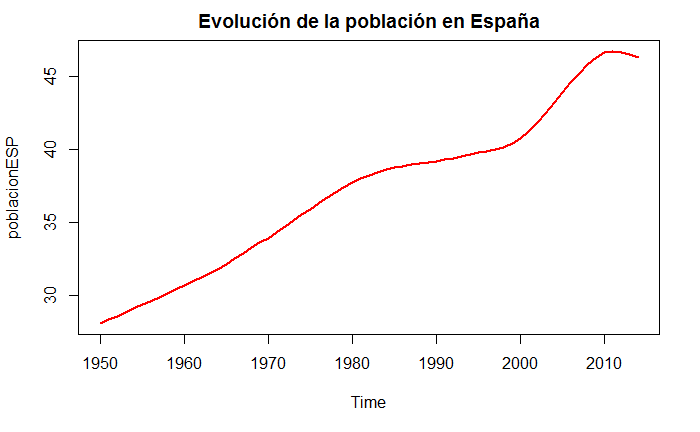
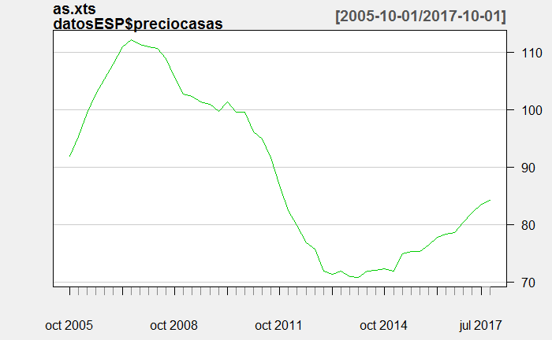
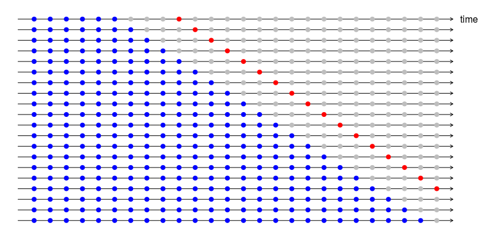
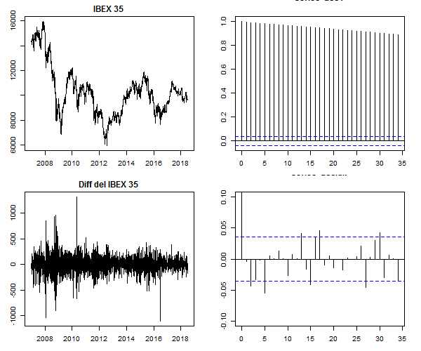
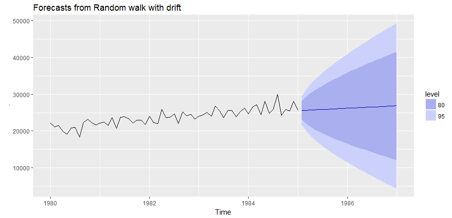
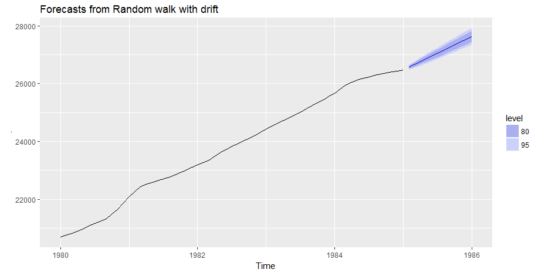
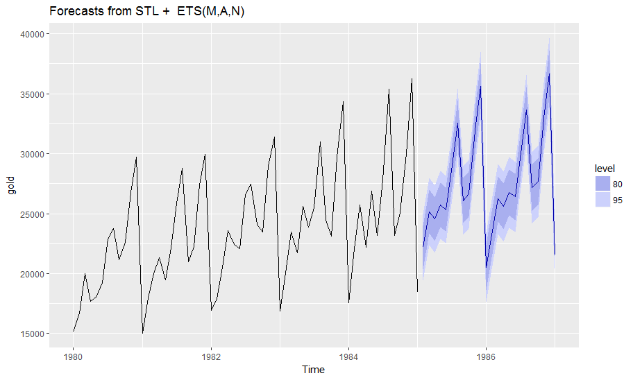

```{r setup, include=FALSE}
knitr::opts_chunk$set(echo = TRUE,
                    warning=FALSE,
                    message = FALSE)
```

# INTRODUCCIÓN
Este manual describe cómo trabajar con series temporales y cómo hacer pronósticos con ellas en R. Explicaremos los principales paquetes de $$R$$ que facilitan el uso de series temporales y muchos ejemplos prácticos que muestran casos concretos de análisis, aplicaciones y programación sobre datos temporales en este lenguaje.

Una serie temporal es una secuencia de datos, observaciones o valores, medidos en determinados momentos y ordenados cronológicamente. Los datos pueden estar espaciados a intervalos iguales o irregulares, normalmente las series sobre las que trabajaremos son series de intervalo regular, pues son las más fáciles de representar y analizar con funciones y librerías..

Las series temporales son pares de valores fecha-dato y uno de los usos principales es su análisis para predicción y pronóstico (así se hace por ejemplo con los datos climáticos, las acciones de bolsa, o las series de datos demográficos). 

Las series que utilizamos habitualmente son **univariadas*, lo que quiere decir que los datos se corresponden con observaciones secuenciales sobre intervalos de tiempo iguales (un dato al año, al día , hora). Si el tiempo entre observaciones es igual siempre, el tiempo no es necesario en los datos aunque esté implícito en ellos, y solo necesitamos una fecha inicial. 

## Clasificación de las series temporales
Existen muchas formas de clasificar las series temporales, cada vez que clasificamos algo pretendemos identificar patrones, grupos comunes que nos aporte información del comportamiento de los datos. Una vez identificado el grupo, nos permite focalizar y realizar un mejor análisis más orientado y eficaz.

Visualizar los datos es el punto de partida de cualquier análisis, porque en la gráfica se aprecian de forma  intuitiva las características de las series y se determina de manera natural la estructura de la serie, enfocando el análisis.

Existen muchas características de las series temporales, vamos a ver algunas de ellas que incluso son complementarias y yuxtapuestas, pero que se entienden  mejor al comparar con su par inverso:

### Tendendcia - ciclo - aleatoriedad

Una forma de ver las características de una serie temporal es según estas tres características, que se pueden dar deforma aditiva sobre una misma serie:

    1. **Series de tendencia.** Son aquellas que tienen una evolución creciente o decreciente en el tiempo.
    2. **Series estacionales** Son las que reflejan comportamientos de patrones periódicos asociados al calendario, o formas que se repiten en horas tiempos fijos. Las **Series Cíclicas.** serían las que tienen patrones de repetición que no se corresponden con calendarios fijos, se repiten en ciclos irregulares, mucho más difíciles de predecir.
    4. **Series aleatorias**. Son las que no se pueden predecir, las que son equivalentes a ruido blanco.
    
En las series estacionales, podemos pronosticar las temporadas de picos y valles, pero en las series cíclicas es algo más complicado pues la repetición del ciclo no es previsible por calendario. También interesa apreciar en los datos si existe una tendencia de fondo, de forma que pueda extraerse de los datos y aplicar diferentes modelos de predicción a cada uno de los componentes que forman la serie de observaciones.

Lo habitual es que una serie temporal sea mezcla y combinación de estos comportamientos (tendencia + estacionalidad + ruido), identificarlos facilitará el trabajo de análisis.

Existen funciones en R que descomponen una serie temporal $$X_t$$ en los 3 componentes principales  $$X_t=T_t+E_t+A_t$$ (tendencia + estacionalidad + ruido). Una de estas funciones es `sdl()` del paquete base y también la función `decompose()`.

Ejemplo: descomponemos los componentes estacionalidad + tendencia + ruido de la serie de cotizaciones del oro entre 1980 y 1985 almacenada en la variable `gold`.

```{r descom_oro, eval=FALSE}
    require(forecast) # la serie ejem: gold está en esta libreria
    
    # Aplicamos funcion de descomposición sdl()
    des.oro<-stl(gold,s.window = "periodic" )
    #Pintamos el resultado    
    plot(des.oro, main="Descomposición del precio del oro")
    #plot(decompose(gold))
```


### Estacionariedad 
Esta característica de las series indica si sus propiedades cambian o no cambian con el tiempo, es decir si por ejemplo la media, la varianza o la covarianza son constantes en la serie o por el contrario cambian a lo largo de las observaciones de forma significativa. En resumen, una serie estacionaria es aquella cuyas propiedades (media, varianza, covarianza) no dependen del periodo de observación en el que se miden. 

No confundir con estacional con estacionario, pues son conceptos diferentes, uno indica ciclos y el otro es una propiedad de los datos.

La *estacionariedad* es una propiedad muy importante, pues existen muchos análisis matemáticos que  describen muy bien las series estacionarias, y no tan bien las que no lo son, de hecho los modelos estadísticos de pronóstico de series temporales **sólo sirven para series estacionarias**.

Existen métodos que veremos para transformar una serie no estacionaria en otra que si lo es, y por tanto sobre la que podemos aplicar pronósticos estadísticos con armamento de análisis potente y fundamentado. Recordemos también que los modelos de pronostico no solo pueden ser estadísticos, hay cientos de modelos físicos y basados en otros conceptos que si funcionan con las series no estacionarias.

La estacionariedad puede darse en unas propiedades y no darse en otras, por lo que las transformaciones serán solo en la dirección que interese. La estacionariedad de la varianza, por ejemplo, se denomina **homoestacidad**.





Las series estacionales pueden abordarse, además de por los sistemas estadísticos, por otros métodos como el **análisis espectral** o de frecuencias. Consisten estos sistemas en la aplicación de la *transformada de Fourier* a los datos para descomponer la serie en combinación lineal de funciones trigonométricas (suma de funciones seno y coseno). 

Las gráficas asociadas a los métodos espectrales son el periodograma o espectro de frecuencias que está relacionado con la gráfica de autocorrelación. En el ejemplo siguiente se analizan las gráficas ACF y el periodograma de la serie de manchas solares anual, y como se ve el periodo de máxima autocorrelación de la gráfica de ACF que se corresponde con una retraso de 10 años, es equivalente a la frecuencia máxima del espectro de frecuencias en tormo a 0,1 ($$ 1/0,1=10$$)

```{r periodograma}
    acf(sunspot.year)
    spectrum(sunspot.year)

    # periodogram(sunspot.year)
```

### Autocorrelación
La autocorrelación (ACF) es una medida de la dependencia de los valores actuales respecto de los pasados en una serie temporal. Es una propiedad muy importante cuando se evalúa para diferentes periodos de retardo en las gráficas de autocorrelación que se generan con la función `acf()`. Cuando los valores son cercanos a 1 indica una relación lineal entre los valores pasado y futuros, si es cero es que no existe relación (lineal) apreciable y si es es -1 es que la dependencia es inversamente lineal.


### Ruido blanco
Se llama ruido blanco a una serie temporal completamente aleatoria **impredecible**, cuyas observaciones son independientes y están idénticamente distribuidas en el tiempo, con media cero y varianza constante.

Cuando hacemos la suma acumulada de una serie de observaciones de *ruido blanco* se nos genera lo que denominamos un *camino aleatorio* ( *randow walk*).

 
```{r ruidoblanco}
    # Generamos ruido blanco
    y<-rnorm(100)
    #par(mfrow=c(2,2))
    # pintamos la serie de ruido blanco
    plot(y, type="l")
    plot(acf(y)) # pintamos la grafica de autocorrelaciones
    # pintamos la serie de camino aleatorio
    plot(cumsum(y),type="l", main="cusum")
    plot(acf(cumsum(y)))

```

Existe una prueba denominada test de *Ljung-Box* que nos sirve para determinar si una serie temporal se comporta como ruido blanco o no. Si el resultado de `p` es un valor mayor que *0.05* se sugiere que los datos no son significativamente diferentes del ruido blanco, y si es inferior es posible que los datos sean predecibles pues se diferencian del ruido blanco, no son observaciones completamente independientes. Veremos esto en detalle en siguientes capítulos

## Estructura del libro

Se ha ordenado el manual en un formato progresivo, de manera que sirva de libro de consulta constante durante el trabajo y también de guía continua de aprendizaje, desde las nociones básicas, a las más complejas.

En primer lugar haremos un resumen completo de las formas de medida del tiempo en R, lo que nos permitirá entender mejor el funcionamiento de las series temporales, así como obtener conocimientos para realizar análisis alternativos, no solo con objetos de serie temporal sino con otras muy comunes como `data frame`.

El segundo capítulo está dedicado a obtener datos, a crear series temporales para ejemplos, o a obtenerlas de los múltiples orígenes que puedan darse (web, ficheros...). Se aportan ejemplos concretos de librerías para descarga de datos financieros que son unos datos muy demandados por usuarios de $$R$$.

En el tercer capítulo entramos al grano describiendo cómo realizar gráficos de series temporales, haremos un completo repaso por las múltiples funciones que existen, y que son más fáciles y atractivas.
También se detallan tipos de gráficos exclusivos de series temporales y que realizan análisis gráficos muy completos, como los gráficos estacionales, los de autocorrelación y retardo etc.

El cuarto capitulo está dedicado a las funciones de pronostico más simples y una introducción al completo paquete `forecast`que tiene elementos interesantes para los pronósticos.

El siguiente capitulo se muestra una introducción al análisis de los residuos, que es una forma de evaluar la bondad de las predicciones que realizamos con los modelos de pronostico.

El sexto capitulo se entra en los métodos de pronostico por regresión lineal.

El séptimo detalla las transformaciones en los datos, y cómo se pueden conseguir con ellas mejores pronósticos con simples cambios de base de los datos.


# MEDIDA DEL TIEMPO EN R

Antes de iniciarnos en el uso de series temporales vamos realizar un resumen de la medida del tiempo en R, qué clases existen, cómo se trabaja con fechas y datos de tiempo. Conocer estos tipos de datos no es imprescindible en el manejo de series temporales, pero nos permite tener un conocimiento profundo y mucho más completo de la teoría.

Los datos de tiempo (fechas y horas) son tratados en R Base mediante varios tipos de datos, objetos y clases. Estas clases almacenan internamente la fecha como el número de días o segundos transcurridos desde el 1 de enero de 1970 en la zona UTC.

R Base define principalmente 3 clases de datos fechados:

  1. Clase ***Date*** para las fechas diarias de calendario 
  2. Para las fechas horarias se usan dos clases:
    -  **POSIXct** es un **valor** numérico que representa el número de segundos desde 1/1/1970.
    -  **POSIXlt** es un objeto **lista** con distintas variables (sec,min,hour,mday,mon, year, wday, yday, isdst, zone, gmtoff)  
    
### Fecha diarias (Dates)

La clase `Dates` almacena solo datos _diarios_ que incluyen el año, mes y día de una fecha, pero no los tiempos inferiores a un día (ni horas, ni segundos por ejemplo).

Un fecha del tipo *Date* se puede asignar mediante código de la siguiente manera:

```{r}
  # Asignar una fecha
  x<- as.Date("1970-01-03")
  x  # se imprime como cadena de texto
  
  # pero podemos comprobar que internamente se almacena como 2
  # dos días despues del 1 de enero de 1970.
  unclass(x)
```


### Fechas completas `POSIXct` y `POSIXlt`

R almacena las fechas completas usando los estándar *POSIX* que incluyen una serie de características para homogeneizar el tipo complejo de datos de tiempos en diferentes sistemas operativos. POSIX es el acrónimo de *Portable Operating System Interface* y la X procede del sistema operativo $$\UNIX$$.
 
Ambas clases *POSIX* almacenan la fecha y hora como el número de segundos transcurridos desde el _1 de enero de 1970_. La clase `POSIXct` almacena internamente esta cifra como un número entero, mientras que la clase `POSIXlt` la descompone en una lista con elementos para los segundos, minutos, horas, día, mes y año.

En resumen:

    -  **POSIXct** es simplemente un numero entero que guarda el número de segundos desde 1/1/1970. Es útil cuando almacenamos tiempos en un data frame, pues ocupa menos espacio y solo una variable.
    -  **POSIXlt** es un objeto lista que almacena un bloque completo de información diferenciada, como el día, año, dia de la semana, día del mes etc.

Para recordar la diferencia es útil la nemotecnia de que el que finaliza en lt es una lista (`POSIXlt` $\rightarrow$ lt  = lista, `POSIXct` = entero) 

### librería `lubridate` funciones para fechas    

Para trabajar con fechas y horas es casi imprescindible cargar la librería `lubridate`. Este paquete nos facilita el uso analítico de los datos fechados:

  * `Sys.Date()` $\rightarrow$ fecha actual del sistema operativo
  * `now()` $\rightarrow$  fecha y hora del momento actual
  * `today()` $\rightarrow$ fecha `Date` de hoy
  * `weekdays()` $\rightarrow$ devuelve el día de la semana
  * `months()` $\rightarrow$ retorna el mes de la fecha
  * `quarters()` $\rightarrow$ retorna el cuatrimestre de la fecha (Q1,Q2,Q3 o Q4)
  
Otras funciones que permiten operaciones de tiempo son:

  * `difftime(fecha1, fecha2, units = "weeks")` $\rightarrow$ la diferencia en tiempo entre dos fechas.
  * `diff()` $\rightarrow$ aplicado a una serie temporal da la diferencia entre dos valores consecutivos de fecha.
  * `seq(dia.inicio, dia.fin,length=10, by=2)`$\rightarrow$ crea una secuencia de fechas.

Una forma alternativa y útil para acceder a un valor concreto dentro de una fecha (por ejemplo el año, el día de una fecha) es hacer la llamada a las propiedades de la variable usando el símbolo `$` en la forma `varfecha$mday`:

  * `sec`: segundos 
  * `min`: minutos de la fecha
  * `hour`: hora
  * `mday`: día del mes
  * `mon`: mes
  * `year`: año desde 1900. Por lo que debemos sumar esto si queremos el año real
  * `wday`: día de la semana (0 domingo - 6 sábado)

Veamos un ejemplo práctico:
```{r ejemplo_lubridate}
  # guardamos la fecha actual del sistema en x
  x <- Sys.time()
  x
  # Convertimos es fecha en la clase POSIXlt (la más completa con la lista)
  fecha_x <- as.POSIXlt(x)
  # imprimimos los nombres de las variables de la clase POSIXlt
  names(unclass(fecha_x))
  # Para sacar el dato de cualquiera de ellos basta escribir:
  #  nombre del objeto + $ nombre_variable
  fecha_x$sec
  fecha_x$wday
  
  # cambiamos el objeto a POSIXct
  fecha_x<-as.POSIXct(fecha_x)
  unclass(fecha_x)
  #solo almacena este gran entero con los segundos desde 1/1/1970
  
  # Generamos una secuencia de días
  dia1=as.Date("25/05/2017",format="%d/%m/%Y")
  dia2=as.Date("10/06/2017",format="%d/%m/%Y")
  seq(dia1,dia2, by=1)
  seq(dia1,length=10,by=1)
  seq(dia1,dia2, by="week")
```

### Conversión de texto a fecha `strptime` 
Cuando el formato de partida que contiene la fecha es un texto, la función _strptime()_ es una manera sencilla de convertirlo en la clase de tiempo, es decir pasar una cadena en formato texto a la clase `POSIX`. La función toma como parámetros de entrada la lista de texto con las fechas y también hay que decirle qué formato tienen dichos textos de entrada.

```{r ejem_strptime}
  # Convertir texto en fecha
  # Ejemplo 1
  x <- c("1 ene 1960 12:37", "2 abr 1990 23:00", "7 jul 1975 15:15")
  # para convertir estos textos con fechas a formato de tiempo de R
  z <- strptime(x, "%d %b %Y %H:%M")
  z
  class(z)
  
  #ahora podemos acceder a los datos de esta forma sencilla
  z$year # nos da el año
  z$mon  # nos devuelve el mes
  z$wday # nos devuelve el día de la semana
  z$mday # devuelve el día del mes
  
  
  # Ejemplo 2 . cambiamos el formato de entrada
  x <- c("1/1/60 12:37", "2/4/90 23:00", "7/7/75 15:15")
  z <- strptime(x, "%d/%m/%y %R") # notese el cambio de formato
  z
```


### Operaciones con fechas y tiempos

Podemos realizar operaciones con fechas y tiempos siempre que los objetos que intervengan pertenezcan a la misma clase. Es decir, un objeto _Date_ no puede sumarse a otro _POSIXlt_, debemos primero convertirlos a la misma clase.

```{r}
  x<- as.Date("2015-03-24")
  y <-as.POSIXlt("2016-03-24 12:10")
  
  # probamos a restar dos objetos de diferentes clases
  # y-x # esto da error 
  
  # Convertimos x a clase POSIXlt
  x<-as.POSIXlt(x)
  y-x
  # ahora la resta es posible
```

Los objetos POSIX tienen una propiedad que permite especificar la zona horaria en la forma `y<-as.POSIXct("2016-03-24 12:10", tz="GMT")`

### Funciones adicionales de `lubridate`

Este paquete añade funciones que facilitan la manipulación de fechas expresadas en la clase POSIXct. La conversión de caracteres a dicha clase puede hacerse utilizando las funciones definidas por combinaciones de las letras d, m, y (day, month, year) y h, m, s (horas, minutos y segundos). 

Este sistema facilita la entrada de datos a R, por ejemplo $dmy_hms$ espera *día-mes-año-horas-minutos-segundos* en ese orden; si usamos $ymd_h$ espera *año-mes-dia-hora* en el mismo orden

Veamos un ejemplo:

```{r}
  require(lubridate)
  library(lubridate)
  
  fecha1=ymd_hms("2016-02-23 18:15:09") 
  fecha1
  
  fecha2=dmy_hm("12/3/1975 23:24")
  fecha2
  
  fecha3=dmy("6 7 1975")
  fecha3
  
  # Extraemos valores de mes, semana, y día de la semana de fechas
  month(fecha2)
  week(fecha3)
  wday(fecha3)
```
### Extraer información de un fecha
Para obtener una información concreta de una fecha u hora se utilizan las funciones, second(), minute(), hour(), day(), wday(), yday(), week(), month(), year() y tz(), para la zona horaria.

```{r}
  fecha.actual<-now()
  
  # Extraemos información de dicha fecha
  year(fecha.actual) # año
  month(fecha.actual) # mes
  wday(fecha.actual,label = TRUE) # dia de la semana
  minute(fecha.actual) # minutos

```

### Aritmétrica con fechas y horas

La suma de fechas con `lubridate` se hace usando la función *difftime(fecha1,fecha2, units="days")*, en units podemos especificar la unidad de fecha para el resultado entre las siguientes:“auto”, “secs”, “mins”, “hours”, “days”, “weeks”

```{r}
  d1 <- as.Date("01 marzo 1950", "%d %B %Y")
  d2 <- as.Date(c("01 abril 1955", "01 julio 1980"), "%d %B %Y")
  
  difftime(d2,d1,units = "weeks")
```

También pueden ser tratadas en R como una nueva clase de objeto que se llama intervalo.

```{r}
  # hay que cargar el paquete lubridate
  require("lubridate")
  # Creamos un intervalo
  congreso_inicio <- ymd_hm("20170528 12:00")
  congreso_fin <- ymd_hm("20170604 10:00") 
  duracion_congreso <-  difftime(congreso_fin,congreso_inicio)
  # Para verlo en unidades enteras de fecha es mejor pasarlo a periodo
  as.period(duracion_congreso)
  
  # Si no solo queremos la diferencia de fechas sino usarlo como intervalo
  # tenemos que crear el objeto 
  duracion_congreso <- interval(congreso_inicio,congreso_fin)
  # Tambien podía definirlo así:
  congreso_inicio %--% congreso_fin

  # Ejem. tengo programada una visita a Madrid en la fecha
  visita_Madrid<-ymd("20170601")
  # quiero saber si coincide con el congreso
  visita_Madrid %within% duracion_congreso
  
  # Cual es la duración del congreso en días
  duracion_congreso / days(1)
  # y en semanas
  duracion_congreso / weeks(1)

```
Para convertir entre intervalos, duraciones o periodos se usan las funciones `as.interval()`, `as.period()`, y `as.duration()`.

Con la aritmética simple podemos generar series temporales de manera sencilla añadiendo o sustrayendo periodos de tiempo a una fecha:

```{r}
  # Inicio de la serie el 15 de mayo de 2017
  inicio<-dmy_hm("15052017 10:00")
  # Sumamos una semana 4 veces
  serie <- inicio + weeks(0:4)
  serie
```

# OBTENER DATOS
Para empezar y aprender necesitamos datos y ejemplos sencillos en los que podamos manipular y probar el código. En este capitulo mostraremos algunas de las formas de obtener datos de series temporales de manera que podamos iniciar nuestra práctica con elementos reales.

Solo vamos a describir de forma breve solo algunas de las fuentes de datos. En primer lugar los propios datos de R base, que tiene bastantes, y después muchas librarías y funciones útiles para descarga de datos de series web. Otra forma es crear los datos uno mismo, por ello explicaremos también de forma sencilla cómo crear series de prueba aleatorias para uso de enseñanza y aprendizaje.

## Datos ejemplo en R base
El programa básico de R contienen un montón de datos de ejemplo que podemos usar en la práctica. Estos datos están contenidos en el paquete `datasets` y contiene ejemplos de  múltiples formatos: data frames, series ts, matrices, vectores.

Para ver todos los datos disponibles hay que ejecutar el comando `data()` en R, así conseguimos que nos muestre una lista completa de todos los objetos de datos almacenados de ejemplo. Entre estos hay varios de series temporales.


Por ejemplo usaremos los datos de *Nile* que contiene observaciones de caudal máximo del río Nilo para este primer script.

```{r datosNilo}
    # Ejemplos de datos en datasets:
    # Serie de caudales del Nilo
    str(Nile) # vemos qué contiene Nile
    
    plot(Nile, main="caudal máximo anual del río Nilo", col="blue") # pintamos la serie temporal
    
    # Otro ejemplo de R Base es AirPassengers
    plot.ts(AirPassengers, main="Num pasajeros internacionales por mes entre 1949-1960", xlab="año" )
    # datos de manchas solares, diarios, mensuales y anuales
    #plot(sunspot.month)
    plot(sunspot.year)
```

Muchas de las librerías relacionadas con los datos contienen ejemplos incluidos en el código del paquete. La libraría `forecast`que usaremos profusamente en este manual tiene varias series temporales de diferentes características que pueden usarse de ejemplo (gold, WWWusage...)

### Resumen de datos temporales de ejemplo

    - sunspot, sunspot.month y sunspot.year :Número de manchas solares medias mensuales de 1749 a 1983. Recolectado en el Observatorio Federal Suizo, Zúrich hasta 1960, luego el Observatorio Astronómico de Tokio.
    - Nile : Mediciones del caudal anual del río Nilo en Aswan, 1871-1970, en $$10^8 m^3$$.
    - EuStockMarkets: precios de cierre diarios de los principales índices bursátiles europeos: Alemania DAX (Ibis), Suiza SMI, Francia CAC y Reino Unido FTSE. Los fines de semana y fiestas se omiten. 
    - WWWusage: del paquete `forecast`.Una serie temporal con el número de usuarios conectados a Internet a través de un servidor cada minuto.
    - gold: del paquete `forecast`. Precios diarios de oro por la mañana en dólares estadounidenses. 1 de enero de 1985 - 31 de marzo de 1989.
    - wineind: del paquete `forecast` Ventas totales de vinos australianos por fabricantes de vino en botellas <= 1 litro. Enero de 1980 - agosto de 1994.
    
## Lectura de ficheros locales
Otra opción simple es la lectura de ficheros locales, como hojas excel o ficheros `csv`.
Recordamos en un ejemplo cómo realizar la lectura de un fichero.

```{r eval=FALSE}
    # Lectura de ficheros separados por comas:
    datos<-read.csv("filename.txt", header = FALSE)
    
    # Lectura de ficheros separados por tab
    datos<-read.table("filename.txt", sep="\t", header = FALSE)
    
    # Por defeco se lee columnas de texto como factores, pero si no queremos eso hacemos
    datos<-read.table("filename.txt", sep="\t", header = FALSE, stringsAsFactors = FALSE)
```

Otra opción interesante es copiar directamente del porta-papeles o de una url web:

```{r eval=FALSE}
# para leer lo copiado en el portapapeles de windwows
datos<-read.table(file="clipboard", sep="\t",header=TRUE)

# para ller de una url web
datos<-read.csv("http://mitablas/aa.csv")

```

Además siempre podemos recurrir al paquete `rio` que simplifica la importación y exportación de ficheros al máximo, con dos únicas funciones (export, import).

```{r eval=FALSE}
    #install.packages("rio")
    library(rio)
    # uso de export
    export(mtcars, "coches.csv")
    
    # uso de import
    x <- import("coches.csv")
```


## Lectura de datos de internet

Existen multitud de webs de *open data* en las que podemos conseguir información de calidad de administraciones y gobiernos. Normalmente hay que bucear en ellas para buscar datos, y una vez que seleccionamos o tenemos a la vista la tabla resultado nos dan la opción de *descarga de ficheros* en un formato estándar como *csv*, o *json*. Copiando estos enlaces a R podemos hacer descargas directas de los datos a nuestro sistema.

Vamos a poner un ejemplo de lectura de datos desde Internet de la web de datos abiertos de la Región de Murcia (<http://datosabiertos.regiondemurcia.es>), es una de tantas paginas oficiales con administración transparente y de volcado de datos públicos. Usaremos esta web para descargar el fichero de datos diarios de la estación meteorológica MU62 situada en la Alberca Murcia y pintar una gráfica de temperaturas máximas. Usaremos el objeto temporal xts que veremos más adelante en este libro.

```{r leerinternet}
    # leemos un fichero de datos meteorologicos obtenido de la web
    #  datosabiertos.regiondemurcia.es 
    # http://datosabiertos.regiondemurcia.es/carm/catalogo/medio-ambiente/informe-meteorologico-diario-carm-anos-2000-a-2017-estacion-meteorologica-mu62
    
    rutafichero<-"https://datosabiertos.carm.es/odata/Agricultura/IMIDA_Diario_MU62.csv"
    
    # Leemos los datos en formato csv directamente desde la url anterior
    datos_meteo<-read.csv(rutafichero)
    # vemos la estructura de los datos leídos
    str(datos_meteo)
    
    require(xts) # para objeto xts
    require(ggplot2) # para autoplot
    
    # creamos un objeto xts con los datos de tmax leídos 
    # para crear un xts(valores, order.by=...fechas)
    stmax <- xts(datos_meteo$tmax, order.by = as.Date(datos_meteo$fecha, format = "%d/%m/%Y")) 
    
    #Graficamos los datos del 2005 al 2008
    autoplot(stmax["2005/2007"], geom = c("line"), color="red") + xlab("año")

```


## Crear objetos temporales `ts`
Existen varias opciones para trabajar con series temporales. La más simple es usar el objeto `ts` de R, pensado para series de tipo anual, mensual e intervalos regulares. Esta función sirve para crear y definir una serie temporal a partir de los datos, fechas y frecuencia: `y <- ts(datos, star=fecha_inicio, end= fecha_fin, frecuency=frecuencia)`. Como está pensada para datos anuales, una frecuencia de 12 indicará datos mensuales, de 4 trimestrales.


```{r series_temporales}
    require(forecast)
    # Creamos una serie de 24 datos aleatorios para trabajar
    # como suma acumulada de una normal x10
    datos <- cumsum(rnorm(24)*10)
    # pintamos los datos
    plot(datos, type="l")

    # Creamos la serie temporal asumiendo que son datos trimestrales (cuartos de año)
    # y que se inician en julio de 1990
    # 12= mensuales
    # 4= cada 4 meses
    mits <- ts(datos, start = c(1990,3), frequency = 4)
    mits
    # Pintamos nuevamente los datos 
    plot(mits)
    # otra forma de ver resumen completo de la serie temporal
    tsdisplay(mits)
    # Calculamos el maximo de la serie
     which.max(mits)
     frequency(mits)
```

En el siguiente ejemplo representaremos varias series temporales en la misma escala y gráfica con la función plot.

```{r}
    # ejemplo para pintar varias series juntas en la misma grafica
    # Generamos 3 series aleatorias mensuales
    z <- ts(matrix(rnorm(300), 100, 3), start = c(1961, 1), frequency = 12)
    z[,2]<-z[,2]+5 # sumo 5 a la serie=col 3
    z[,3]<-z[,3]-5 # resto 5 a la serie=col 3
    
    class(z)
    head(z) # as "matrix"
    # pintamos las series con plot y con plot single
    plot(z)
    
    plot(z, plot.type = "single", lty = 1:3, col=c(1:3))
```


Vamos a crear también una serie temporal cíclica con números aleatorios:

```{r}
    st_estac <- sin(seq(0.1*pi, 10*pi, 0.1*pi))
    
    # generamos una lista de 100 numero aleatorios de media 0 y standard deviation de 0.2
    err <- rnorm(length(st_estac),0, 0.2) #note: length(aSeq)=100
    st_estac <- st_estac + err
    
    	
    #creating a monthly time series, beginning at January 2001
    st_estac<- ts(st_estac, freq = 12, start=c(2005,1))
    plot.ts(st_estac, col="red")

```

### Dividir series temporales ts
En muchas ocasiones nos interesa extraer una parte de la serie temporal, dividir una serie para obtener dos o mas subconjuntos. Esto lo podemos hacer con la función `window()`. Veamos un ejemplo.

```{r}
    # ejemplo de uso de window para extraer el año 1993 de los datos
    # recordemos que son datos trimestrales (4 datos al año)
    # Usamos la serie generada en el ejmplo anterior
    ano93 <- window(mits, start = 1993, end = c(1993,4))
    ano93

    plot(ano93)
```
### Objeto `xts`
Aunque existen muchos objetos creados en R para el manejo de Series temporales, es `xts` el estándar que ha permitido la gestión eficiente de las series temporales y ha conseguido aglutinar en un mismo objeto las características comunes a todos los que necesitan implementar valores de series en el tiempo.

Uno de los defectos que encontramos en el uso de `ts` como objeto temporal es que muchas veces obtenemos datos fechados sin que tengamos necesidad de indicar el inicio y fin del periodo. Un objeto `xts` almacena los datos como `coredata` y las fechas o tiempo como `index`admitiendo una variedad amplia de formatos de tiempo. En el núcleo de un objeto `xts` está `zoo`.

En el ejemplo siguiente veremos muchas formas de usar `xts`, por ejemplo para extraer los datos de la fecha de una objeto `xts`se usa la función `index(objet_xts)`esto no ahorrará muchos dolores de cabeza buscando la forma trabajar con las fechas de la serie.
 
```{r xts_ejemplo}
    library(xts)
    # creamos de nuevo una serie aleatoria temporal
    datostem <- cumsum(rnorm(60)*10)
    datostem <- ts(datostem, start = c(2010,3), frequency = 12)
    
    # convertimos el objeto del ejemplo anterior mits en xts
    xts1<-as.xts(datostem)
    class(xts1)
    head(xts1)    
    
    # La forma habitual de crear una serie xts será así:
    require(rio)
      dat.bit<-import("bitcoinity_data.csv")
      xts1 <- xts(dat.bit$price, order.by=as.Date(dat.bit$Time, "%Y-%m-%d %R"))
    
    # extraemos solo lo datos de xts 
    head(coredata(xts1))
    # vemos el indice de tiempo almacenado en xts
    index(xts1)
    indexClass(xts1) # tipo de fechas usadas
    indexFormat(xts1) # formato de las fechas
    tzone(xts1) # Zona Horaria
    
    # otra forma de verlo todo a la vez es con el comando
        .index(xts1)
    # nos dice el día de la semana del indice
    .indexwday(xts1)

    # periodicidad de la serie temporal
    periodicity(xts1)
    nmonths(xts1) # cuenta el numero de meses de la serie
    nyears(xts1) # cuenta el numero de años
    
    # seleccion de un año con xts
    xts1["2013"]
    # seleccion en un intervalo de fechas
    xts1["20111101/20130705"]
    
    # Tambien se permiten calculos de retraso o diferencia
    head(lag(xts1,2)) # crea una serie con retraso de un intervalo
    head(diff(xts1,3)) # crea una serie con la diferencia del 3 intervalo
    
    # conversion de frecuencia de los datos
    datos_ano<-to.period(xts1, period = "years",OHLC = FALSE)
    head(datos_ano )
    
    # uso de splits
    split(xts1 , f = "years")
    # uso de lapply
    lapply(xts1, FUN = cumsum)
    
```


## Librería `Quandl`
El paquete `Quandl` da acceso desde R a la amplia base de datos del mismo nombre. `Quandl` ofrece datos financieros de múltiples fuentes, algunos de forma gratuita y otros en formato premium que requiere inscripción e incluso pago.

El primer paso para usar `Quandl` es registrar un nuevo usuario en el sitio web. Poco después, hay que ir a la configuración de la cuenta y hacer clic en **API KEY**. Esta página debe mostrar un código, como este: *LDgg4c7zsTgLLxyHj*. Este código lo usaremos para la conexión.

La gente `Quandl` ha desarrollado una API especifica para R bastante sencilla de usar. Hay muchos datos libres,como por ejemplo todos los datos económicos mundiales de la [FRED](https://fred.stlouisfed.org/categories). Para obtener el listado completo de datos que ofrece la librería podemos ir a su web y buscar el nombre de la serie especifica que buscamos <https://www.quandl.com/data/>. Veamos un ejemplo.


```{r eval=FALSE}
    # install.packages("Quandl")
    require(Quandl)
    # creamos el API KEY para la conexión
    Quandl.api_key("LDgg4c7zsTgLLxyHj.")

    # obtenemos datos: serie temporal población en España
    poblacionESP<-Quandl("FRED/POPTTLESA148NRUG",type="ts")
    
    # podemos especificar las fechas de inicio y fin:
    # Quandl("FRED/GDPPOT", start_date="2005-01-03",end_date="2013-04-10",type="xts")

    plot(poblacionESP, main="Evolución de la población en España",type= "l",col="red",lwd=2)
```



La web de `Quandl` incluso facilita el propio script de R para el dato que buscas, por ejemplo mira aquí: <https://www.quandl.com/data/FRED/GDPPOT-Real-Potential-Gross-Domestic-Product>


## Librería `quandmod`

Para obtener datos de bolsa y valores `quandmod` es una librería interesante que contienen la función `getSymbols()`. Esta función permite extraer de las webs de yahoo, FRED y alguna más los datos diarios de acciones, fondos e índices. Por desgracia *Google* bloqueó recientemente el acceso a *getSymbols*.

Para descargar un valor entre fechas es necesario conocer el TICKER del valor y usar la función como sigue, por cierto los datos se almacenan en un objeto `xts`.

```{r ejemplo_quantmod}
    require(quantmod)

    acc1 <- getSymbols("TEF.MC", 
                       src ="yahoo",
                       periodicity = "monthly",
                       warning= "FALSE",
                       adjust = TRUE,
                       auto.assign=FALSE)
    require(ggplot2)    
    autoplot(Cl(acc1),main="Telefónica MC")
    
```

## Librería `BatchGetSymbols`
Esta librería es similar a `quantmod`, pero para análisis de varios valores puede tener alguna ventaja al estructurar mejor los datos en una única *data frame*.

```{r eval=FALSE}
    # esta librería no funcion con R nuevo
    library("BatchGetSymbols")
    # Cargamos varios tickers de empresas
    mis.valores <- c('MSFT','GOOGL','JPM','GE')
    
    # establecemos las fechas
    fecha.ini <- Sys.Date()-30
    fecha.fin <- Sys.Date()
    
    datosvalores<- BatchGetSymbols(tickers = mis.valores,
                             first.date = fecha.ini,
                             last.date = fecha.fin )
```

## ustyc
El paquete `ustyc` permite la descarga de los datos de la curva de interés del  Departamento del Tesoro de EE.UU. La curva de intereses es el tipo que un inversor recibiría por los bonos a diferentes vencimientos. Los valores de los rendimientos se basan en los precios de los instrumentos de deuda del gobierno de EE.UU. negociados en el mercado secundario. 

Dado que estos bonos tienen un riesgo de incumplimiento mínimo, estos valores se utilizan comúnmente como puntos de referencia para rendimientos sin riesgo en los mercados financieros.

Usar el paquete ustyc es muy simple. Todo lo que necesita hacer es llamar a la función `getYieldCurve`. En el siguiente ejemplo, descargaremos la curva de rendimiento para el año 2017.

```{r}
    library(ustyc)
    # obtener lacurva de rendimiento
    my.yield.curve <- getYieldCurve(year = 2017)
    print(head(my.yield.curve$df))
```

## Datos de Bitcoin y otras criptomonedas
Otra fuente de datos de interés son las nuevas criptomonedas y el Bitcoin (BTC). 

### `coinmarketcapr`
Uno de los paquetes más interesantes es `coinmarketcapr` con el que podemos descargar las series temporales de valoración de criptos que usa la web <https://coinmarketcap.com/> y muchas funciones variadas de control del estado de mercado:

```{r}
    library(coinmarketcapr)
    # funcion plot_top_5_currencies
    # pinta el valor de las 5 primeras criptos en capitalización
    plot_top_5_currencies()

    # funcion get_marketcap_ticker_all
    # nos da el precio actual de cada cripto frente al $ y BTC
    market_today <- get_marketcap_ticker_all()
    head(market_today[,1:8])
```

### `RBitcoin`

Otro paquete que vale la pena mencionar es [RBitcoin](https://github.com/jangorecki/Rbitcoin). Permite el acceso a los datos comerciales de varias casa de cambio de Bitcoin. Vamos a mostrar un ejemplo simple de importación de datos desde el exchange de intercambio [kraken](https://www.kraken.com/).

```{r bitcoin}
    #install.packages("Rbitcoin", repos=c("https://jangorecki.gitlab.io/Rbitcoin","https://cran.rstudio.com"))
    
    library(Rbitcoin)
    # ver precios en exchanges
    market <- "kraken"
    #currency_pair <- c("BTC","EUR")
    currency_pair <- c("LTC","EUR")
    ticker <- market.api.process(market, currency_pair, "ticker")
    ticker
    
    # CONVERSION DE VALORES
    fromBTC(1) # el precio actual de BTC en USD
    fromBTC(1, "EUR") # el precio actual de BTC en euros
    
    toBTC(150, "EUR") # convertir 150 EUROS a BTC
    
    # acceso a la blockchain
    # a wallet
    monedero <- blockchain.api.process('1A1zP1eP5QGefi2DMPTfTL5SLmv7DivfNa')
    str(monedero)
    
    # Acceso a las transacciones
    tx <- blockchain.api.process('e5c4de1c70cb6d60db53410e871e9cab6a0ba75404360bf4cda1b993e58d45f8')
    str(tx, max.level=1)
```

### `coindeskr`
Otro paquete interesante es `coindeskr`, que extrae de la web de noticias mas famosa del sector <https://www.coindesk.com/> el precio del bitcoin y otras cosas interesantes. La información de la libraría está en: <https://cran.r-project.org/web/packages/coindeskr/coindeskr.pdf>

```{r coindeskr}
    # Intalamos el paquete
    #install.packages('coindeskr')
    library(coindeskr) #R-Package connecting to Coindesk API
    
    # obtenemos el precio de los ultimos 31 días (ultimo mes)
    last31 <- get_last31days_price() 
    # pintamos le resultado
    plot.ts(last31)
    
    # obtenemos los precios historicos del cambio BTC EUR
    precios100_dias<-get_historic_price(currency = "EUR", start = Sys.Date() - 100,end = Sys.Date() )
    plot.ts(precios100_dias)
    
```

### Enlaces de datos
Algunas paginas web dan un servicio directo de descarga de datos en formato csv, por ejemplo los datos de cambio de BTC están disponibles en este sistema en: <http://data.bitcoinity.org/markets/price_volume/all/USD?t=lb&vu=curr>

De esta página hemos descargado el fichero *bitcoinity_data.csv* con los precios históricos y volumen de BTC.

```{r ejem_rio}
    #Leemos el fichero
    require(rio)
    dat.bit<-import("bitcoinity_data.csv")
    plot.ts(dat.bit$price)
    
    # Como vemos no coge bien las fechas por lo que debemos hacer una conversión forzada
    # usando la libraría xts.
    library(xts)
    dat.xts.bit <- xts(dat.bit$price, order.by=as.Date(dat.bit$Time, "%Y-%m-%d %R"))
    # pintamos el logaritmo de la serie para comprender mejor los cambios de escala
    autoplot(log(dat.xts.bit))
    
    #otra opcion es usar zoo
    require(zoo)
    dd<- read.zoo(dat.bit[,1:2],header = TRUE, format = "%Y-%m-%d %R")
    plot(dd)
    
    # agregamos a valores mensuales por año yearamon
    dd.mes<-as.zooreg(aggregate(dd, as.yearmon,max),freq=12)
    tail(dd.mes)
```

# GRÁFICAS DE SERIES TEMPORALES
Hemos visto como manejar objetos de tiempo en R, con las clases: `Date`, `POSIXlt` y `POSIXct`, estas clases nos facilitan el trabajo de fechas, pero las series temporales son algo más complejas pues además del fechado está el otro par del conjunto que lo forma el valor.

En las series de intervalo regular nos podemos olvidar del fechado para trabajo analítico y quedarnos solo con el valor y el orden cronológico de dichos datos. Esto facilita el trabajo y amplia las posibilidades de cálculo.

Vamos a ver en este capitulo cómo pintar objetos de serie temporal en R para producir desde gráficos sencillos a otros complejos con tratamiento implícito de los datos como los estacionales o los de ACF.

## Funciones básicas de trazado de series temporales
Cuando usamos el comando `plot()` para representar series temporales R reconoce automáticamente el origen de los datos y ejecuta la función `plot.ts()`. Esta función adapta los ejes de abscisas al formato de fecha que tenga la serie temporal así como algunas otras características gráficas.

Otra de las funciones que permiten dibujar series temporales es `ggplot`, y en concreto el comando `autoplot()`.

```{r leer_datos_bolsa}
    # Vamos a leer unos datos temporales de la FRED 
    # para su representación grafica posterior:
    # desempleo datos ESP trimestrales
    desESP <- getSymbols("LRUN64TTESQ156N", 
                       src ="FRED",
                       warning= "FALSE",
                       adjust = TRUE,
                       auto.assign=FALSE)  
    # precio vivienda ESP datos trimestrales
    pcasasESP <- getSymbols("QESN628BIS", 
                       src ="FRED",
                       warning= "FALSE",
                       adjust = TRUE,
                       auto.assign=FALSE) 
    
    # Unimos las dos variables
    datosESP<- cbind(desESP,pcasasESP)
    # Eliminamos las filas sin ambos datos
    datosESP<-datosESP[complete.cases(datosESP),]
```


## Gráficas estandar 
Describimos las funciones sencillas para pintar gráficas temporales. Es un asunto delicado, pues nos encontraremos que en muchas ocasiones, las funciones habituales de trazado no pintan las gráficas correctamente, o no interpretan las fechas que están almacenadas en los objetos `ts`, `xts`, u otros.
En ocasiones manejaremos dataframes, que son los objetos más comunes, y no sabremos cómo pintar las fechas correctamente, bien porque están en los nombres de fila o porque proceden de un objeto xts.
Estas cuestiones las intentaremos aclarar en este apartado que será consulta obligada para el que se inicia en series temporales.

###`plot.xts`
El formato más completo para trabajar con series temporales es `xts`, pues los datos de objetos `ts` están más limitados, por ejemplo requieren datos de frecuencia uniforme y sin huecos mientras que `xts`no.

Por esto la forma habitual de pintar una gráfica temporal es como `plot.xts()`, esta función produce gráficas por defecto que detectan las fechas y pinta correctamente los datos.

```{r eval=FALSE}
    # pintamos una grafica como plot.xts
    plot.xts(datosESP)

```


### `autoplot` 
Otro tipo de gráfico comodín al que recurrir con frecuencia es `autoplot`. Es una versión simplificada de `ggplot` que no necesita de la definición detallada de los parámetros y por tanto es más sencilla de usar que la función original de la librería `ggplot2`. Cuando la función detecta una serie temporal la función real que ejecuta es `autoplot.zoo()`.

```{r eval=FALSE}
    # pintamos una grafica como plot.xts
    autoplot(datosESP)
    
    #Calculamos 3 funciones de pronostico de los datos a h=10
        y <-forecast(datosESP$desempleo, h=10) # ets pronostico
        y2<-rwf(datosESP$desempleo,h=10,drift=TRUE)
        y3<-naive(datosESP$desempleo,h=10)
        
    # pintamos los 3 pronosticos en la misma gráfica
        autoplot(y, PI=T) +  #PI=false indica la banda no se muestra
            autolayer(y2, PI=F, col="red") + # añadir capas a autoplot
            autolayer(y3, PI=F, col="green")

```
 
### `plot.zoo`
Las funciones de trazado de `zoo`para series temporales son de las mejores y están expresamente pensadas para crear gráficas claras y atractivas. 

```{r eval=FALSE}
    # Muestra de plot.zoo
    plot.zoo(datosESP,col=c("blue","red"), xlab="Año")
```
### Otras funciones gráficas
Existen multitud de librerías gráficas en R. Para usar con serie temporales suelen ser apropiadas las librerías financieras que contienen funciones gratificas adaptadas y en algún caso muy buenas, también otras librerías especializadas en gráficos interactivos como dygraphs, vemos algunas de ellas.

Las funciones `chartSeries` y `barChart` de la librería `quandmod`, o la función `chart.TimeSeries` de la librería  `PerformanceAnalytics` suelen dar buenos resultados vamos a ver ejemplos para nuestro currículo.

```{r eval=FALSE}
    # Ejemplo de graficas
    # Librería quantmod
    require(quantmod)
        chartSeries(datosESP$preciocasas, TA=NULL,theme=chartTheme('white'))
       # barChart(datosESP$preciocasas,TA=NULL,theme=chartTheme('white'))

    # Librería PerformanceAnalytics
    require(PerformanceAnalytics)
    chart.TimeSeries(datosESP)
    
    # Libraría dygraph, interactiva
    # install.packages("dygraphs")
    require(dygraphs)
    dygraph(datosESP)
```

 


## Gráficas estacionales

La librería `forecast` contiene una función para representar *graficas estacionales* usando `ggseasonplot()`o también `seasonplot()`. Lo que hacen estas funciones es trazar una línea para cada ciclo completo y superponer todos juntos en la gráfica. Es decir, para el caso de gráficas con ciclos anuales, nos pintaría cada año superpuesto.

Una gráfica estacional es similar a una gráfica de tiempo excepto que los datos se dibujan en las "temporadas" individuales en las que se observaron los datos.

Estas funciones tienen una variante interesante que convierte los datos a coordenadas polares, donde el eje de tiempo es circular en lugar de horizontal. Para cambiar este sistema es suficiente con cambiar el argumento polar a VERDADERO.

Otra opción es el formato de gráfica de subseries, que hace una mini gráfica de cada temporada y marca el valor medio de cada temporada se muestra como una línea azul.


```{r}
    require(ggplot2)  # para las graficas
    require(forecast) # para el ggseasonplot

    require(Quandl)   # para los datos
    # Quandl.api_key("lalala")
    # obtenemos los datos de población de España
    # vamos a usar datos de consumo de gas en USA
    gas<-Quandl("EIA/STEO_NGTCPUS_M", api_key="ybWqPvdv3r6bfrsNFkbq", type="ts")
    # podemos especificar las fechas de inicio y fin:
    autoplot(gas,main="US Natural Gas Consumption, Monthly")
    
    # Grafica estacional
    ggseasonplot(gas,year.labels=TRUE, main="Grafico estacional del gas")
    # Grafcia estacional en ByN 
    seasonplot(gas)
    # Grafica estacional  sin superposición
    ggsubseriesplot(gas)

```

## Graficas de dispersión o Scatterplots
Si queremos hallar relaciones entre variables de una tabla temporal, tenderemos que hacer muchas gráficas de dispersión comparando cada observación de la variable x con la observación de la misma fecha de la variable y. 

```{r ustyc_ejem}
    library(ustyc)
    # obtener lacurva de rendimiento
    my.yield.curve <- getYieldCurve(year = 2017)
    # me guardo la tabla de curva de intereses
    curva.de.interes<-na.omit(my.yield.curve$df)
    # Quito las filas con ceros
    curva.de.interes<-curva.de.interes[apply(curva.de.interes!=0, 1, all),]
    
    qplot(BC_10YEAR, BC_5YEAR, data=curva.de.interes) +
        ylab("Tasa a 5 años") + xlab("Tasa a 10 años") +
        ggtitle("Comparar tasas de interés diferentes periodos 2017")

    # para ver las relaciones de todos con todos en un data frame   
    # vamos a representar las relaciones de todos 
    require(GGally) # paquete para pintar el grafico 
    curva.de.interes[,c(1,4,7,9,11)] %>% GGally::ggpairs()
```


## Autocorrelogramas 
Otra forma de ver los datos de series de tiempo es trazar cada observación contra otra observación que ocurrió algún tiempo antes. Esto es lo que llamamos gráficas de retardo  y puede hacerse con la función `gglagplot()`.

Por ejemplo, trazar $$y_t$$ contra $$y_{t-_1}$$. Esto se llama **diagrama de retardo** porque está trazando la serie temporal contra los retardos (*lag*) de sí misma.

Si calculamos el coeficiente de correlación de los datos de cada gráfica de retardo, obtenemos una gráfica muy interesante que llamamos **grafica de autocorrelación (ACF)** de la serie o **autocorrelogramas**. Esta gráfica nos aporta mucha información valiosa para interpretar los datos, la existencia o no de ciclos, la magnitud de estos y la relación entre intervalos temporales. En R la función que usamos para pintarla es `ggAcf()`.

La variación de la gráfica de autocorrelación según el retardo es lo que denominamos **gráfica de autocorrelación parcial (PACF)**, es como la derivada de la función ACF. Las gráficas de PACF son importantes como veremos para determinar los parámetros de los modelos de regresión lineal ARIMA.

### Autocorrelación en series no estacionales

```{r}
    library(ggplot2)
    # Pintar la serie temporal completa
    autoplot(Nile)
    
    # Pintar la grafica de autocorrelaciones 
    gglagplot(Nile,do.lines=FALSE)
    # Tambien puede hacerse con la función lag.plot
    lag.plot(Nile, lags=10, do.lines =FALSE)
    
    # Pintar la grafica de autocorrelación 
    ggAcf(Nile)
    

```
### Autocorrelación en series en series cíclicas
Cuando los datos son estacionales o cíclicos, el ACF alcanzará su punto máximo alrededor de los retrasos estacionales o en *la duración promedio del ciclo*.

Vamos a investigar el fenómeno de manchas solares con los datos disponibles en la base de datos `sunspot.year` y  comprobar que existe un ciclo de 10-11 años en los que se repite la intensidad de las mismas.

```{r}
    require(ggplot2)
    require("forecast")
    # Creamos el grafico de numero de manchas solares con el año.
    #autoplot(sunspot.year)
    autoplot.zoo(sunspot.year)
    
    # Creamos un grafico de restrasos con los datos
    gglagplot(sunspot.year)
    
    # Creamos un grafico ACF 
    ggAcf(sunspot.year)
```

Como vemos en el gráfico, las bandas azules indican los limites de ruido blanco. Si la autocorrelación es menor que esas marcas cuyo valor es $$\pm 2 / \sqrt{T}$$ donde $$T$$ es el numero de observaciones, es indicativo de que se trata de ruido blanco.

## Test de Ruido blanco
El ruido blanco es un término que describe datos puramente aleatorios. Para comprobar si una serie es o no ruido blanco se puede realizar la prueba de *Ljung-Box* utilizando la función `Box.test (serie, lag = 24, fitdf = 0, tipo = "Ljung")`. 

Si el resultado de `p` es un valor mayor que **0.05** se sugiere que los datos no son significativamente diferentes del ruido blanco, y si es inferior es posible que los datos sean predecibles pues se diferencian del ruido blanco.

Vamos a comprobar la "Hipótesis del mercado eficiente" que establece que los precios de los activos reflejan toda la información disponible, por lo que no son predecibles  son independientes de los valores anteriores. Una consecuencia de esto es que los cambios diarios en los precios de las acciones deben comportarse como _ruido blanco_ (ignorando los dividendos, las tasas de interés y los costos de transacción). La consecuencia para los pronosticadores sería que el mejor pronóstico del precio futuro es el precio actual.

Probaremos esto con los precios de google, (la serie `goog`), que contiene el precio de cierre de acciones para Google durante más de 1.000 días hábiles que finaliza el 13 de febrero de 2017. 

```{r}
    # leemos los datos de la web con quandmod
library("quantmod")
    valor1<-getSymbols("goog", from ="2016-09-15", to ="2017-02-13", src ="yahoo", warning= "FALSE",adjust = TRUE,auto.assign=FALSE)
    # numero de días de los datos
    ndays(valor1)
    # pintamos la serie origen
    autoplot(Cl(valor1))

    # Pintamos la serie de diferencias
    autoplot(diff(Cl(valor1)))

    #Pintamos la grafica de retrasos de autocorrelación
    ggAcf(diff(Cl(valor1)))

    # Por último realizamos el test de Ljung-Box
    # sobre la serie de diferencias
    Box.test(diff(Cl(valor1)), lag = 1, type = "Ljung")
```
Como vemos el valor del test (p-value = 0.20) es bastante superior a 0.05, por lo que podemos afirmar que la serie de diferencias de las acciones de Google se comporta como ruido blanco y por tanto.

# PREDICIONES SIMPLES
Un pronóstico es la estimación del valor futuro de una serie temporal. No es difícil hacer predicciones a futuro en base a unos datos iniciales, la prueba es que existen métodos simples que han sido usados profusamente incluso con buenos resultados. En otras ocasiones es necesario conocer estas fórmulas sencillas de pronóstico para comparar sus resultados con otros modelos complejos y estimar su calidad, recordemos que el *principio de parsimonia* nos indica que las soluciones más simples suelen ser las correctas.

Veremos en este capítulo 4 modelos de pronóstico de formulación muy sencilla, contenidas dentro del paquete `forecast` de R:

    - método de la media: `meanf()`
    - pronóstico simple: `naive()`
    - pronóstico simple estacional: `snaive()`
    - modelo lineal:  `rwf()`
    
## Método de la media
Se trata simplemente de estimar el valor futuro de la serie como el valor medio de las observaciones dadas hasta la fecha de pronóstico. La función de desarrolla el modelo es `meanf()`

```{r}
    require(forecast)
    # Usamos la serie ts de ejemplo del cap1
    # creamos un pronostico simple de media
    p.med<-meanf(mits,20)
    #Pintamos el pronostico
    plot(p.med)
```


## Pronóstico simple o ingenuo
El método de pronóstico simple consiste en usar la última observación, la más reciente, como valor de predicción para el futuro próximo, esto es lo que se conoce como *pronóstico ingenuo*. Puede parecer tonto, pero existe una función específica para su calculo `naive()`y es, en muchas ocasiones el mejor pronóstico que podemos ofrecer.

Esta estimación sencilla es lo mejor que se puede tener para muchas series temporales, incluida la mayoría de los datos sobre el precio de las acciones, e incluso si no es un buen método de pronóstico, proporciona un punto de referencia útil para comparar con otros.

Para los datos estacionales o cíclicos, una idea similar es establecer como pronóstico el último valor de la misma temporada que la actual. Por ejemplo, si deseamos pronosticar el volumen de ventas para el próximo marzo, usaríamos el volumen de ventas del marzo del año anterior. Esto se implementa en la función `snaive()`(*sesonal naive*, es decir, ingenuo de temporada).

```{r eval=FALSE}
    # pronostico ingenuo en serie tendencial
    naive(y, h = 10) ;

    # pronostico ingenuo en serie cíclica estacional
    snaive(y, h = 2 * frequency(y))`

```
`
Para ambas funciones de pronóstico, puede establecerse un segundo parámetro que indica el número de valores hacia el futuro a pronosticar (argumento `h`).

El paquete de R `forecast`nos facilita el uso de pronósticos sobre series temporales y contiene unas ayudas gráficas que representan la información de manera intuitiva y limpia.
Además la clase principal de objetos en el paquete `forecast` contiene muchas funciones para manejarlos, incluyendo `summary()` y `autoplot()`.


```{r}
    require(forecast)
    # Usamos naive() para hacer un pronostico ingenuo de la serie por 10 días
    p.simple <- naive(mits, 10)

    # Pintamos el pronóstico y el resumen
    plot(p.simple)
    summary(p.simple)

```

Otro ejemplo con lectura de fichero Excel:

```{r}
    require(forecast)
    require(xlsx)
    
    paro.Murcia<-read.xlsx("sec1.xls", sheetIndex = 2, header = T)
    #, colIndex = "1:2")#, rowIndex ="7:120")
    
    paro<-xts(paro.Murcia[,2], order.by = as.Date(paro.Murcia[,1],"%Y-%m-%d %R"))
    colnames(paro)<-"Total_paro"
    head(paro)
    # Usamos naive() para hacer un pronostico ingenuo de la serie por 10 días
    p.simple <- naive(paro, 12)

    # Pintamos el pronóstico y el resumen
    autoplot(p.simple)
```

##Pronóstico simple estacional

Para series estacionales la función de pronóstico simple añade una `s` inicial `snaive()`.
Veamos un ejemplo de uso.

```{r}
    # Usaremos una serie estacinal como wineind
    # seleccionamos un tramo de la serie que acaba en 1985
    vinos<-window(wineind,end=1985)
    # realizamos el pronostico simple estacional para 2 años
    p.simple <- snaive(vinos, 24)

    # Pintamos el pronóstico 
    autoplot(p.simple)
```

## Método lineal
El método lineal extrapola los valores futuros en base a las dos ultimas observaciones, con una simple interpolación lineal de los datos.

Este método está también incluido en el paquete `forecast` mediante la función `rwf(y, h, drift=TRUE)`.
```{r}
    # Pronostico lineal
    # usaremos la serie del oro
    # realizamos un pronostico simple para 50 pasos futuros
    p.simple <- rwf(gold[1:400], 50,drift=TRUE)

    # Pintamos el pronóstico 
    plot(p.simple)
```

# EVALUACIÓN DE PRONÓSTICOS
Vamos a ver fórmulas que nos permitan evaluar la bondad de las predicciones que realizamos.
Estas funciones se basan principalmente en medir la diferencia entre el valor pronosticado y el observado en la realidad.

## Residuos del pronóstico, función tubería
Llamamos *residuos* ($$e_t$$) a las diferencias entre cada valor pronosticado $$\hat{y_t}$$ al aplicar el modelo sobre los datos y su correspondiente valor observado $$y_t$$. Estas diferencias, para cada punto del pronóstico forman una nueva variable aleatoria, que podemos estudiar y que debe cumplir unas características adecuadas para asegurar que el modelo es correcto.

$$ e_t = y_t - \hat{y_t}$$

Por ejemplo, es bueno que los residuos sean pequeños, que tengan un comportamiento de ruido blanco y distribución normal de sus valores, esto indicaría que la parte de residuo **que no pronostica el modelo** es mínima e impredecible. En jerga estadística (regresión lineal) lo que se busca es que se cumplan en los residuos las premisas de linealidad, homocedasticidad y normalidad (<http://tabarefernandez.tripod.com/coco2.pdf>).

Por tanto, para analizar el buen comportamiento del modelo de pronóstico es importante verificar siempre que los **residuos** se comporten bien, esto es: sin valores atípicos, ni patrones y que se asemejen al ruido blanco y que se distribuya normalmente. 

La función `checkresiduals()` se usa para verificar estas características y entre ellas aporta el resultado de la prueba de `Ljung-Box` sobre el ruido blanco.

Para probar esta función es habitual el uso de la función de tubería (*%>%*) en el código R. Esta función es útil cuando hay funciones anidadas, en las que el resultado de una es tomado de entrada en la siguiente. Las funciones de tubería hacen que el código sea mucho más fácil de leer. 

Vamos a calcular los residuos de las funciones de pronóstico anteriores usando también la función tubería.

```{r}
    require(quantmod)
    require(ggplot2)    
    require(forecast)

    acc1 <- getSymbols("MSFT", 
                       src ="yahoo",
                       periodicity = "monthly",
                       warning= "FALSE",
                       adjust = TRUE,
                       auto.assign=FALSE)

    autoplot(Cl(acc1),main="Microsoft") +
        xlab("Mes") + ylab("Precio Microsoft en $")
    
    # Calculamos los residuos de los pronosticos ingenuos
    res<-residuals(naive(Cl(valor1)))
    # Grafica de residuos
    autoplot(res) + xlab("Mes") + ylab("residuos") +
        ggtitle("Residuos del metodo simple")
    # Grafica de histograma de residuos
    gghistogram(res) + ggtitle("Histograma de residuos")
    

```

Podemos pintar un resumen de las anteriores gráficas con la función `checkresiduals()`.

```{r}

    # función checkresiduals
    Cl(valor1) %>% naive() %>% checkresiduals()
    
    # Calculamos el test de Ljung
    Cl(valor1) %>% diff() %>% Box.test(lag=1,type= "Ljung")
```


## Datos de entrenamiento vs prueba
Antes de comenzar a trabajar en un modelo de pronóstico sobre datos, es preciso dividir la muestra de observaciones o la serie temporal de partida en dos grupos:

 1. un conjunto o varios para el **entrenamiento** del modelo
 2. otro conjunto con datos diferentes de **prueba** del modelo
 
El conjunto de entrenamiento será el que nos de los parámetros finales de calibración del modelo y debe ser diferente al conjunto de prueba, pues de otro modo, estaríamos sobreajustando los parámetros y caeremos en lo que se denomina (en inglés) *overfitting*, sobreajuste.

No se puede evaluar la bondad de un modelo de predicción sobre datos que se han utilizado para calibrar el modelo, pues los resultados serían falsos, no adecuados. Un modelo sobreajustado  da muy buenos pronósticos en los datos de entrenamiento, pero suele dar malos en los datos de prueba. Esto indica que el modelo no ha detectado la señal principal en los datos y se ha centrado en el ruido, aunque también hay que comprobar que no exista un *bias* o desviación en los conjuntos de muestra.

Se logra por tanto un buen resultado, pero a costa de usar demasiados datos observables, lo que suele conllevar fallos en la predicción cuando se incluyen datos nuevos. El sobre-calibrado o sobreajuste es una muestra más del *principio de parsimonia*, o principio de la navaja de Ockham, que dice que en **igualdad de condiciones, la explicación más sencilla suele ser la más probable**. 

Por esto es necesario **siempre** reservar una cantidad de datos para descubrir sus posibles relaciones y calibrar el modelo y otro conjunto significativo de observaciones distintas para las pruebas del mismo.

### Funciones para dividir una muestra
Una función que se puede usar para crear los grupos de entrenamiento y de prueba es `subset()` del paquete `forecast` en caso de series `ts`, que devuelve un subconjunto de una serie temporal donde los argumentos opcionales de inicio y fin se especifican usando valores de índice.

```{r}
    require("forecast")
    # convertimos los datos a ts
    observaciones<-ts(Cl(valor1))
    
    length(observaciones) # comprobamos la longitud de registros
    str(observaciones) # comprobamos el tipo de objeto
    
    # Creamos subconjunto de entrenamiento de las 50 primeras obsevaciones
    train<-subset(observaciones, end = 50)
    
    # Creamos subconjunto de prueba
    test<-subset(observaciones,start = 51, end = 103)
    
    # comprobamos la longitud de cada subconjunto
    length(train)
    length(test)
```
Otra función que nos vale para dividir la muestra es `window()`, o las funciones típicas de data.frames como `head()` o `tail()` que nos permiten dividir series.

```{r}
    require("forecast")

    # Creamos subconjunto de entrenamiento y test
    # sobre las primeras 40 observaciones
    train<-window(observaciones, end = 40)
    test<-subset(observaciones, start = 41)
    
    # comprobamos la longitud de cada subconjunto
    print(paste("Num datos conjunto entrenamiento=", length(train)))
    print(paste("Num datos conjunto prueba=", length(test)))
```
## Medidas del error de predicción 
Dado que el residuo o error de las predicciones dependen de las escala de los datos observados, debemos buscar una fórmula que nos permita comparar diferentes modelos de ajuste sin la dependencia esta escala inicial de los datos.

Hay varios indicadores en este sentido, por ejemplo los dos siguientes ns permiten comparar diferentes modelos en una misma serie, siendo el MAE más fácil de interpretar.

  * **MAE**(Mean absolute error) o valor absoluto medio del error $$MAE=media(|e_t|)$$
  * **RMSE** o raíz cuadrada del error medio cuadrático = $$ RMSE=\sqrt{media(e_t^2)}$$

Otras de las medidas como el MAPE permiten des escalar los resultados a porcentaje lo que permite comparar diferentes series y modelos. Todas estas medidas tienen sus ventajas y desventajas, por ejemplo MAPE sobrevalora los errores positivos, o las escalas con un cero, por lo que hay otras mediciones como **sMAPE** o incluso el **MASE** que tratan de paliar estas consecuencias con mejores , pero más complejos estimadores.
 
 * **MAPE** (mean absolute mean error) $$MAPE= mean(|100e_t/y_t|)$$ este valor es el mejor par series con estacionalidad.

## Precisión del modelo en series de tendencia

La función `accuracy(f,x,...)` del paquete `forecast`calcula varias estadísticas referentes al ajuste del pronóstico, dados las predicciones y también las observaciones reales correspondientes. Es una función muy completa a la que se le debe aportar como parámetros:

 * **f** es un objeto de clase `forecast`
 * **x** es un vector numérico o una serie temporal

Entre los estadísticos que da están los vistos en el apartado anterior como RMSE, MSE etc...
Cuanto menor sea el valor de esta medidas, por ejemplo de RMSE, mejor es el pronóstico, más se ajusta a los datos observados.

Vamos a comparar dos modelos de pronostico con esta función para ver cual es el mejor.

```{r}
    # Trabajaremos sobre la serie del ventas de vinos en Australia que ya usamos anteriormente
    # pintamos la serie 
    vinos<-window(wineind,end=1985)
    autoplot(vinos)
    
    # Longitud de la serie
    length(vinos)
    
    # Creamos el conjunto de entrenamiento
    train <- subset(vinos, end = 50)

    # 1. Metodo simple
    # Calculamos el pronostico ingenuo, para los proximos 11 intervalos
    pronos_s1 <- naive(train, h = 11)
    autoplot(pronos_s1)

    # 2. Metodo simple estacional     
    # Calculamos el pronostico de media anterior
    pronos_s2 <- snaive(train, h = 11)
    autoplot(pronos_s2)
    
    # 3. Comparamos resultados
    # Usamos accuracy()  para calcular el RMSE 
    accuracy(pronos_s1, vinos)
    accuracy(pronos_s2, vinos)
    
    # Podemos acceder a valroes concetor
    accuracy(pronos_s1, wineind)["Test set", "MAPE"]
    accuracy(pronos_s2, wineind)["Test set", "MAPE"]

    checkresiduals(pronos_s2)

```


## Validación cruzada con `tsCV()`
Otra de las funciones que nos permiten evaluar la bondad de un modelo de pronóstico es aplicar la validación cruzada a los datos de prueba. La función `tsCV()` (*En inglés time serie Cross Validation*) calcula los errores (es decir la diferencia entre el valor esperado y el observado) en un pronóstico realizado con una función determinada, para cada valor de la serie temporal.

```{r}
    # argumentos de la función tsCV()
    args(tsCV)
```

La validación cruzada consiste en aplicar calcular los pronósticos con datos de la serie de prueba tomando cada vez un elemento más de la misma serie, y tratándolos como series independientes.
Es decir, considera como conjunto de entrenamiento todos los puntos de la serie hasta uno determinado, y con eso pronostica una serie de pasos adelante, y repite esta misma acción considerando un nuevo intervalo.




La llamada a la función `tsCV()` requiere que se de la *serie temporal*, el *método de pronóstico* y el *horizonte de pronóstico*. El resultado es una nueva serie con el error del valor pronosticado para cada intervalo de la serie temporal.

Haciendo estadísticas de estos errores podemos saber la precisión del modelo de pronóstico.

Veamos un ejemplo en el que calcularemos el MSE (Mean Square Error= erro medio al cuadrático). Lo de elevarlo al cuadrado es para obtener valor absoluto del error.

```{r}
    require(quantmod)
    #Leemos los datos de Santander en bolsa de Madrid
    acc1 <- getSymbols("SAN.MC", 
                       src ="yahoo",
                       periodicity = "monthly",
                       warning= "FALSE",
                       adjust = TRUE,
                       auto.assign=FALSE)    
    
    autoplot(acc1$SAN.MC.Close)

   e <- matrix(NA_real_, nrow = length(acc1$SAN.MC.Close), ncol = 8)
   
    # Creamos una matriz que va a contener los errores de diferentes pronósticos.
    # en este caso haremos la validación cruzada para 8 pasos adelante
    # y necesitamos almacenarlo en una matriz de la misma longitud que la serie y 8 columnas
    # una por cada paso o pronostico
    # Creamos matriz de NA_reales   
    for (h in 1:8){
      e[, h] <- tsCV(acc1$SAN.MC.Close, forecastfunction = naive, h = h)
    }
   
    # Calcularemos pel MSE ara cada pronostico 
    mse <- colMeans(e^2, na.rm = TRUE)
    
    # Pintamos la evolución del MSE contra el horizonte de pronostico.
    data.frame(h = 1:8, MSE = mse) %>%
      ggplot(aes(x = h, y = MSE)) + geom_point()  
   
```
Como vemos en el ejemplo anterior a mayor horizonte de pronóstico, el error MSE es mayor.

## Banda de predicción
Los gráficos que estamos usando por defecto para representar pronósticos en la libraría `forecast` incluyen, no solo el valor predicho para cada horizonte de pronostico, sino también unas bandas de colores que indican los intervalos de predicción del 80 y 95%.

Se trata de un rango de probabilidad en los que se espera que esté el pronostico, suponiendo que las predicciones tengan una distribución normal.

```{r}
    # Bandas de predición de pronóstico
    p.acc<-forecast(acc1$SAN.MC.Close,h=20)
    plot(p.acc)
    
```


# MODELOS DE REGRESIÓN LINEAL

En capítulos anteriores hemos visto algunos modelos muy simples, como el modelo ingenuo que pronostica el último valor observado como predicción futura. Vamos a estudiar en este capítulo otros modelos para series temporales basados en regresión lineal.

## Regresión lineal simple
Cuando tenemos dos variables relacionadas se puede utilizar la regresión lineal para estimar una de ellas a partir del valor de la otra. Para esto usaremos las funciones gráficas que devuelven directamente el modelo de  regresión de mejor ajuste, o las funciones como `lm()` que aportan los parámetros de la regresión.

```{r}
    # tomamos dos variables : desempleo en españa y precio de la vivienda
    # aunque pongamos fechas, los datos del FRED se leen enteros y  no hace caso a las fechas de inicio y fin
    require(quantmod)
    require(ggplot2)
    require(dplyr) # para pipe operator %>%
    # desempleo datos ESP trimestrales
    desESP <- getSymbols("LRUN64TTESQ156N", 
                       src ="FRED",
                       warning= "FALSE",
                       from ="2006-01-01", to ="2017-01-01",
                       adjust = TRUE,
                       auto.assign=FALSE)  
    # precio vivienda ESP datos trimestrales
    pcasasESP <- getSymbols("QESN628BIS", 
                       src ="FRED",
                       warning= "FALSE",
                       from ="2006-01-01", to ="2017-01-01",
                       adjust = TRUE,
                       auto.assign=FALSE) 
    
    #    plot(pcasasESP)   
    # Unimos las dos variables
    datosESP<- cbind(desESP,pcasasESP)
    # Eliminamos las filas sin ambos datos
    datosESP<-datosESP[complete.cases(datosESP),]
    head(datosESP)
    # Cambiamos los nombres de las columnas
    colnames(datosESP)<-c("desempleo","preciocasas")

  # pintamos la grafica
    plot.zoo(datosESP,col=c("blue","red"))

    require(lubridate) # para la fucnion year que convierte a años una fecha
    #Pintamos la relación grafica
    datosESP %>% as.data.frame()  %>% ggplot(aes(x=desempleo, y=preciocasas)) +
        ylab("Precio vivienda en España") +
        xlab("Desempleo en España") +
        geom_point(size=2, color=year(index(datosESP))) +
        geom_smooth(method="lm", se=TRUE)
        
 
    # Los coeficientes de regresion de la grafica son los obtenidos por a funcion:
    lm(desempleo ~ preciocasas, data=as.data.frame(datosESP))
    # y= intercep + coeficient x    
    # el primero es el valor de interseccion del eje y
    #el segundo es la pendiente de la linea de regresión
    
    # Para añadir la linea a una grafico podriamos usar:
    # abline(intercep, coeficient) en plot
    # geom_abline(intercep, coeficient) en ggplot

```

## Correlación entre variables
Si tenemos varias variables relacionadas, una forma de ver gráficamente los coeficientes de correlación entre cada par de variables es usar la función `ggpairs()` del paquete **GGally**. El resultado nos da la matriz gráfica de autocorrelaciones entre las series.


```{r}
    #Añadimos a la serie anterior de datosEsp las exportaciones
    expESP <- getSymbols("ESPEXPORTQDSMEI", 
                       src ="FRED",
                       warning= "FALSE",
                       from ="2006-01-01", to ="2017-01-01",
                       adjust = TRUE,
                       auto.assign=FALSE)

    # añadimos la serie de exportaciones
    datosESP<- cbind(datosESP,expESP)
    
    # Eliminamos las filas sin ambos datos
    datosESP<-datosESP[complete.cases(datosESP),]
     colnames(datosESP)[3]<-"export"
    plot.zoo(datosESP)    
    
    # También podemos ver la relacioó entre las variables con GGally
    datosESP %>%
        as.data.frame() %>%
        GGally::ggpairs() 
```

## Regresión múltiple
La función `tlsm()` del paquete forecast, realiza pronósticos de regresión lineal a partir de la descomposición de una serie temporal. El modelo permite especificar una formula de pronostico. 

```{r}
    require(forecast)
    # Creamos una serie de ejemplo periodica y con tendencia
    y <- ts(rnorm(100,0,5) + 1:100 + 20*sin(2*pi*(1:100)/12), frequency=12, start = 2010)
    plot.zoo(y)
    # predicción usando tendencia y estacionalidad
    fit <- tslm(y ~ trend + season)
    plot(forecast(fit, h=24))
    
    # predicción solo usando la tendencia 
    fit <- tslm(y ~ trend)
    plot(forecast(fit, h=24))
    
```


## Suavizamiento exponencial simple
La función `ses()` produce pronósticos de regresión obtenidos usando la suavización exponencial simple (SES). Los parámetros óptimos los obtiene la función internamente minimizando el error por mínimos cuadrados. El uso práctico de la serie es simple, solo se necesita especificar la serie de tiempo y el horizonte de pronóstico. 

Se usa este método de pronostico en series que no reflejan claramente ni tendencia ni estacionalidad, series de difícil pronóstico, en las que pueden dar mejores resultados incluso los métodos ingenuos.

La función `fitted()` se puede utilizar para pintar los datos pronosticados en un paso adelante con el modelo.

```{r}
    # Uso de ses() en el pronostico de una serie a h=20
    dat<-window(AirPassengers,start=c(1960,3))
    plot(dat)
    # Creamos el pronostico al horizonte 3
    fc <- ses(dat, h =3)
    # Usamos summary() para ver los resultados
    head(summary(fc))
    
    # Pintamos la serie con el pronostico y la serie ajustada
    autoplot(fc) + autolayer(fitted(fc))
```

Como vemos el modelo SES es bastante simple y los resultados difieren poco del modelo ingenuo (`naive()`). 

## Holt para tendendicas
El método de tendencia local de Holt se implementa en la función `holt()`, es aplicable a series con una clara tendencia, no es aplicable a series estacionales. La función tiene el parámetro damped que sirve para aplicar un suavizado a la curva de pronostico.

```{r}
    # Pronostico de hotl para la serie diaria de DAX en 1991-1994
    dat<-window(EuStockMarkets[,"DAX"], start=1991, end=1994)
    # str(dat)    
    # plot(dat)
    
    #Realizamos un pronostico a 100 días por holt
    fc <- holt(dat	,h=100) # esto para tendencias de pendiente constante
    
    # Pronostico con version con suavizado
    fc1 <- holt(dat,h=100, damped = TRUE)
    #summary(fc)
    autoplot(fc, PI=F) + autolayer(fc1, PI=F, lwd=2, col="red")
    # probamos que los residuos sean ruido blanco
    checkresiduals(fc)
```

## Holt-Winters para datos estacionales
La función `hw()` produce pronósticos usando el método de Holt-Winters específico para cualquier serie estacional. Hay que especificar el método elegido de pronostico si aditivo  multiplicativo. El primero añade ciclos iguales a los actuales y el segundo son ciclos ampliados.


```{r eval=FALSE}
    # Trabajaremos con la serie del oro de ejemplo
    # queremos un pronostico a 3 años
    fc <- hw(gold, seasonal = "additive", h =12*3)

    #fc1 <- hw(gold, seasonal = "multiplicative", h =12*3)
    autoplot(fc)
    #  autoplot(fc) + autolayer(fc1, PI=F, lwd=2, col="red")
    checkresiduals(fc)
 
```


## Predicción automática con `ets`
La función ETS (alisamiento exponencial), proporciona una forma completamente automática de realizar pronósticos para una amplia gama de series de temporales. La llamada de la función es algo diferente, pues `ets()` ajusta los parámetros del modelo, pero para realizar el pronóstico. Digamos que selecciona previamente qué modelo elegir que se ajuste mejor, y después lo usaremos como un función más a través de la llamada a `forecast()`.

```{r}
    # Calculamos un pronóstico automático con ETS
    fc <- forecast(ets(gold),h=3*12)
    # Pintamos los datos  del pronóstico 
    autoplot(fc) 
    # Análisis de residuos
    #checkresiduals(fc)
```
Esta función realiza el ajuste con métodos internos, por lo que automatiza mucho el proceso y los resultados son ajustados, aunque a veces el método ingenuo tenga menor error como podemos ver en el siguiente ejemplo.

```{r eval=FALSE}
    # CReamos una función para almacenar los resultados de 
    # pronosticos ETS 
    p_ets <- function(y, h) {
      forecast(ets(y), h = h)
    }
    
    # aplicamos la validación cruzada tsCV() a los métodos para horizonte de 6 meses
    e1 <- tsCV(gold, forecastfunction = p_ets, h = 6)
    e2 <- tsCV(gold, forecastfunction = snaive, h = 6)
    
    # calculamos el MSE de cada resultado)
    mean(e1^2, na.rm = TRUE)
    mean(e2^2, na.rm = TRUE)

```
Como vemos el pronostico de `ets()` no siempre es bueno, incluso en series cíclicas no estacionales funciona bastante mal como por ejemplo con la serie *lynx* que contiene el número de trampas de lince entre 1821-1934.

```{r}
    # Pintamos la serie lynx{datasets}
    require(ggplot2)
    autoplot(lynx)
    
    # Ajustamos un modelo ets a la serie
    fit <- ets(lynx)
    
    # veos los parametros del calculo 
    summary(fit)
    
    # Pintamos un pronostico a 20 años
    fit %>% forecast(h=20) %>% autoplot()
    
    # sin embargo con series estacionales si va bien
    autoplot(AirPassengers)
    fit <- ets(AirPassengers)
    fit %>% forecast(h=20) %>% autoplot()

```

# TRANSFORMACIONES y DESCOMPOSICIÓN DE SERIES TEMPORALES

El propósito de la transformación de series temporales es simplificar los patrones en los datos  y quitar las fuentes de variación evidentes. Se trata en definitiva, de poder aplicar los métodos de pronóstico estadístico y por tanto de obtener con la transformación una serie estacionaria sobre la que trabajar mejor.

Las transformaciones de las series temporales extraen la esencia de los datos, y permiten analizar los componentes de tendencia, ciclo y variabilidad de forma independiente y mejorar la predicción.

La descomposición es la separación en componentes de una serie temporal,buscando también la simplificación del análisis en grupos sencillos. La principal descomposición que realizamos es extraer de la serie original las componentes de tendencia, ciclo y remanente o parte que no se puede explicar.

## Diferenciación
La diferenciación de una serie consiste en transformar la original en otra con las diferencias o incrementos en cada x pasos. Es decir, la resta de dos valores consecutivos de la serie. Con esto conseguimos en muchos casos **eliminar la tendencia de la serie** y obtener una variable estacionaria.
La diferenciación elimina patrones sistemáticos como tendencia y estacionalidad de los datos. 

La función `diff()` aplicada sobre una serie temporal nos devuelve la serie diferenciada. Como veremos en el siguiente ejemplo en la serie diferenciada la gráfica de acf cae inmediatamente a valores próximos a cero, lo que indica que se trata de una serie estacionaria. Por contra las series no estacionarias tienen valores altos y positivos como la serie original. 

```{r eval=FALSE}
    require(quantmod)
    require(ggplot2) 
    # leemos los ultimos 10 años del ibex en diarios
    acc1 <- getSymbols("^IBEX", 
                       src ="yahoo",
                       periodicity = "daily",# "monthly",
                       warning= "FALSE",
                       adjust = TRUE,
                       auto.assign=FALSE)
    
    acc.dif<-diff(Cl(acc1))
    #length(acc.dif)
    acc.dif<-na.omit(acc.dif)
    acc1<-na.omit(Cl(acc1))
    png('imagenes/grafibex.png',height = 500, width = 600, units = "px")
        par(mfrow=c(2,2),mar=c(3,3,2,2))
        #spectrum(acc.dif)
        plot.zoo(acc1,main="IBEX 35")
        acf(acc1)
        plot.zoo(acc.dif,main="Diff del IBEX 35")
        acf(acc.dif, ylim=c(-0.1,0.1))
    dev.off()
    
    Box.test(acc.dif, lag=10, type="Ljung-Box")

```



Cuando la diferenciación de un retardo no proporciona una serie estacionaria, puede probarse la segunda derivada - `diff(diff(serie))`- o también la diferenciación por retardos diferentes por ejemplo para desestacionalizar una serie. Si el ciclo es anual, puede hacerse `diff(serie, lag=12)` por ejemplo.

Para saber qué intervalo es el adecuado para diferenciar existen algunos test como el `kpss`.

```{r eval=FALSE}
    library(urca)
    acc1 %>% ur.kpss() %>% summary()

    # Calculo del lag apropiado
    ndiffs(acc1)
```
```{r eval=FALSE}
####################### 
# KPSS Unit Root Test # 
####################### 

Test is of type: mu with 9 lags. 

Value of test-statistic is: 8.4046 

Critical value for a significance level of: 
                10pct  5pct 2.5pct  1pct
critical values 0.347 0.463  0.574 0.739
```
El valor del test para la serie original de 8.4046 es muy alto indicando que habría que diferenciar la serie. Para ver que valor de retardo lag de diferencia es apropiado podemos usar la función `ndiffs(serie)`.


## Transformaciones de Box-Cox 
La transformación de Box-Cox se usa para estabilizar la *varianza* de la serie, esto es, para que las variaciones sean comparables en escala a lo largo del tiempo. Se aplica por tanto en series estacionales o con ciclos. 
La función `BoxCox()` tiene dos argumentos principales, la serie origen y `lambda`. El calculo de lambda que hace a la serie menos variable puede hacerse de forma automática con la función `BoxCox.lambda(serie)`. 

Por ejemplo, en la serie `AirPassengers` vemos ciclos estacionales que además crecen con el tiempo, para estabilizar la varianza aplicamos al ejemplo una transformación Box COx con lambda=-0.2947156, calculado automáticamente por la función BoxCox.lambda. Como vemos en las gráficas los ciclo resultantes son más iguales.

```{r}
    # Serie de num de pasajeros
    autoplot(AirPassengers) 

    # Cálculo de lambda=BoxCox.lambda(AirPassengers)
    autoplot(BoxCox(AirPassengers,lambda=BoxCox.lambda(AirPassengers)))

```

## Logaritmo
Una de las transformaciones clásicas de la series con comportamientos exponenciales o de gran variabilidad es el logaritmo. Haciendo un log de la serie conseguimos cambiar las tendencias exponenciales a lineales y las variaciones e vuelven más uniformes por lo que podemos trabajar con las series de manera habitual.

Vamos a ver los resultados para una serie como el precio del Bitcoin con enorme variación de escala

```{r}
    # Intalamos el paquete

    library(coindeskr) #R-Package connecting to Coindesk API

    # obtenemos los precios historicos del cambio BTC EUR
    pBTC<-get_historic_price(currency = "USD", start = "2013-01-01" ,end = Sys.Date() )
    plot.ts(pBTC)
    plot.ts(log(pBTC))
    
```

Vamos a ver un ejemplo:

```{r}

    y<-ts(na.omit(log(pBTC)))
    y1<- window(y, end =1600)
    
    autoplot(forecast(ets(y1),300), PI=F) + autolayer(window(y, start=1600))
```


## Descomposición de series
### `decompose`
Es un método clásico para series con estacionalidad. Se puede aplicar con dos tipos, el aditivo y el multiplicativo, uno suma y otro divide la estacionalidad en proporción al valor observado de tendencia.
El resultado de aplicar las funciones de descomposición de series `decompose()` es una terna de series formado por el componente de tendencia, el de ciclo y el que resta que podemos decir es el aleatorio.

Veamos un ejemplo:

```{r decompose}
AirPassengers %>% decompose(type="multiplicative") %>%
  autoplot() + xlab("Year") +
  ggtitle("Descomposición de la serie de pasajeros")
```

### `seasonal`
Otro método de descomposición de series es el `X11` que en R está programado dentro del paquete `seasonal`. Tienen parecidas características, pero aporta algunos gráficos interesantes que vamos a mostrar. Una de las novedades es que el componente estacional no es constante.

```{r x11}
    require(seasonal)
    AirPassengers %>% seas(x11="") -> fit
    
    autoplot(fit) +
  ggtitle("X11 decomposicion")
    
    
    autoplot(AirPassengers, series="Datos") +
        autolayer(trendcycle(fit), series="Tendendica")    +
        autolayer(seasadj(fit), series="Estacional ajustada")    +
        xlab("Año") + ylab("Pasajeros") +
        ggtitle("Evolución de pasajeros - descomposición") +
        scale_colour_manual(values=c("gray","blue","red"),
             breaks=c("Datos","Estacional ajustada","Tendendica"))
    
    # otro grafico interesante
    fit %>% seasonal() %>% ggsubseriesplot() + ylab("Temporada") 
```
El paquete `seasonal` da acceso a las series descompuestas con las funciones  `seasadj()`, `trendcycle()` y `remainder()` (estacional, tendencia y resto).

### `stl`
Como última alternativa veremos la función `stl()` que también realiza la descomposición de una serie estacional, con la ventaja de que no solo es válido como las anteriores para series de ciclos mensuales, anuales o semanales, es una formulación más aséptica, y válida para cualquier frecuencia.

Además permite que el componente estacional varíe en el tiempo, no como `decompose`, y es más robusto frente a outliers o valores fuera de rango, pero hay que tener cuidado con estas funciones, pues no tienen ajuste automático a calendarios y por tanto en series con secuencias discontinuas como datos diarios de bolsa (donde faltan los fines de semana y festivos) hay -previamente- que hacer alguna transformación temporal.

Los parámetros de la función son:

 - *t.window* que controla la tendencia (indica el lag que se toma en consideración para la tendencia)
 - *s.window* que controla el ciclo. (si se pone ="periodic" lo calcula automáticamente)
 
```{r stl_decompose}
AirPassengers %>%
  stl(t.window=12, s.window="periodic", robust=TRUE) %>%
  autoplot()
```


## Pronosticos sobre descomposiciones de series
Una vez hemos realizado una descomposición de la serie que creemos adecuada, podremos realizar pronósticos sobre los datos, y modular estos según cada componente de la descomposición. Esto es, podemos ejecutar un pronostico de tendencia sobre la parte de tendencia de la descomposición, y aplicarle luego la modulación que aporta la arte de estacionalidad.

```{r stl, eval=FALSE}
    # creamos una descomposición de la serie gold 
    smodel<- stl(gold, s.window="periodic") 
    autoplot(smodel)
    # Creamos un pronostico con el metodo drif de la parte de estacionalidad ajustada de la serie descompuesta
    smodel %>% seasadj() %>%  rwf(24,drift=TRUE)  %>% autoplot()
    
    # Idem pronostico con el metodo drif de la parte de tendencia de la descomposición
    # para 12 meses
    smodel %>% trendcycle() %>%  rwf(12,drift=TRUE)  %>% autoplot()
    
    # lo mismo usandola función forecast
    smodel %>% forecast(method="rwdrift") %>% autoplot()
    # lo mismo usando la función stlf en la que hay que indicar el método de pronostico
    autoplot(stlf(gold, method='rwdrift'))
    
    #Podemos usar un modelo ets
    smodel<- ets(gold) 
    smodel %>% forecast() %>% autoplot()
```









# MODELOS ARIMA 

Los modelos de regresión exponencial y los ARIMA (o modelos de media móvil integrada auto-regresiva) son los más amplia mente utilizados para el pronóstico de series temporales. Los primeros se basan en la tendencia y estacionalidad de los datos y los ARIMA en la autocorrelación de las serie.

## AR
Los modelos ARMA predicen los valores futuros mediante la combinación lineal de los valores pasados. Un modelos  sigue la siguiente ecuación: $$y_t=c+a_1y_t_−1+a_2y_t_−2+ ⋯+a_ y_t−p+e_t$$

## MA 
Los modelos MA predicen valores futuros mediante la combinación lineal de los errores de pronostico pasados.

## ARIMA 
Combinando diferenciación con modelos autorregresivos con media móvil tenemos los ARIMA. La nomenclatura de los modelos ARIMA(p,d,q) significa:

- p= orden de la parte autorregresiva
- d = grado de diferenciación del modelo
- q = orden de la media móvil

Muchos de los modelos que hemos descrito son casos especiales de ARIMA:

| ruido blanco| ARIMA(0,0,0) |
| paseo aleatorio | ARIMA(0,1,0) |
| paseo aleatorio con deriva | 	ARIMA(0,1,0) |
| AR 	| ARIMA(p,0,0) |
| MA | 	ARIMA(0,0,q) |

Veamos un ejemplo de uso:

```{r ARIMA}
    # Ajustamos un modelo ARIMA automáticamente  a la serie de oro
    fit <- auto.arima(gold)
    
    # Calculamos los residuos y el resumen 
    checkresiduals(fit) 
    summary(fit)
    
    # Pintamos el pronostico para un año
    fit %>% forecast(h = 12) %>% autoplot()
```


```{r eval=FALSE}
    # para un modelo concreto
    arima(lh, order = c(1,0,1))
    arima(USAccDeaths, order = c(0,1,1), seasonal = list(order = c(0,1,1)))
    
    autoplot(forecast(arima(lh, order = c(1,0,1))))

    fit <- auto.arima(presidents)
    fit %>% forecast(h = 12) %>% autoplot()
    predict(fit, 3)
```


## Modelos ARIMA automáticos 
La función `auto.arima()` da como resultado una formula del tipo siguiente: `ARIMA (p,d,q) (P,D,Q) [m]`, por ejemplo ARIMA (0,1,4) (0,1,1) [12].

el significado de cada letra puede verse en la ayuda de la función, pero básicamente d es el orden de la primera diferenciación de la serie, D el de la frecuencia estacional
 
La función `auto.arima()` también funciona con datos estacionales, aunque hay que establecer `lambda = 0` (de BoxCox) en la función para que la transformación de estacionalidad de deshaga, es decir que el modelo se ajustará a los datos transformados, y que los pronósticos se transformarán de nuevo a la escala original.


Vamos a ver un ejemplo sobre los datos de precios del bitcoin.

```{r eval=FALSE}
    # usamos los datos leidos de BTC
    pBTC1<-ts(na.omit(log(pBTC))) # quitamos NA y hacemos log
    # pintamos la grafica de log del BTC
    pBTC1 %>% autoplot()

    # Ajustamo un modelo ARIMA con lambda = 0
    fit <- auto.arima(pBTC1, lambda=0)

    # Resumen de resultados
    summary(fit)

    # Pintamos el pronostico para 60 días
    fit %>% forecast(h=60) %>% autoplot() #+ coord_cartesian(xlim = c(1800, 2050)) 
```


La función `auto.arima()` necesita estimar muchos modelos diferentes, y se usan varios atajos para tratar de hacer la función lo más rápido posible. Esto puede hacer que se devuelva un modelo que en realidad no tiene el valor de *AICc* más pequeño. Para hacer que `auto.arima()` trabaje más duro para encontrar un buen modelo, agregue el argumento opcional `stepwise = FALSE` para ver una colección de modelos mucho más grande.

```{r eval=FALSE}
# Find an ARIMA model for euretail
fit2 <- auto.arima(pBTC1,stepwise = FALSE)
summary(fit2) 

fit2 %>% forecast(h=60) %>% autoplot()
```

### Comparando auto.arima() y ets()
Vamos a comparar los dos métodos semi automáticos de ciclo de pronósticos, el modelo ets() y el auto.arima(). Lo haremos sobre los datos históricos de caudales máximos del río Nilo. Distinguiremos dos conjuntos de datos una de ensayo y otro de test.

```{r eval=FALSE}
str(Nile) # vemos la serie de Nile
# Seleccionamos dos conjuntos de entrenamiento y prueba
train <- window(Nile, start =1871, end = 1960)
test<-window(Nile, start =1960, end = 1970)

# Ajustamos un modelos de arima y de ets a los datos de entrenamiento.
fit1 <- auto.arima(train)
fit2 <- ets(train)

# Vemos los residuos de cada caso. y como son parecidos
checkresiduals(fit1)
checkresiduals(fit2)

# HAcemos el pronostico a 10 años de cada modelo
fc1 <- forecast(fit1, h = 10)
fc2 <- forecast(fit2, h = 10)

# Use accuracy() to find better model based on RMSE
accuracy(fc1, Nile)
accuracy(fc2, Nile)

#Pintamos los resultados
autoplot(fc1,PI=F) + autolayer(fc2,PI=F,col="red") + autolayer(test)
```

# REGRESION DINÁMICA
La regresión dinámica incorpora al conocimiento de los modelos relaciones de la serie temporal con otras series, ajustando los datos según la correlación que exista entre ellas. Se incorpora de esta manera información adicional

La función `auto.arima()` que ajusta un modelo de regresión puede incorporar información adicional de otras series que se aporta como parámetro adicional con el el argumento `xreg` que contiene una matriz de variables de regresión. 

Vamos a ver un caso de ejemplo para tener las cosas más claras. 
La dataframe `datosESP` incluye datos de desempleo, precio de casas y exportaciones en España.

```{r regdinamica, eval=FALSE}
    # Vemos la variable datosESP y la pintamos
    str(datosESP)
    plot.zoo(datosESP, col=c("red", "blue","brown"), lwd=2)
    
    # Ajustamos un modelo ARIMA
    fit <- auto.arima(datosESP[, "preciocasas"], xreg = datosESP[, "desempleo"], stationary = TRUE)
    
    fit <- auto.arima(datosESP$preciocasas, xreg = datosESP$desempleo, stationary = TRUE)

    # Chequeamos el modelo.
    # Este parametro concreto nos da el incremento de precio casa
    #por cada unidad de incremento de desempleo
    coefficients(fit)[3]
```
Ahora que tenemos el modelo, vamos a hacer el pronostico condicionado. Para ello primero calcularemos el pronostico de desempleo según la función lineal `ets()` para 2 años (8 trimestres), y con los datos de esta predicción haremos un pronostico del precio de la vivienda.

```{r regdinamica1}
    # 1. Ejecutamos un modelo ets() para el desempleo
    fit1<-ets(datosESP[, "desempleo"])
    pronostico_desempleo<-forecast(fit1,h=8)
    autoplot(pronostico_desempleo, main="desempleo ESP")
    
    # 2. Predecimos el precio de la vivienda con el pronóstico anterior de desempleo en cuenta.
    fc <- forecast(fit1, xreg = pronostico_desempleo$mean)
    # Pintamos la predicción condicionada
    autoplot(fc, main="Pronostico reecio vivienda") +
        xlab("trimestres") + ylab("precio vivienda Index")
    
    
# y si el desempleo se mantien constante en el 20% esos 2 años    
    pronostico_desempleo<-rep(20,8)
    fc <- forecast(fit1, xreg = pronostico_desempleo)
    autoplot(fc, main="Pronostico reecio vivienda") +
        xlab("trimestres") + ylab("precio vivienda Index")
# Y si el desempleo baja de forma escalonada hasta el 5% en 2 años    
    fc <- forecast(fit1, xreg = c(18,15,10,8,5,5,5,5))
    autoplot(fc, main="Pronostico reecio vivienda") +
        xlab("trimestres") + ylab("precio vivienda Index")
    
```

## Pronóstico de la demanda de electricidad
También puede modelar la demanda de electricidad diaria en función de la temperatura. Como puede haber visto en su factura de electricidad, se usa más electricidad en los días calurosos debido al aire acondicionado y en los días fríos debido a la calefacción.

En este ejercicio, se ajustará a un modelo de regresión cuadrática con un error ARMA. Un año de datos diarios se almacenan como elec, incluida la demanda diaria total, una variable indicadora para los días de trabajo (un día de trabajo se representa con 1, y un día no laborable se representa con 0) y las temperaturas máximas diarias. Como hay estacionalidad semanal, la frecuencia se ha establecido en 7.


Vamos a ver otro ejemplo de ajuste dinámico, en los datos de demanda eléctrica y temperatura. Como es sabido, cuando hace calor se enchufa el aire acondicionado, y cuando hace frió la calefacción, por lo que la demanda de energía guarda cierta relación física con la temperatura.

Tenemos un fichero que contienen un año de datos diarios de demanda, temperatura y si es o no un día normal o festivo almacenados en `elec.csv`

```{r eval=FALSE}
    elec<-read.csv("elec.csv",sep = ";")
    # Time plots of demand and temperatures
    head(elec)
    str(elec)
    elec<-ts(elec, start = 1, frequency=7)
    autoplot(elec[, c("Demanda", "Temperatura")], facets = TRUE)
    
    # Matriz de regresión que usamos tem y wday
    xreg <- cbind(MaxTemp = elec[, "Temperatura"], 
                  Workday = elec[, "Wday"])
    
    # Ajustamos el modelo de prediccion de la demanda
    fit <- auto.arima(elec[,"Demanda"], xreg = xreg)
    
    # Realizamos un pronostico para los 5 días siguientes 
    # suponemos que la tem se queda en 30 
    # y que son días normales 3 entre semana y 2 festivos seguidos
    prono5<-forecast(fit, xreg = cbind(rep(30,5),c(0,0,0,1,1)))
    autoplot(prono5, xlim = c(40, 55))
```

# FOURIER 
Cuando tenemos serie cíclicas y estacionales la predicción se hace más compleja y debemos recurrir a la transformada de Fourier. Un vídeo interesante para informarse sobre el tema es este <https://www.youtube.com/watch?v=FjmwwDHT98c>. Las transformadas de Fourier también son útiles en series estacionales difíciles de detectar como en series diarias de datos con estacionalidad mensual, en las que hay muchos datos y la estacionalidad es lejana o de frecuencias . La regresión armónica que usa senos y cosenos puede ser una solución para modelizar estas series.

Antes vamos a ver unas cuestiones técnicas. Llamamos frecuencia a la magnitud temporal del ciclo, y periodo o periodo de retorno (T) al inverso de la frecuencia.

La función `fourier(x,K,h=NULL))` facilita la generación de los armónicos necesarios. Cuanto mayor sea el orden (K), más "ondulado" será el patrón estacional. Con K = 1, es una curva sinusoidal simple. Puede seleccionar el valor de K minimizando el valor del estimador del error **AICc**.

Vamos a ver un ejemplo de predicción de demanda eléctrica dependiente de la temperatura. Es fácil pensar que a mayor temperatura más aires acondicionados y más demanda eléctrica, y a menor temperatura en invierno también por calefacción.

Los datos de demanda están en un fichero csv en formato tabla por año y mes que hay primero que transformar.

```{r eval=FALSE}
    elec<-read.csv("elec.csv",sep = ";")
    # Time plots of demand and temperatures
    
    elec<-ts(elec, start = 1, frequency=7)
    
    elec1<-window(elec[,"Demanda"],star=40)
    #spectrum(elec)
    autoplot(elec1)
    # Set up harmonic regressors of order 13
    armonicos <- fourier(elec1)
    
    # Fit regression model with ARIMA errors
    fit <- auto.arima(elec1, xreg = armonicos, seasonal = FALSE)
    fc <- forecast(fit, xreg = armonicos, h=7*2)
    
    # Plot forecasts fc
    autoplot(fc)
```


## Regresión armónica para la estacionalidad múltiple
Las regresiones armónicas también son útiles cuando las series temporales tienen múltiples patrones estacionales. La función `auto.arima()` toma mucho tiempo para ajustarse a series largas, por lo que en su lugar es preferible usar un modelo de regresión estándar con términos de Fourier utilizando la función `tslm()`. Esto es muy similar a `lm()`, pero está diseñado para manejar series temporales.

Con la estacionalidad múltiple, debe especificar el orden K para cada uno de los períodos estacionales.

```{r}
    # Veamos los argumentos de la funcion:
    args(tslm)
```

```{r eval=FALSE}
# Fit a harmonic regression using order 10 for each type of seasonality , 
# K es un vector pues hay doble ciclo estacinal diario y semanal
fit <- tslm(taylor ~ fourier(taylor, K = c(10, 10)))

# Forecast 20 working days ahead
fc <- forecast(fit, newdata = data.frame(fourier(taylor, K = c(10, 10), h = 960)))

# Plot the forecasts
autoplot(fc)

# Check the residuals of fit
checkresiduals(fit)
```

Veamos otro ejemplo de serie de fourier. Por desgracia en la versión de R con la que he realizado el manual no funciona correctamente la función fourier, por lo que tan solo expongo el código sin ejecutarlo.

```{r eval=FALSE}
    # Plot the calls data
    autoplot(lynx)
    
    # Set up the xreg matrix
    xreg <- fourier(Nile, 2)
    c(4,4))
    
    McSpatial::fourier(Nile,minq=1,maxq=10,crit="gcv")
    fit_g<-McSpatial::fourier(y~x,minq=1,maxq=qmax-1,crit="gcv")
    fit_g$q
    # Fit a dynamic regression model
    fit <- auto.arima(calls, xreg = xreg, seasonal = FALSE, stationary = TRUE)
    
    # Check the residuals
    checkresiduals(fit)
    
    # Plot forecasts for 10 working days ahead
    fc <- forecast(fit, xreg =  fourier(calls, c(10, 0), h = 1690))
    autoplot(fc)
```

## Modelo TBATS

Otro de los modelos de predicción del paquete `forecast` es el tbats (*Exponential smoothing state space model with Box-Cox transformation, ARMA errors, Trend and Seasonal component*). Se trata de un tipo especial de modelo de predicción de series temporales que puede ser muy lento de estimar, especialmente con varias series temporales estacionales, pero muy completo, esto es que es apropiado para series complejas, en las que hay cambios de varianza y tendencia apreciables.

### Ejemplo Gas
Tenemos un fichero csv, con los datos de producción de gas mensual en Australia.En este ejemplo primero leeremos el fichero y lo transformaremos en uno limpio sobre el que podamos leer datos, ya que el original contienen datos en tablas por meses y necesitamos con estos datos hacer una serie temporal. Una vez transformado pintaremos la gráfica y vemos que la varianza de la serie ha cambiado mucho con el tiempo, por lo que necesita una transformación. La estacionalidad también ha cambiado de forma con el tiempo, y hay una fuerte tendencia. Esto lo convierte en una serie ideal para probar la función `tbats()` que está diseñada para manejar estas características.

```{r eval=FALSE}
    # LEEMOS Y LIMPIAMOS LOS DATOS
    # Leemos los datos del fichero
    gas1<-read.csv("gas.csv")
    str(gas1)
    head(gas1)
    #names(gas1)[1]<-"ano"
    names(gas1)<-c("ano","ene","feb","mar","abr", "may", "jun", "jul", "ago", "sep", "oct", "nov", "dic")
    # Vamos a juntar los datos en uan tbla utilizable
    require(tidyr)
    # con el siguiente script limpiamos la tabla y la hacemos dfecha datos
    df.gas <- melt(gas1, id=c("ano"),na.rm = T)
    #df.gas <- gather(gas1,key=ano,value=2:13,na.rm=T) 
    str(df.gas)
    names(df.gas)<-c("ano","mes","valor")
    head(df.gas)
    
    df.gas$fecha<-paste0("1", df.gas$mes,df.gas$ano)
    df.gas$fecha<-as.Date(df.gas$fecha,"%d%b%Y")

    # HACEMOS EL MODELO DE PRONOSTICO
    require(xts)
    require(ggplot2)
    ts.gas<-xts(df.gas$valor, order.by = df.gas$fecha)
    
    # Pintamos los datos
    autoplot(ts.gas)
    # Ajustamos el modelo TBATS a los datos del gas
    # ojo que debemos transformarlo en ts antes
    fit <- tbats(as.ts(ts.gas))
    # Realizamos el pronóstico a 5 años
    fc <- forecast(fit, h=5*12)
    # Pintamos el resultados
    autoplot(fc)

```

# Enlaces

Ponemos varios enlaces interesantes al respecto de la series temporales en R.

 * <https://robjhyndman.com/hyndsight/tspackages/>
 * <https://www.stat.pitt.edu/stoffer/tsa4/R_toot.htm>
 * <https://otexts.org/fpp2/appendix-using-r.html>
 * <https://a-little-book-of-r-for-time-series.readthedocs.io/en/latest/src/timeseries.html>